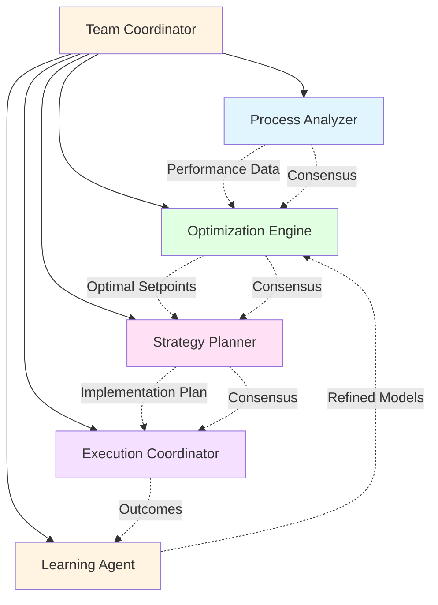
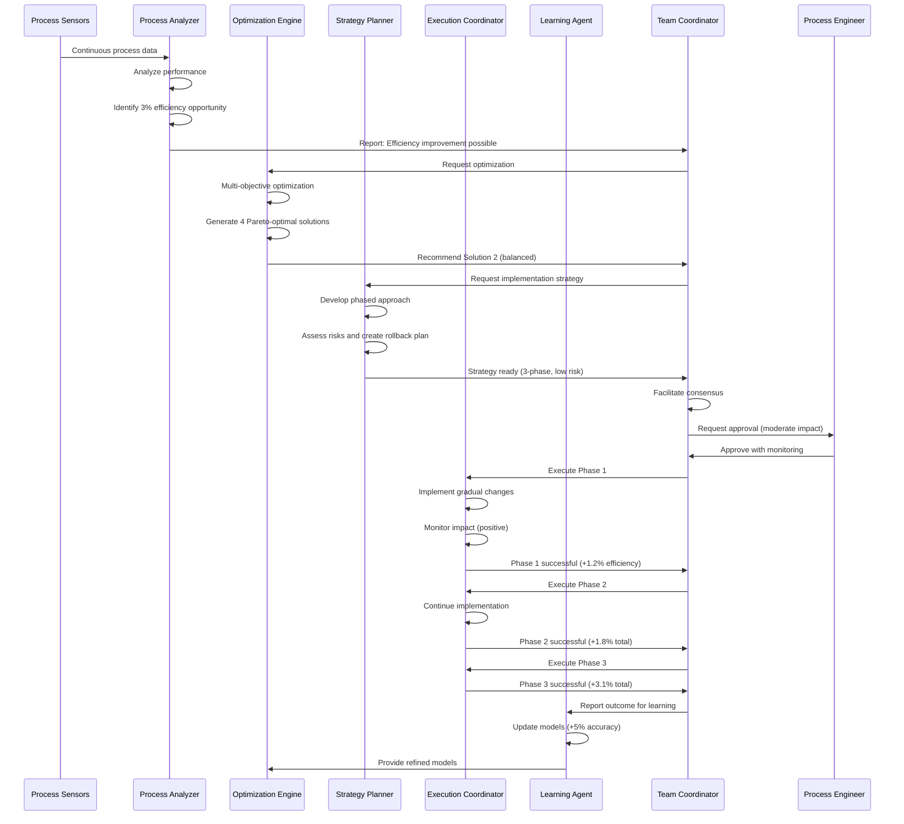

# Process Optimization: Continuous Improvement Through Intelligence

## Overview

Process optimization demonstrates how MAGS continuously improves operational efficiency through intelligent analysis, multi-objective optimization, and adaptive strategies. Unlike traditional optimization approaches that focus on single metrics or require manual intervention, MAGS provides autonomous, continuous optimization that balances multiple competing objectives while adapting to changing conditions.

Industrial processes are complex systems with numerous interdependent variables, conflicting objectives, and dynamic constraints. Optimizing such systems requires deep domain knowledge, sophisticated analysis, and the ability to balance trade-offs. MAGS brings coordinated intelligence to this challenge, enabling organizations to achieve and maintain optimal performance across production, quality, cost, and sustainability dimensions.

### Why Process Optimization Matters

**The Challenge**: Industrial processes operate below optimal efficiency due to complexity, changing conditions, and conflicting objectives. Manual optimization is slow, limited in scope, and cannot keep pace with dynamic operations.

**The Solution**: Multi-agent systems that continuously analyze performance, identify improvement opportunities, optimize across multiple objectives, and adapt strategies based on results.

**The Result**: Sustained efficiency improvements (15-25%), cost reductions (10-20%), quality enhancements (10-15%), and reduced environmental impact (15-30%).

### Key Business Drivers

1. **Efficiency Gains**: Even 1% efficiency improvement can save millions annually in large operations
2. **Cost Reduction**: Energy, materials, and labor represent 60-80% of production costs
3. **Quality Improvement**: Process optimization directly impacts product quality and consistency
4. **Sustainability**: Optimized processes reduce waste, emissions, and resource consumption
5. **Competitive Advantage**: Superior operational efficiency enables better pricing and margins

---

## Business Context

### Industry Challenges

**Manufacturing**:
- Complex multi-stage processes with interdependencies
- Trade-offs between throughput, quality, and cost
- Equipment constraints and bottlenecks
- Batch-to-batch variability
- Energy consumption and sustainability targets

**Chemical Processing**:
- Non-linear process dynamics
- Multiple quality specifications to meet
- Safety constraints and operating limits
- Catalyst performance degradation
- Yield optimization vs. energy consumption

**Food & Beverage**:
- Recipe consistency and quality standards
- Shelf life and freshness requirements
- Regulatory compliance (food safety)
- Waste minimization
- Seasonal ingredient variations

**Pharmaceuticals**:
- Strict quality and regulatory requirements (GMP)
- Batch reproducibility critical
- High-value materials requiring yield optimization
- Process validation and documentation
- Scale-up from lab to production

### Traditional Approach Limitations

**Manual Optimization**:
- Slow, periodic optimization efforts
- Limited to few variables at a time
- Relies on expert availability and intuition
- Cannot adapt quickly to changing conditions
- Optimization gains decay over time

**Single-Objective Focus**:
- Optimizes one metric at expense of others
- Misses holistic improvement opportunities
- Creates unintended consequences
- Suboptimal overall performance
- Stakeholder conflicts over priorities

**Static Setpoints**:
- Fixed operating parameters regardless of conditions
- Doesn't adapt to equipment degradation
- Ignores raw material variations
- Misses dynamic optimization opportunities
- Leaves performance on the table

**Siloed Optimization**:
- Each unit optimized independently
- Misses system-level opportunities
- Creates bottlenecks and imbalances
- Suboptimal overall throughput
- Coordination challenges

---

## MAGS Approach

### Multi-Agent Intelligence

MAGS transforms process optimization through coordinated specialist agents that continuously analyze, optimize, and adapt:

**Process Analyzer Agent**:
- Monitors process performance across all metrics
- Identifies inefficiencies and improvement opportunities
- Analyzes correlations and causal relationships
- Detects performance degradation trends
- Provides data-driven insights

**Optimization Engine Agent**:
- Performs multi-objective optimization
- Balances competing objectives (throughput, quality, cost, energy)
- Generates Pareto-optimal solutions
- Considers constraints and operating limits
- Evaluates trade-offs quantitatively

**Strategy Planner Agent**:
- Develops implementation strategies for improvements
- Plans phased optimization approaches
- Considers operational constraints and risks
- Generates rollback plans for safety
- Coordinates with production scheduling

**Execution Coordinator Agent**:
- Implements optimization changes safely
- Monitors impact in real-time
- Validates improvements against predictions
- Rolls back if unexpected issues arise
- Documents changes for compliance

**Learning Agent**:
- Tracks optimization outcomes
- Refines models based on results
- Identifies successful patterns
- Shares learning across similar processes
- Continuously improves optimization strategies

### Advantages Over Traditional Approaches

**Continuous Optimization**:
- 24/7 analysis and improvement
- Immediate response to changing conditions
- No waiting for periodic optimization studies
- Sustained performance at optimal levels
- Prevents performance decay

**Multi-Objective Balancing**:
- Simultaneously optimizes multiple metrics
- Quantifies trade-offs explicitly
- Finds Pareto-optimal solutions
- Aligns with stakeholder priorities
- Avoids unintended consequences

**Adaptive Intelligence**:
- Learns from every optimization attempt
- Adapts to equipment degradation
- Responds to raw material variations
- Adjusts for seasonal patterns
- Improves strategies over time

**System-Level View**:
- Optimizes entire process, not just units
- Identifies system bottlenecks
- Balances flows and inventories
- Maximizes overall throughput
- Coordinates across departments

**Risk Management**:
- Validates changes before implementation
- Monitors impact continuously
- Automatic rollback if issues detected
- Maintains safety margins
- Documents all changes

---

## Agent Team Structure

### Team Composition



### Agent Roles and Responsibilities

**Process Analyzer Agent**

*Primary Responsibility*: Monitor and analyze process performance

*Capabilities*:
- Real-time performance monitoring across all KPIs
- Statistical process control and trend analysis
- Correlation and causality analysis
- Bottleneck identification
- Opportunity quantification

*Decision Authority*:
- Autonomous: Generate performance reports, identify opportunities
- Escalate: Significant performance degradation or improvement opportunities

*Key Metrics*:
- Analysis accuracy: >90%
- Opportunity identification rate: >80%
- False positive rate: <10%
- Analysis latency: <5 minutes

**Optimization Engine Agent**

*Primary Responsibility*: Generate optimal operating parameters

*Capabilities*:
- Multi-objective optimization algorithms
- Constraint satisfaction
- Pareto frontier generation
- Trade-off analysis
- Sensitivity analysis

*Decision Authority*:
- Autonomous: Generate optimization recommendations
- Escalate: Major process changes or high-risk optimizations

*Key Metrics*:
- Optimization quality: >90% of theoretical optimum
- Constraint satisfaction: 100%
- Computation time: <10 minutes
- Solution feasibility: >95%

**Strategy Planner Agent**

*Primary Responsibility*: Develop safe implementation strategies

*Capabilities*:
- Phased implementation planning
- Risk assessment and mitigation
- Rollback strategy development
- Change impact analysis
- Stakeholder coordination

*Decision Authority*:
- Autonomous: Develop implementation plans
- Escalate: High-risk changes requiring approval

*Key Metrics*:
- Plan completeness: >95%
- Risk assessment accuracy: >90%
- Implementation success rate: >90%
- Rollback effectiveness: 100%

**Execution Coordinator Agent**

*Primary Responsibility*: Safely implement optimization changes

*Capabilities*:
- Gradual setpoint changes
- Real-time impact monitoring
- Automatic rollback on issues
- Change documentation
- Compliance tracking

*Decision Authority*:
- Autonomous: Implement approved changes
- Escalate: Unexpected issues or deviations

*Key Metrics*:
- Implementation accuracy: >99%
- Safety compliance: 100%
- Rollback response time: <30 seconds
- Documentation completeness: 100%

**Learning Agent**

*Primary Responsibility*: Learn from outcomes and improve strategies

*Capabilities*:
- Outcome tracking and analysis
- Model refinement based on results
- Pattern identification in successes/failures
- Knowledge sharing across processes
- Strategy evolution

*Decision Authority*:
- Autonomous: Update models and strategies
- Escalate: Significant model changes requiring validation

*Key Metrics*:
- Learning effectiveness: >10% improvement per quarter
- Model accuracy improvement: >5% per quarter
- Knowledge transfer success: >80%
- Strategy adaptation rate: 2-4 per quarter

---

## Workflow

### End-to-End Process



### Detailed Step-by-Step Process

**Step 1: Performance Monitoring (Observe)**

*Agent*: Process Analyzer

*Actions*:
- Collect process data from all sensors and systems
- Calculate key performance indicators (KPIs)
- Compare current performance to baselines and targets
- Identify deviations and trends
- Assess significance of observations

*Example*:
```
Production Line Performance:
  - Throughput: 95 units/hour (target: 100, baseline: 92)
  - Quality: 97.5% (target: 98%, baseline: 97%)
  - Energy: 1.25 kWh/unit (target: 1.15, baseline: 1.30)
  - Material yield: 94% (target: 96%, baseline: 93%)
  
Overall Efficiency: 92.3% (target: 95%, baseline: 90%)
Improvement Opportunity: 2.7% efficiency gain possible
```

*Decision Point*: Is improvement opportunity significant?
- Opportunity >2%: Proceed to optimization
- Opportunity 1-2%: Monitor for sustained pattern
- Opportunity <1%: Continue monitoring

**Step 2: Root Cause Analysis (Reflect)**

*Agent*: Process Analyzer

*Actions*:
- Analyze correlations between variables
- Identify causal relationships
- Determine limiting factors and bottlenecks
- Quantify impact of each factor
- Prioritize improvement opportunities

*Example*:
```
Efficiency Analysis:
  Primary Bottleneck: Reactor temperature control
    - Current: ±3°C variation
    - Impact: -1.5% throughput, -0.8% yield
    - Improvement potential: 2.3%
  
  Secondary Factor: Feed rate optimization
    - Current: Fixed at 85% capacity
    - Impact: -0.5% throughput
    - Improvement potential: 0.5%
  
  Tertiary Factor: Cooling system efficiency
    - Current: 78% efficiency
    - Impact: +8% energy consumption
    - Improvement potential: Energy savings only
```

*Decision Point*: Which factors should be optimized?
- High impact + feasible: Prioritize for optimization
- High impact + difficult: Develop phased approach
- Low impact: Defer or combine with other improvements

**Step 3: Multi-Objective Optimization (Plan)**

*Agent*: Optimization Engine

*Actions*:
- Define objective function with multiple goals
- Set constraints and operating limits
- Run optimization algorithms
- Generate Pareto-optimal solutions
- Evaluate trade-offs between solutions

*Example*:
```
Optimization Problem:
  Objectives:
    - Maximize throughput (weight: 0.35)
    - Maximize quality (weight: 0.30)
    - Minimize energy (weight: 0.20)
    - Maximize yield (weight: 0.15)
  
  Constraints:
    - Temperature: 180-220°C
    - Pressure: 2-4 bar
    - Feed rate: 70-95% capacity
    - Safety margins: ±10%
  
  Pareto-Optimal Solutions:
  
  Solution 1: Throughput-Focused
    - Throughput: +4.2% (99.2 units/hour)
    - Quality: +0.5% (98.0%)
    - Energy: +2% (1.28 kWh/unit)
    - Yield: +1.5% (95.5%)
    - Overall Score: 0.87
  
  Solution 2: Balanced (RECOMMENDED)
    - Throughput: +3.1% (97.9 units/hour)
    - Quality: +1.2% (98.7%)
    - Energy: -5% (1.19 kWh/unit)
    - Yield: +2.1% (96.1%)
    - Overall Score: 0.94 ⭐
  
  Solution 3: Quality-Focused
    - Throughput: +1.8% (96.7 units/hour)
    - Quality: +2.5% (99.5%)
    - Energy: -3% (1.21 kWh/unit)
    - Yield: +2.8% (96.8%)
    - Overall Score: 0.89
  
  Solution 4: Energy-Focused
    - Throughput: +2.5% (97.3 units/hour)
    - Quality: +0.8% (98.3%)
    - Energy: -8% (1.15 kWh/unit)
    - Yield: +1.8% (95.8%)
    - Overall Score: 0.85
```

*Decision Point*: Which solution best meets objectives?
- Balanced score >0.90: Recommend for implementation
- Multiple close scores: Present alternatives to stakeholders
- All scores <0.85: Refine optimization or defer

**Step 4: Strategy Development (Plan)**

*Agent*: Strategy Planner

*Actions*:
- Develop phased implementation approach
- Assess risks for each phase
- Create rollback procedures
- Define success criteria
- Plan monitoring and validation

*Example*:
```
Implementation Strategy for Solution 2:

Phase 1: Temperature Control Optimization (Low Risk)
  - Duration: 2 hours
  - Changes: Tighten temperature control (±3°C → ±1.5°C)
  - Expected Impact: +1.2% efficiency
  - Rollback Trigger: Temperature instability or quality drop
  - Success Criteria: Stable operation for 2 hours
  
Phase 2: Feed Rate Optimization (Medium Risk)
  - Duration: 4 hours
  - Changes: Increase feed rate (85% → 90%)
  - Expected Impact: +1.8% efficiency (cumulative)
  - Rollback Trigger: Pressure excursion or quality issues
  - Success Criteria: Sustained throughput increase
  
Phase 3: Cooling System Optimization (Low Risk)
  - Duration: 2 hours
  - Changes: Optimize cooling setpoints
  - Expected Impact: +3.1% efficiency (cumulative)
  - Rollback Trigger: Temperature control issues
  - Success Criteria: Energy reduction achieved

Total Implementation Time: 8 hours
Risk Level: MEDIUM (requires approval)
Rollback Plan: Revert to previous setpoints within 5 minutes
```

*Decision Point*: Is strategy safe and feasible?
- Low risk + high confidence: Proceed to execution
- Medium risk: Require approval
- High risk: Require detailed review and multiple approvals

**Step 5: Consensus and Approval (Act)**

*Agent*: Team Coordinator

*Actions*:
- Facilitate consensus among specialist agents
- Compile recommendation with evidence
- Assess overall risk and impact
- Escalate to human if required
- Document decision rationale

*Example*:
```
Consensus Process:
  - Process Analyzer: Agrees (opportunity validated)
  - Optimization Engine: Recommends Solution 2 (score: 0.94)
  - Strategy Planner: Confirms feasibility (3-phase, medium risk)
  - Execution Coordinator: Ready to implement
  - Learning Agent: Models support predictions
  
Team Consensus: ACHIEVED (100% agreement)
Recommendation: Implement Solution 2 in 3 phases
Expected Benefit: +3.1% efficiency, +1.2% quality, -5% energy
Risk Level: MEDIUM (requires process engineer approval)

Escalation: Process Engineer
```

*Decision Point*: Is human approval required?
- Low risk + proven approach: Autonomous execution
- Medium risk: Require engineer approval
- High risk: Require management approval

**Step 6: Phased Implementation (Act)**

*Agent*: Execution Coordinator

*Actions*:
- Implement Phase 1 changes gradually
- Monitor impact continuously
- Validate against predictions
- Proceed to next phase if successful
- Rollback if issues detected

*Example*:
```
Phase 1 Execution (Temperature Control):
  Hour 0: Begin gradual temperature control tightening
  Hour 0.5: Temperature variance reduced to ±2°C
  Hour 1: Temperature variance reduced to ±1.5°C
  Hour 1.5: Monitoring - all parameters stable
  Hour 2: Phase 1 complete
  
  Results:
    - Throughput: +1.3% (actual vs. +1.2% predicted)
    - Quality: +0.4%
    - Energy: -1%
    - Status: SUCCESS - proceed to Phase 2

Phase 2 Execution (Feed Rate):
  Hour 2: Begin feed rate increase (85% → 87%)
  Hour 3: Feed rate at 88%
  Hour 4: Feed rate at 90%
  Hour 5: Monitoring - pressure stable, quality maintained
  Hour 6: Phase 2 complete
  
  Results:
    - Throughput: +1.9% cumulative (actual vs. +1.8% predicted)
    - Quality: +1.1%
    - Energy: -3%
    - Status: SUCCESS - proceed to Phase 3

Phase 3 Execution (Cooling):
  Hour 6: Optimize cooling setpoints
  Hour 7: Monitor energy consumption
  Hour 8: Phase 3 complete
  
  Results:
    - Throughput: +3.1% cumulative (matches prediction)
    - Quality: +1.2% (matches prediction)
    - Energy: -5.2% (exceeds prediction)
    - Yield: +2.3% (exceeds prediction)
    - Status: SUCCESS - optimization complete
```

**Step 7: Validation and Stabilization (Reflect)**

*Agent*: Process Analyzer + Execution Coordinator

*Actions*:
- Monitor performance for extended period
- Validate sustained improvements
- Identify any unexpected effects
- Fine-tune if needed
- Document final results

*Example*:
```
24-Hour Validation Period:
  Hour 8-16: Performance stable at new levels
  Hour 16-24: Continued stable operation
  Hour 24-32: Performance sustained
  
Final Results (vs. Baseline):
  - Throughput: +3.1% sustained (95 → 97.9 units/hour)
  - Quality: +1.2% sustained (97.5% → 98.7%)
  - Energy: -5.2% sustained (1.25 → 1.19 kWh/unit)
  - Yield: +2.3% sustained (94% → 96.3%)
  - Overall Efficiency: 95.4% (vs. 92.3% baseline, 95% target)
  
Validation: SUCCESS
Status: Optimization complete and stable
```

**Step 8: Learning and Model Refinement (Reflect)**

*Agent*: Learning Agent

*Actions*:
- Compare predictions to actual outcomes
- Assess model accuracy
- Refine optimization models
- Update success patterns
- Share learning with similar processes

*Example*:
```
Outcome Analysis:
  Prediction Accuracy:
    - Throughput: 100% (3.1% predicted, 3.1% actual)
    - Quality: 100% (1.2% predicted, 1.2% actual)
    - Energy: 104% (5% predicted, 5.2% actual - better!)
    - Yield: 110% (2.1% predicted, 2.3% actual - better!)
  
  Overall Prediction Accuracy: 103.5% (excellent)
  
Learning Updates:
  ✓ Temperature control model refined (+3% accuracy)
  ✓ Feed rate optimization model validated
  ✓ Cooling system model improved (+5% accuracy)
  ✓ Multi-objective weights validated
  ✓ Success pattern added to knowledge base
  
Model Improvements:
  - Optimization accuracy: +5%
  - Prediction confidence: +8%
  - Strategy effectiveness: +10%
  
Knowledge Sharing:
  - Similar processes notified of successful approach
  - 3 other lines scheduled for similar optimization
```

---

## Capabilities Applied

### Cognitive Intelligence Capabilities

**Memory Significance (Critical)**

*Application*: Identifying significant performance patterns and opportunities

*How Used*:
- Calculates importance of performance deviations
- Identifies unusual patterns requiring investigation
- Prioritizes improvement opportunities by impact
- Filters noise from meaningful signals

*Example*:
```
Performance deviation analysis:
  - Throughput variance: Importance 0.95, Surprise 0.75 → Significance 0.87
  - Quality trend: Importance 0.90, Surprise 0.60 → Significance 0.78
  - Energy spike: Importance 0.70, Surprise 0.85 → Significance 0.77
  
Prioritization: Throughput optimization (highest significance)
```

**Synthetic Memory (Critical)**

*Application*: Creating optimization models from historical data

*How Used*:
- Synthesizes patterns from past optimizations
- Generates process models for optimization
- Creates correlation models between variables
- Builds success pattern libraries

*Example*:
```
Process Model (synthesized from 200+ optimization cycles):
  - Temperature-throughput relationship: +1°C → +0.8% throughput
  - Feed rate-quality relationship: +5% rate → -0.3% quality
  - Cooling-energy relationship: Optimized cooling → -8% energy
  - Typical improvement potential: 2-5% efficiency
```

**Content Processing (Important)**

*Application*: Understanding process data and context

*How Used*:
- Interprets sensor data in process context
- Understands operating procedures and constraints
- Processes technical documentation
- Extracts relevant information from reports

**Confidence Scoring (Critical)**

*Application*: Assessing reliability of optimization predictions

*How Used*:
- Scores optimization solution confidence
- Calibrates prediction accuracy
- Evaluates implementation risk
- Enables risk-based decision gating

*Example*:
```
Optimization Confidence: 0.91
  - Model accuracy: 0.93
  - Data quality: 0.95
  - Historical validation: 0.88
  - Constraint satisfaction: 1.00
  
Confidence interpretation: HIGH - suitable for implementation
```

**Plan Adaptation (Critical)**

*Application*: Adjusting optimization strategies based on results

*How Used*:
- Adapts to changing process conditions
- Responds to equipment degradation
- Adjusts for raw material variations
- Optimizes timing based on production schedule

### Decision Orchestration Capabilities

**Consensus Management (Critical)**

*Application*: Coordinating optimization decisions across agents

*How Used*:
- Facilitates agreement on optimization approach
- Resolves conflicts between objectives
- Ensures all agents align on strategy
- Documents consensus rationale

*Example*:
```
Consensus Vote on Optimization Solution:
  - Process Analyzer: Solution 2 (validated opportunity)
  - Optimization Engine: Solution 2 (score: 0.94)
  - Strategy Planner: Solution 2 (feasible, medium risk)
  - Execution Coordinator: Solution 2 (ready to implement)
  
Result: UNANIMOUS consensus for Solution 2
```

**Communication Framework (Important)**

*Application*: Sharing optimization information

*How Used*:
- Publishes performance analyses
- Shares optimization recommendations
- Communicates implementation progress
- Generates stakeholder reports

### Performance Optimization Capabilities

**Goal Optimization (Critical)**

*Application*: Balancing multiple process objectives

*How Used*:
- Optimizes throughput vs. quality vs. cost vs. energy
- Balances short-term and long-term objectives
- Considers stakeholder priorities
- Generates Pareto-optimal solutions

*Example*:
```
Multi-Objective Function:
  - Maximize throughput: Weight 0.35
  - Maximize quality: Weight 0.30
  - Minimize energy: Weight 0.20
  - Maximize yield: Weight 0.15
  
Solution 2 scores:
  - Throughput: 0.93 (+3.1%)
  - Quality: 0.96 (+1.2%)
  - Energy: 0.95 (-5%)
  - Yield: 0.94 (+2.3%)
  - Overall: 0.94 (optimal)
```

**Plan Optimization (Critical)**

*Application*: Generating optimal implementation strategies

*How Used*:
- Evaluates multiple implementation approaches
- Considers risks and constraints
- Optimizes phasing and timing
- Generates safe execution plans

### Integration & Execution Capabilities

**DataStream Integration (Critical)**

*Application*: Continuous process monitoring

*How Used*:
- Connects to process control systems
- Processes real-time process data
- Integrates with historians and databases
- Handles multiple data sources

**Tool Orchestration (Important)**

*Application*: Implementing optimization changes

*How Used*:
- Sends setpoint changes to control systems
- Updates process parameters
- Triggers alarms and notifications
- Integrates with MES/ERP systems

**Telemetry and Monitoring (Important)**

*Application*: Tracking optimization effectiveness

*How Used*:
- Monitors optimization outcomes
- Tracks performance improvements
- Measures ROI and benefits
- Enables continuous improvement

---

## Implementation

### Getting Started

**Phase 1: Process Selection (Weeks 1-2)**

*Objective*: Select 1-2 processes for initial optimization

*Criteria*:
- Significant improvement potential (>3% efficiency)
- Good data availability
- Stable baseline operation
- Management support

*Activities*:
- Identify candidate processes
- Assess data quality and availability
- Validate improvement potential
- Secure stakeholder commitment

**Phase 2: Baseline Establishment (Weeks 3-4)**

*Objective*: Establish performance baselines and models

*Activities*:
- Collect historical process data
- Calculate baseline KPIs
- Identify normal operating ranges
- Build initial process models
- Document current performance

*Technical Requirements*:
- Process data (minimum 3 months, preferably 12+ months)
- All relevant sensors and measurements
- Operating procedures and constraints
- Historical optimization attempts

**Phase 3: Agent Configuration (Weeks 5-6)**

*Objective*: Configure and train optimization agents

*Activities*:
- Configure Process Analyzer with KPIs and thresholds
- Train Optimization Engine on process models
- Set up Strategy Planner with constraints
- Configure Execution Coordinator with control system access
- Establish Learning Agent feedback loops

**Phase 4: Validation (Weeks 7-8)**

*Objective*: Validate optimization recommendations

*Activities*:
- Run in recommendation-only mode
- Validate optimization suggestions against expert judgment
- Calibrate confidence scoring
- Tune objective function weights
- Adjust constraints and limits

*Success Criteria*:
- Optimization quality >85% of expert solutions
- Prediction accuracy >80%
- Constraint satisfaction 100%
- Expert agreement >85%

**Phase 5: Gradual Autonomy (Weeks 9-12)**

*Objective*: Progressively enable autonomous optimization

*Activities*:
- Week 9: Enable autonomous monitoring and analysis
- Week 10: Enable autonomous optimization generation
- Week 11: Enable autonomous strategy development
- Week 12: Enable autonomous implementation (with approval)

*Autonomy Gating*:
- Start with human approval for all changes
- Gradually increase autonomy based on performance
- Maintain oversight for high-impact changes
- Full autonomy only after proven reliability

### Integration Points

**Process Control Systems (DCS/PLC)**:
- Read: Process variables, setpoints, alarms
- Write: Optimized setpoints (with safety limits)

**Historians**:
- Read: Historical process data, trends
- Write: Optimization events, results

**MES/ERP Systems**:
- Read: Production schedules, material data
- Write: Optimization reports, performance metrics

**LIMS (Laboratory Information Management)**:
- Read: Quality test results
- Write: None (read-only)

### Deployment Considerations

**Infrastructure Requirements**:
- Compute: Moderate to high (optimization algorithms)
- Storage: Significant (historical data, models)
- Network: Reliable connectivity to control systems
- Latency: <5 minutes for optimization

**Security Considerations**:
- Controlled write access to setpoints
- Safety interlocks and limits enforced
- Audit logging for all changes
- Rollback capabilities

**Scalability**:
- Start with 1-2 processes
- Expand to 5-10 processes after validation
- Scale to dozens of processes with proven ROI
- Use process similarity for faster deployment

---

## Measuring Success

### Key Performance Indicators

**Operational Metrics**:

```
Overall Equipment Effectiveness (OEE):
  Baseline: 75%
  Target: >85% (13% improvement)
  Measurement: Availability × Performance × Quality

Throughput Improvement:
  Baseline: Process-specific
  Target: +3-5%
  Measurement: Units produced per hour

Quality Improvement:
  Baseline: Process-specific
  Target: +1-2%
  Measurement: First-pass yield, defect rate

Energy Efficiency:
  Baseline: Process-specific
  Target: -5-10%
  Measurement: Energy per unit produced

Material Yield:
  Baseline: Process-specific
  Target: +2-3%
  Measurement: Output / Input ratio
```

**Agent Performance Metrics**:

```
Optimization Quality:
  - Solution optimality: >90% of theoretical best
  - Constraint satisfaction: 100%
  - Multi-objective balance: >0.90 score
  - Computation time: <10 minutes

Prediction Accuracy:
  - Improvement predictions: >85% accurate
  - Impact predictions: ±10% of actual
  - Risk predictions: >90% accurate
  - Confidence calibration error: <10%

Implementation Success:
  - Successful implementations: >90%
  - Rollback rate: <5%
  - Safety incidents: 0
  - Compliance: 100%

Learning Effectiveness:
  - Model accuracy improvement: >5% per quarter
  - Strategy success rate improvement: >10% per quarter
  - Knowledge transfer success: >80%
```

**Business Impact Metrics**:

```
Cost Reduction:
  - Production cost per unit: -10-20%
  - Energy costs: -15-25%
  - Material waste: -15-30%
  - Maintenance costs: -10-15%

Revenue Impact:
  - Increased throughput: +3-5%
  - Improved quality: +1-2% premium pricing
  - Reduced waste: +2-3% yield
  - Total revenue impact: +5-10%

Return on Investment:
  - Annual savings: $200K-$500K per process
  - Implementation cost: $75K-$150K per process
  - Payback period: 3-6 months
  - 3-year ROI: 400-600%
```

### Continuous Improvement

**Weekly Reviews**:
- Optimization outcomes analysis
- Model accuracy assessment
- Opportunity identification
- Quick wins implementation

**Monthly Optimization**:
- Objective function tuning
- Constraint refinement
- Strategy effectiveness review
- Cross-process learning

**Quarterly Assessment**:
- ROI validation
- Expansion planning
- Technology updates
- Strategic alignment

---

## Variations

### Industry-Specific Adaptations

**Discrete Manufacturing - Assembly Lines**

*Focus*: Maximize throughput while maintaining quality

*Adaptations*:
- Cycle time optimization
- Bottleneck management
- Line balancing
- Changeover time reduction

*Example*:
```
Electronics Assembly:
  - Processes: 12 assembly stations
  - Optimization focus: Line balance, throughput
  - Typical improvements: +8-12% throughput
  - Key metrics: Takt time, cycle time, OEE
  - Constraints: Quality specs, equipment limits
```

**Continuous Processing - Chemical Plants**

*Focus*: Maximize yield and energy efficiency

*Adaptations*:
- Reaction optimization
- Heat integration
- Catalyst performance
- Distillation efficiency

*Example*:
```
Chemical Reactor:
  - Process: Continuous polymerization
  - Optimization focus: Yield, energy, quality
  - Typical improvements: +3-5% yield, -10-15% energy
  - Key metrics: Conversion, selectivity, energy intensity
  - Constraints: Safety limits, product specs
```

**Batch Processing - Pharmaceuticals**

*Focus*: Maximize yield while ensuring quality and compliance

*Adaptations*:
- Recipe optimization
- Batch-to-batch consistency
- Cycle time reduction
- Quality attribute targeting

*Example*:
```
Pharmaceutical Batch:
  - Process: API synthesis (8-hour batch)
  - Optimization focus: Yield, quality, cycle time
  - Typical improvements: +2-4% yield, -10% cycle time
  - Key metrics: Purity, yield, batch time
  - Constraints: GMP requirements, validation
```

**Food & Beverage - Processing Lines**

*Focus*: Maximize throughput while ensuring quality and safety

*Adaptations*:
- Recipe consistency
- Shelf life optimization
- Waste minimization
- Energy efficiency

*Example*:
```
Beverage Bottling:
  - Process: Filling and packaging line
  - Optimization focus: Speed, quality, waste
  - Typical improvements: +5-8% throughput, -20% waste
  - Key metrics: Line speed, fill accuracy, waste
  - Constraints: Food safety, quality specs
```

---

## Related Documentation

### Core Concepts
- [ORPA Cycle](../concepts/orpa-cycle.md) - Observe-Reflect-Plan-Act framework
- [Memory Systems](../concepts/memory-systems.md) - How agents remember and learn
- [Decision Making](../concepts/decision-making.md) - Agent decision frameworks

### Cognitive Intelligence
- [Memory Significance](../cognitive-intelligence/memory-significance.md) - Identifying significant patterns
- [Synthetic Memory](../cognitive-intelligence/synthetic-memory.md) - Creating optimization models
- [Confidence Scoring](../cognitive-intelligence/confidence-scoring.md) - Assessing prediction reliability
- [Plan Adaptation](../cognitive-intelligence/plan-adaptation.md) - Adapting strategies

### Decision Orchestration
- [Consensus Management](../decision-orchestration/consensus-management.md) - Coordinating decisions
- [Communication Framework](../decision-orchestration/communication-framework.md) - Agent communication

### Performance Optimization
- [Goal Optimization](../performance-optimization/goal-optimization.md) - Multi-objective optimization
- [Plan Optimization](../performance-optimization/plan-optimization.md) - Optimal strategy generation

### Design Patterns
- [Agent Team Patterns](../design-patterns/agent-team-patterns.md) - Team composition strategies
- [Decision Patterns](../design-patterns/decision-patterns.md) - Decision-making approaches

### Best Practices
- [Agent Design Principles](../best-practices/agent-design-principles.md) - Effective agent design
- [Team Composition](../best-practices/team-composition.md) - Building effective teams
- [Objective Function Design](../best-practices/objective-function-design.md) - Defining optimization goals

### Other Use Cases
- [Predictive Maintenance](predictive-maintenance.md) - Equipment failure prevention
- [Quality Management](quality-management.md) - Quality assurance
- [Root Cause Analysis](root-cause-analysis.md) - Problem investigation

---

## References

### Process Optimization
- Biegler, L. T., Grossmann, I. E., & Westerberg, A. W. (1997). "Systematic Methods of Chemical Process Design". Prentice Hall
- Edgar, T. F., Himmelblau, D. M., & Lasdon, L. S. (2001). "Optimization of Chemical Processes" (2nd ed.). McGraw-Hill
- Marlin, T. E. (2000). "Process Control: Designing Processes and Control Systems for Dynamic Performance" (2nd ed.). McGraw-Hill

### Multi-Objective Optimization
- Deb, K. (2001). "Multi-Objective Optimization using Evolutionary Algorithms". John Wiley & Sons
- Miettinen, K. (1999). "Nonlinear Multiobjective Optimization". Springer
- Coello Coello, C. A., Lamont, G. B., & Van Veldhuizen, D. A. (2007). "Evolutionary Algorithms for Solving Multi-Objective Problems" (2nd ed.). Springer

### Multi-Agent Systems
- Wooldridge, M. (2009). "An Introduction to MultiAgent Systems" (2nd ed.). John Wiley & Sons
- Ferber, J. (1999). "Multi-Agent Systems: An Introduction to Distributed Artificial Intelligence". Addison-Wesley

### Industrial Applications
- Qin, S. J., & Badgwell, T. A. (2003). "A survey of industrial model predictive control technology". Control Engineering Practice, 11(7), 733-764
- Darby, M. L., & Nikolaou, M. (2012). "MPC: Current practice and challenges". Control Engineering Practice, 20(4), 328-342

### Continuous Improvement
- Imai, M. (1986). "Kaizen: The Key to Japan's Competitive Success". McGraw-Hill
- Womack, J. P., & Jones, D. T. (2003). "Lean Thinking: Banish Waste and Create Wealth in Your Corporation". Free Press

### Machine Learning for Process Optimization
- Venkatasubramanian, V. (2019). "The promise of artificial intelligence in chemical engineering: Is it here, finally?". AIChE Journal, 65(2), 466-478
- Lee, J. H., Shin, J., & Realff, M. J. (2018). "Machine learning: Overview of the recent progresses and implications for the process systems engineering field". Computers & Chemical Engineering, 114, 111-121

---

**Document Version**: 2.0
**Last Updated**: December 6, 2025
**Status**: ✅ Enhanced to Match Phases 1-4 Quality Standard