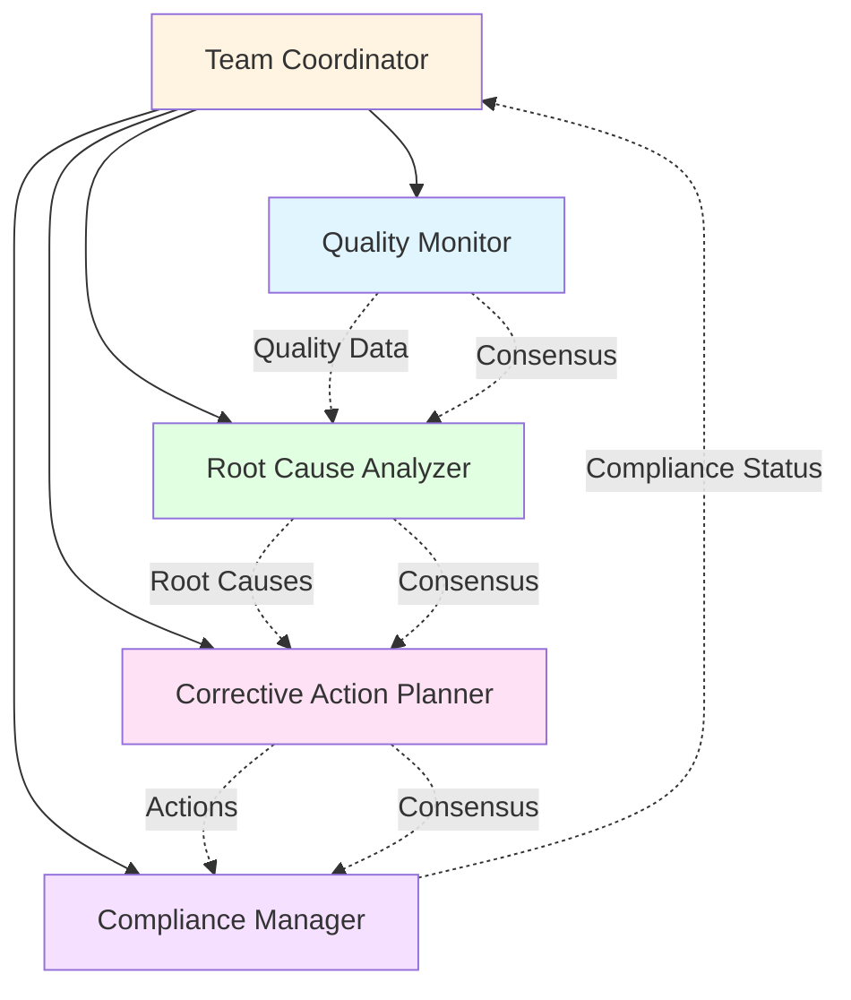
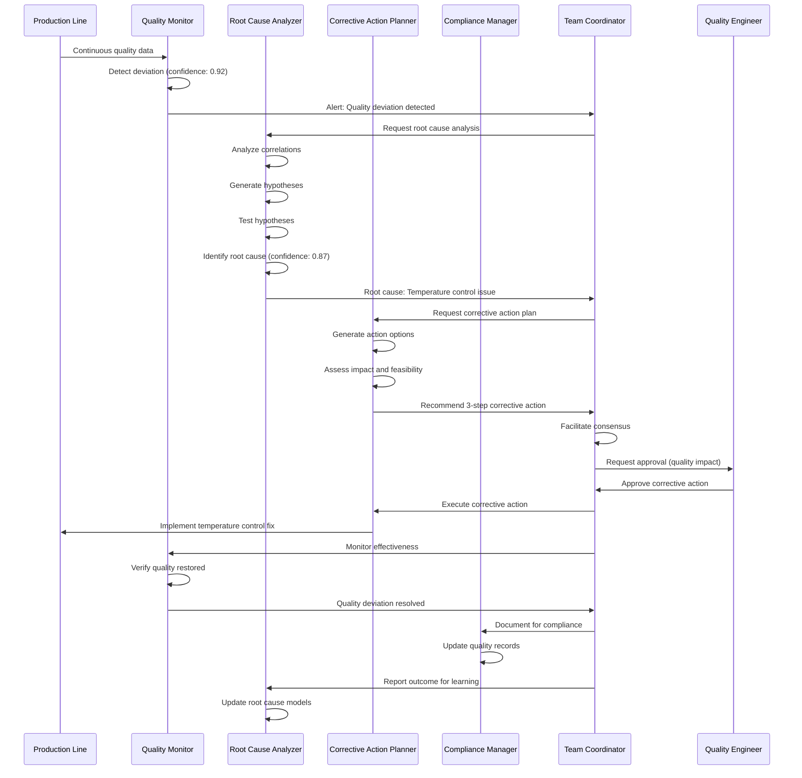

# Quality Management: Ensuring Excellence Through Intelligence

## Overview

Quality management demonstrates how MAGS detects quality issues, identifies root causes, implements corrective actions, and maintains compliance through coordinated agent teams. By combining continuous monitoring, intelligent analysis, and systematic problem-solving, MAGS transforms quality management from reactive firefighting into proactive quality assurance.

Traditional quality management relies heavily on manual inspection, periodic audits, and reactive responses to defects. This approach is slow, inconsistent, and often misses subtle quality degradation until significant problems occur. MAGS provides continuous, intelligent quality oversight that detects issues early, identifies root causes accurately, and implements effective corrective actions systematically.

### Why Quality Management Matters

**The Challenge**: Quality issues are costly, damage reputation, and can have safety implications. Traditional approaches detect problems too late and struggle to identify true root causes.

**The Solution**: Multi-agent systems that continuously monitor quality, detect deviations early, perform systematic root cause analysis, and coordinate effective corrective actions.

**The Result**: Reduced defect rates (40-60%), faster issue resolution (50-70% faster), improved first-pass yield (10-20%), and enhanced regulatory compliance (100%).

### Key Business Drivers

1. **Cost of Poor Quality**: Defects cost 15-25% of revenue in manufacturing, up to 40% in some industries
2. **Customer Satisfaction**: Quality directly impacts customer retention and brand reputation
3. **Regulatory Compliance**: Many industries face strict quality regulations with severe penalties
4. **Competitive Advantage**: Superior quality enables premium pricing and market differentiation
5. **Operational Efficiency**: Quality issues disrupt operations and waste resources

---

## Business Context

### Industry Challenges

**Manufacturing**:
- High-speed production with limited inspection time
- Complex products with multiple quality attributes
- Supplier quality variability
- Process drift and equipment degradation
- Traceability requirements

**Pharmaceuticals**:
- Strict GMP (Good Manufacturing Practice) requirements
- Batch release testing and documentation
- Stability and shelf life concerns
- Regulatory inspections and audits
- Zero-defect expectations

**Food & Beverage**:
- Food safety and contamination risks
- Shelf life and freshness requirements
- Allergen management
- Regulatory compliance (FDA, USDA)
- Brand protection

**Automotive**:
- Safety-critical components
- Complex supply chains
- Warranty cost management
- Recall prevention
- Customer satisfaction metrics

### Traditional Approach Limitations

**Manual Inspection**:
- Inconsistent between inspectors
- Fatigue and attention lapses
- Limited sampling (typically <5%)
- Slow feedback to production
- Subjective judgment

**Reactive Quality Control**:
- Detects problems after production
- Expensive scrap and rework
- Customer complaints and returns
- Delayed root cause identification
- Repeated issues

**Statistical Process Control (SPC)**:
- Requires manual chart monitoring
- Threshold-based alerts miss complex patterns
- Limited to single variables
- No root cause analysis
- Reactive rather than predictive

**Periodic Audits**:
- Infrequent snapshots of quality
- Preparation bias (cleaning up for audits)
- Limited scope and sampling
- Delayed corrective actions
- Compliance-focused, not improvement-focused

---

## MAGS Approach

### Multi-Agent Intelligence

MAGS transforms quality management through coordinated specialist agents that provide comprehensive, intelligent quality oversight:

**Quality Monitor Agent**:
- Continuously monitors all quality parameters
- Detects deviations from specifications
- Identifies quality trends and patterns
- Provides early warning of degradation
- Tracks quality across production batches

**Root Cause Analyzer Agent**:
- Investigates quality issues systematically
- Analyzes correlations and causal relationships
- Identifies contributing factors
- Generates hypotheses and tests them
- Provides confidence-scored root cause assessments

**Corrective Action Planner Agent**:
- Develops corrective action plans
- Prioritizes actions by impact and feasibility
- Considers implementation constraints
- Generates preventive measures
- Tracks action effectiveness

**Compliance Manager Agent**:
- Ensures regulatory compliance
- Maintains documentation and audit trails
- Tracks quality metrics and trends
- Generates compliance reports
- Manages non-conformance procedures

**Team Coordinator Agent**:
- Orchestrates quality team workflow
- Facilitates consensus on corrective actions
- Escalates critical quality issues
- Maintains quality management system
- Coordinates with production and engineering

### Advantages Over Traditional Approaches

**Continuous Monitoring**:
- 100% inspection vs. sampling
- Real-time quality assessment
- No human fatigue or inconsistency
- Immediate detection of deviations
- Trend analysis and prediction

**Intelligent Analysis**:
- Multi-parameter quality assessment
- Pattern recognition across batches
- Causal analysis, not just correlation
- Confidence-scored conclusions
- Learning from every issue

**Systematic Problem-Solving**:
- Structured root cause analysis
- Hypothesis generation and testing
- Evidence-based conclusions
- Effective corrective actions
- Prevention of recurrence

**Proactive Quality Assurance**:
- Predicts quality issues before they occur
- Identifies degradation trends early
- Prevents defects rather than detecting them
- Optimizes quality parameters
- Continuous improvement

**Complete Documentation**:
- Automatic audit trail generation
- Comprehensive quality records
- Traceability from raw materials to finished goods
- Regulatory compliance documentation
- Historical analysis capabilities

---

## Agent Team Structure

### Team Composition



### Agent Roles and Responsibilities

**Quality Monitor Agent**

*Primary Responsibility*: Continuous quality monitoring and deviation detection

*Capabilities*:
- Real-time quality parameter monitoring
- Statistical process control (SPC)
- Multi-parameter quality assessment
- Trend analysis and prediction
- Quality score calculation

*Decision Authority*:
- Autonomous: Log quality observations, generate alerts
- Escalate: Quality deviations exceeding thresholds

*Key Metrics*:
- Detection accuracy: >98%
- False positive rate: <2%
- Detection latency: <30 seconds
- Coverage: 100% of production

**Root Cause Analyzer Agent**

*Primary Responsibility*: Systematic root cause investigation

*Capabilities*:
- Causal analysis and hypothesis generation
- Correlation analysis across variables
- Historical pattern matching
- Evidence gathering and evaluation
- Confidence-scored root cause identification

*Decision Authority*:
- Autonomous: Conduct investigations, generate hypotheses
- Escalate: High-confidence root causes requiring action

*Key Metrics*:
- Root cause accuracy: >85%
- Investigation time: <2 hours for critical issues
- Hypothesis validation rate: >80%
- Confidence calibration error: <10%

**Corrective Action Planner Agent**

*Primary Responsibility*: Develop effective corrective and preventive actions

*Capabilities*:
- Corrective action plan generation
- Preventive action identification
- Impact and feasibility assessment
- Implementation strategy development
- Effectiveness tracking

*Decision Authority*:
- Autonomous: Generate action plans
- Escalate: High-impact actions requiring approval

*Key Metrics*:
- Action effectiveness: >90%
- Recurrence prevention: >85%
- Implementation success: >90%
- Time to resolution: <target for severity

**Compliance Manager Agent**

*Primary Responsibility*: Ensure regulatory compliance and documentation

*Capabilities*:
- Regulatory requirement tracking
- Audit trail maintenance
- Non-conformance management
- Compliance reporting
- Documentation generation

*Decision Authority*:
- Autonomous: Maintain records, generate reports
- Escalate: Compliance violations or audit findings

*Key Metrics*:
- Documentation completeness: 100%
- Compliance rate: 100%
- Audit readiness: 100%
- Report accuracy: >99%

**Team Coordinator Agent**

*Primary Responsibility*: Orchestrate quality management workflow

*Capabilities*:
- Workflow coordination across agents
- Consensus facilitation
- Escalation management
- Performance monitoring
- Continuous improvement

*Decision Authority*:
- Autonomous: Coordinate routine quality management
- Escalate: Critical quality issues or systemic problems

*Key Metrics*:
- Coordination efficiency: >90%
- Consensus achievement: >95%
- Escalation appropriateness: >95%
- Issue resolution time: <target for severity

---

## Workflow

### End-to-End Process



### Detailed Step-by-Step Process

**Step 1: Continuous Quality Monitoring (Observe)**

*Agent*: Quality Monitor

*Actions*:
- Collect quality data from all inspection points
- Calculate quality parameters and scores
- Compare to specifications and control limits
- Identify deviations and trends
- Assess significance of observations

*Example*:
```
Product Quality Assessment:
  - Dimension A: 10.02 mm (spec: 10.00 ± 0.05 mm) - PASS
  - Dimension B: 5.08 mm (spec: 5.00 ± 0.05 mm) - MARGINAL
  - Surface finish: 1.8 Ra (spec: <2.0 Ra) - PASS
  - Hardness: 58 HRC (spec: 55-60 HRC) - PASS
  - Visual defects: 0 - PASS
  
Overall Quality Score: 0.94 (target: >0.95)
Trend: Dimension B drifting toward upper limit (last 50 units)
Significance: 0.85 (HIGH - requires investigation)
```

*Decision Point*: Is quality deviation significant?
- Significance >0.8: Initiate root cause analysis
- Significance 0.6-0.8: Enhanced monitoring
- Significance <0.6: Continue normal monitoring

**Step 2: Deviation Analysis (Reflect)**

*Agent*: Quality Monitor

*Actions*:
- Retrieve historical quality data
- Analyze deviation patterns
- Identify affected batches/products
- Assess customer impact
- Generate detailed deviation report

*Example*:
```
Deviation Analysis - Dimension B:
  Current: 5.08 mm (upper limit: 5.05 mm)
  Trend: +0.003 mm per hour over last 8 hours
  Affected units: 127 units in last 4 hours
  Pattern: Gradual drift, not sudden shift
  
Historical Context:
  - Similar pattern occurred 3 months ago
  - Previous root cause: Tool wear
  - Corrective action: Tool replacement
  
Customer Impact:
  - Units within specification: Acceptable
  - Trend continuing: Will exceed spec in 6 hours
  - Risk level: MEDIUM (preventive action needed)
```

*Decision Point*: What type of investigation is needed?
- Critical deviation: Immediate investigation
- Trending deviation: Scheduled investigation
- Minor deviation: Continued monitoring

**Step 3: Root Cause Investigation (Reflect)**

*Agent*: Root Cause Analyzer

*Actions*:
- Generate potential root cause hypotheses
- Analyze correlations with process variables
- Test hypotheses against evidence
- Identify most likely root cause
- Provide confidence-scored conclusion

*Example*:
```
Root Cause Analysis - Dimension B Drift:

Hypothesis 1: Tool Wear
  - Evidence: Gradual drift pattern consistent with wear
  - Correlation: Tool usage hours (87% correlation)
  - Historical: Previous similar case confirmed tool wear
  - Confidence: 0.87 (HIGH)
  
Hypothesis 2: Material Variation
  - Evidence: New material lot started 6 hours ago
  - Correlation: Material hardness (45% correlation)
  - Historical: Material variations typically cause sudden shifts
  - Confidence: 0.35 (LOW)
  
Hypothesis 3: Temperature Drift
  - Evidence: Ambient temperature increased 3°C
  - Correlation: Temperature vs. dimension (62% correlation)
  - Historical: Temperature effects typically affect multiple dimensions
  - Confidence: 0.52 (MEDIUM)

Root Cause Conclusion:
  Primary: Tool wear (confidence: 0.87)
  Contributing: Temperature drift (confidence: 0.52)
  Recommendation: Replace tool, verify temperature control
```

*Decision Point*: Is root cause confident enough to act?
- Confidence >0.8: Proceed to corrective action
- Confidence 0.6-0.8: Additional investigation or implement with monitoring
- Confidence <0.6: Continue investigation

**Step 4: Corrective Action Planning (Plan)**

*Agent*: Corrective Action Planner

*Actions*:
- Generate corrective action options
- Assess immediate vs. long-term actions
- Evaluate impact and feasibility
- Develop implementation strategy
- Create preventive measures

*Example*:
```
Corrective Action Plan:

Immediate Actions (0-2 hours):
  1. Replace cutting tool
     - Impact: Resolves primary root cause
     - Feasibility: Tool available, 30-minute changeover
     - Risk: Low (standard procedure)
     - Expected result: Dimension returns to center
  
  2. Verify temperature control
     - Impact: Addresses contributing factor
     - Feasibility: 15-minute check
     - Risk: Very low
     - Expected result: Confirms temperature stability

Short-term Actions (2-24 hours):
  3. Inspect affected units (127 units)
     - Impact: Ensures no out-of-spec units shipped
     - Feasibility: 4 hours inspection time
     - Risk: Low
     - Expected result: All units confirmed acceptable
  
  4. Adjust tool change schedule
     - Impact: Prevents recurrence
     - Feasibility: Update maintenance schedule
     - Risk: Very low
     - Expected result: Proactive tool changes

Long-term Actions (1-4 weeks):
  5. Implement predictive tool wear monitoring
     - Impact: Early warning of tool degradation
     - Feasibility: Requires sensor installation
     - Risk: Low
     - Expected result: Prevent future drift

Preventive Measures:
  - Reduce tool change interval from 100 to 80 hours
  - Add temperature monitoring to quality dashboard
  - Implement automated tool wear tracking
  - Train operators on early warning signs
```

*Decision Point*: Which actions should be implemented?
- Critical actions: Immediate implementation
- Preventive actions: Scheduled implementation
- Long-term improvements: Project planning

**Step 5: Consensus and Approval (Act)**

*Agent*: Team Coordinator

*Actions*:
- Facilitate consensus among agents
- Compile recommendation with evidence
- Assess action risk and impact
- Escalate to human if required
- Document decision rationale

*Example*:
```
Consensus Process:
  - Quality Monitor: Agrees deviation significant (0.85)
  - Root Cause Analyzer: Confirms tool wear (0.87)
  - Corrective Action Planner: Recommends 5-step plan
  - Compliance Manager: Confirms documentation requirements
  
Team Consensus: ACHIEVED (100% agreement)
Recommendation: Implement immediate actions (1-2), schedule short-term (3-4)
Risk Level: LOW (standard corrective action)
Impact: Production pause 30 minutes for tool change

Escalation: Quality Engineer (for approval and oversight)
```

*Decision Point*: Is human approval required?
- Low risk + standard procedure: Autonomous execution
- Medium risk: Require quality engineer approval
- High risk: Require management approval

**Step 6: Implementation and Verification (Act)**

*Agent*: Corrective Action Planner + Quality Monitor

*Actions*:
- Implement corrective actions
- Monitor quality during and after implementation
- Verify effectiveness
- Document results
- Update quality records

*Example*:
```
Implementation Timeline:

Hour 0: Tool replacement initiated
  - Production paused
  - Old tool removed (usage: 87 hours)
  - New tool installed and verified
  - Production resumed
  - Duration: 28 minutes

Hour 0.5: First parts inspection
  - Dimension B: 5.01 mm (centered, excellent)
  - All other dimensions: Within specification
  - Quality score: 0.98 (exceeds target)
  
Hour 2: Temperature control verified
  - Temperature stability: ±0.5°C (excellent)
  - No issues identified
  
Hour 4: Affected units inspection complete
  - 127 units inspected
  - All units within specification
  - 0 units rejected
  - Customer shipment approved

Hour 8: Effectiveness verification
  - Dimension B stable at 5.01 ± 0.01 mm
  - Quality score sustained at 0.98
  - No drift observed
  - Corrective action: EFFECTIVE

Results:
  ✓ Root cause addressed
  ✓ Quality restored to target
  ✓ No customer impact
  ✓ Preventive measures implemented
  ✓ Documentation complete
```

**Step 7: Compliance Documentation (Act)**

*Agent*: Compliance Manager

*Actions*:
- Document quality deviation
- Record root cause analysis
- Log corrective actions
- Update quality metrics
- Generate compliance reports

*Example*:
```
Quality Deviation Report QDR-2025-0234:

Deviation Details:
  - Date/Time: 2025-12-06 08:00
  - Product: Part #12345, Batch #B-5678
  - Parameter: Dimension B
  - Deviation: Trending toward upper limit
  - Severity: MEDIUM
  - Units affected: 127 (all within spec)

Root Cause:
  - Primary: Tool wear (confidence: 0.87)
  - Contributing: Temperature variation (confidence: 0.52)
  - Investigation time: 45 minutes
  - Evidence: Tool usage hours, historical patterns

Corrective Actions:
  - Immediate: Tool replacement (completed)
  - Short-term: Unit inspection (completed)
  - Long-term: Predictive monitoring (scheduled)
  - Preventive: Reduced tool change interval

Effectiveness:
  - Quality restored: Yes
  - Customer impact: None
  - Recurrence prevention: Measures implemented
  - Verification: 8-hour monitoring confirmed

Compliance:
  - Documentation: Complete
  - Traceability: Full
  - Regulatory: Compliant
  - Audit trail: Maintained

Approvals:
  - Quality Engineer: J. Smith (approved)
  - Production Manager: M. Johnson (notified)
  - Compliance: Automated verification
```

**Step 8: Learning and Improvement (Reflect)**

*Agent*: Root Cause Analyzer + Quality Monitor

*Actions*:
- Compare predictions to actual outcomes
- Assess root cause accuracy
- Refine quality models
- Update pattern libraries
- Share learning across products

*Example*:
```
Outcome Learning:

Root Cause Validation:
  - Predicted: Tool wear (confidence: 0.87)
  - Actual: Tool wear confirmed (visual inspection)
  - Accuracy: 100% (correct identification)
  - Confidence calibration: Appropriate
  
Corrective Action Effectiveness:
  - Predicted: Quality restoration
  - Actual: Quality exceeded target (0.98 vs. 0.95)
  - Effectiveness: 100%
  - Time to resolution: 8 hours (vs. 12-hour target)

Model Updates:
  ✓ Tool wear pattern refined (+3% accuracy)
  ✓ Drift detection sensitivity optimized
  ✓ Temperature correlation model updated
  ✓ Corrective action library enhanced
  
Knowledge Sharing:
  - Similar products notified of tool wear pattern
  - 5 other products scheduled for tool change review
  - Predictive monitoring project prioritized
  
Continuous Improvement:
  - Root cause accuracy: +2% (now 87%)
  - Detection latency: -15% (now 25 seconds)
  - Resolution time: -25% (now 6 hours average)
```

---

## Capabilities Applied

### Cognitive Intelligence Capabilities

**Memory Significance (Critical)**

*Application*: Identifying significant quality deviations and patterns

*How Used*:
- Calculates importance of quality parameters
- Identifies unusual quality patterns
- Prioritizes quality issues by significance
- Filters normal variation from true deviations

*Example*:
```
Quality deviation significance:
  - Dimension B drift: Importance 0.90, Surprise 0.80 → Significance 0.85
  - Surface finish variation: Importance 0.70, Surprise 0.40 → Significance 0.58
  - Hardness fluctuation: Importance 0.85, Surprise 0.30 → Significance 0.62

Prioritization: Dimension B (highest significance)
```

**Synthetic Memory (Critical)**

*Application*: Creating quality pattern models and root cause libraries

*How Used*:
- Synthesizes patterns from historical quality issues
- Generates root cause signatures
- Creates defect classification models
- Builds corrective action effectiveness models

*Example*:
```
Tool Wear Pattern (synthesized from 47 historical cases):
  - Early stage: Gradual drift 0.001-0.002 mm/hour
  - Middle stage: Accelerating drift 0.003-0.005 mm/hour
  - Late stage: Rapid drift >0.005 mm/hour
  - Typical duration: 80-100 hours from start to failure
  - Corrective action: Tool replacement (100% effective)
```

**Content Processing (Important)**

*Application*: Understanding quality specifications and requirements

*How Used*:
- Interprets quality specifications
- Understands inspection procedures
- Processes quality documentation
- Extracts relevant information from standards

**Confidence Scoring (Critical)**

*Application*: Assessing reliability of root cause conclusions

*How Used*:
- Scores root cause hypothesis confidence
- Calibrates investigation conclusions
- Evaluates corrective action effectiveness predictions
- Enables risk-based decision gating

*Example*:
```
Root Cause Confidence: 0.87
  - Evidence strength: 0.90
  - Historical validation: 0.88
  - Correlation strength: 0.87
  - Alternative hypotheses ruled out: 0.83
  
Confidence interpretation: HIGH - suitable for corrective action
```

**Plan Adaptation (Important)**

*Application*: Adjusting quality strategies based on results

*How Used*:
- Adapts to changing quality patterns
- Responds to new defect types
- Adjusts inspection strategies
- Optimizes corrective action approaches

### Decision Orchestration Capabilities

**Consensus Management (Critical)**

*Application*: Coordinating quality decisions across agents

*How Used*:
- Facilitates agreement on root causes
- Resolves conflicts between corrective actions
- Ensures all agents align on quality strategy
- Documents consensus rationale

*Example*:
```
Consensus Vote on Root Cause:
  - Quality Monitor: Tool wear (evidence: drift pattern)
  - Root Cause Analyzer: Tool wear (confidence: 0.87)
  - Corrective Action Planner: Agrees (action: tool replacement)
  - Compliance Manager: Agrees (documentation ready)
  
Result: UNANIMOUS consensus for tool wear root cause
```

**Communication Framework (Important)**

*Application*: Sharing quality information

*How Used*:
- Publishes quality alerts
- Shares root cause findings
- Communicates corrective actions
- Generates quality reports

### Performance Optimization Capabilities

**Goal Optimization (Important)**

*Application*: Balancing quality objectives

*How Used*:
- Optimizes quality vs. cost vs. speed
- Balances inspection coverage vs. throughput
- Considers multiple quality attributes
- Generates optimal quality strategies

*Example*:
```
Quality Objective Function:
  - Maximize defect detection: Weight 0.40
  - Minimize false positives: Weight 0.25
  - Minimize inspection time: Weight 0.20
  - Maximize customer satisfaction: Weight 0.15
  
Current strategy score: 0.92 (optimal)
```

**Plan Optimization (Important)**

*Application*: Generating optimal corrective action plans

*How Used*:
- Evaluates multiple corrective action options
- Considers implementation constraints
- Optimizes action sequencing
- Generates effective implementation plans

### Integration & Execution Capabilities

**DataStream Integration (Critical)**

*Application*: Continuous quality data collection

*How Used*:
- Connects to inspection systems
- Processes real-time quality data
- Integrates with quality management systems
- Handles multiple data sources

**Tool Orchestration (Important)**

*Application*: Implementing corrective actions

*How Used*:
- Generates work orders for corrective actions
- Updates quality management systems
- Triggers notifications and alerts
- Integrates with production systems

**Telemetry and Monitoring (Important)**

*Application*: Tracking quality performance

*How Used*:
- Monitors quality metrics over time
- Tracks corrective action effectiveness
- Measures quality improvement
- Enables continuous improvement

---

## Implementation

### Getting Started

**Phase 1: Quality Assessment (Weeks 1-2)**

*Objective*: Assess current quality management maturity

*Activities*:
- Review current quality processes
- Identify quality pain points
- Assess data availability
- Define quality objectives
- Secure stakeholder commitment

*Deliverables*:
- Current state assessment
- Quality improvement opportunities
- Data readiness evaluation
- Implementation roadmap

**Phase 2: Data Integration (Weeks 3-4)**

*Objective*: Connect MAGS to quality data sources

*Activities*:
- Integrate with inspection systems
- Connect to quality management system (QMS)
- Set up data quality monitoring
- Establish quality baselines
- Configure quality specifications

*Technical Requirements*:
- Real-time quality data access
- Historical quality data (minimum 6 months)
- Quality specifications and tolerances
- Inspection procedures and methods

**Phase 3: Agent Configuration (Weeks 5-6)**

*Objective*: Configure and train quality agents

*Activities*:
- Configure Quality Monitor with specifications
- Train Root Cause Analyzer on historical issues
- Set up Corrective Action Planner with procedures
- Configure Compliance Manager with requirements
- Establish Team Coordinator workflows

**Phase 4: Validation (Weeks 7-8)**

*Objective*: Validate quality detection and analysis

*Activities*:
- Run in monitoring-only mode
- Validate deviation detection against experts
- Calibrate root cause analysis
- Tune corrective action recommendations
- Adjust thresholds and parameters

*Success Criteria*:
- Deviation detection accuracy >95%
- False positive rate <5%
- Root cause accuracy >80%
- Expert agreement >85%

**Phase 5: Gradual Deployment (Weeks 9-12)**

*Objective*: Progressively enable autonomous operation

*Activities*:
- Week 9: Enable autonomous monitoring and alerting
- Week 10: Enable autonomous root cause analysis
- Week 11: Enable autonomous corrective action planning
- Week 12: Enable autonomous implementation (with approval)

### Integration Points

**Quality Management System (QMS)**:
- Read: Quality specifications, procedures, history
- Write: Deviations, corrective actions, reports

**Inspection Systems**:
- Read: Real-time quality measurements
- Write: None (read-only for safety)

**Production Systems (MES)**:
- Read: Production data, batch information
- Write: Quality holds, corrective action requests

**Laboratory Information Management System (LIMS)**:
- Read: Test results, certificates of analysis
- Write: Investigation requests

### Deployment Considerations

**Infrastructure Requirements**:
- Compute: Moderate (real-time analysis)
- Storage: Significant (quality data, history)
- Network: Reliable connectivity
- Latency: <1 minute for detection

**Security Considerations**:
- Read-only access to production systems
- Controlled write access to QMS
- Audit logging for all decisions
- Data privacy and confidentiality

**Scalability**:
- Start with 1-2 critical products
- Expand to 10-20 products after validation
- Scale to full product portfolio
- Use product similarity for faster deployment

---

## Measuring Success

### Key Performance Indicators

**Quality Metrics**:

```
Defect Rate:
  Baseline: 2.5% (2,500 PPM)
  Target: <1.0% (1,000 PPM) (60% reduction)
  Measurement: Defects per million opportunities

First Pass Yield:
  Baseline: 94%
  Target: >97% (3% improvement)
  Measurement: Units passing first inspection

Customer Complaints:
  Baseline: 15 per month
  Target: <5 per month (67% reduction)
  Measurement: Customer-reported quality issues

Cost of Poor Quality (COPQ):
  Baseline: 18% of revenue
  Target: <10% of revenue (44% reduction)
  Measurement: Scrap + rework + warranty + returns
```

**Agent Performance Metrics**:

```
Quality Monitoring:
  - Detection accuracy: >98%
  - False positive rate: <2%
  - Detection latency: <30 seconds
  - Coverage: 100% of production

Root Cause Analysis:
  - Root cause accuracy: >85%
  - Investigation time: <2 hours
  - Confidence calibration error: <10%
  - Hypothesis validation rate: >80%

Corrective Actions:
  - Action effectiveness: >90%
  - Recurrence prevention: >85%
  - Implementation success: >90%
  - Time to resolution: <target for severity

Compliance:
  - Documentation completeness: 100%
  - Compliance rate: 100%
  - Audit readiness: 100%
  - Report accuracy: >99%
```

**Business Impact Metrics**:

```
Cost Savings:
  - Scrap reduction: $200K-$400K/year
  - Rework reduction: $150K-$300K/year
  - Warranty reduction: $100K-$200K/year
  - Total savings: $450K-$900K/year

Revenue Protection:
  - Prevented recalls: $1M-$5M/year
  - Customer retention: +5-10%
  - Brand protection: Priceless

Return on Investment:
  - Annual savings: $450K-$900K
  - Implementation cost: $100K-$200K
  - Payback period: 2-5 months
  - 3-year ROI: 600-1200%
```

### Continuous Improvement

**Daily Reviews**:
- Quality deviation analysis
- Root cause validation
- Corrective action tracking
- Trend identification

**Weekly Optimization**:
- Detection threshold tuning
- Root cause model refinement
- Corrective action effectiveness review
- Process improvement opportunities

**Monthly Assessment**:
- Quality metrics review
- Cost of poor quality analysis
- Compliance status
- Strategic planning

---

## Variations

### Industry-Specific Adaptations

**Pharmaceuticals - GMP Compliance**

*Focus*: Regulatory compliance and batch release

*Adaptations*:
- Strict documentation requirements
- Batch genealogy tracking
- Deviation investigation procedures
- Regulatory reporting

*Example*:
```
Pharmaceutical Batch Quality:
  - Product: API Batch #2025-001
  - GMP requirements: 21 CFR Part 211
  - Quality attributes: 15 critical parameters
  - Documentation: Complete batch record required
  - Deviation threshold: Zero tolerance for critical parameters
  - Investigation: Mandatory for all deviations
```

**Automotive - Safety-Critical Components**

*Focus*: Zero-defect quality for safety components

*Adaptations*:
- 100% inspection for critical features
- Traceability to raw materials
- Failure mode analysis
- Warranty cost tracking

*Example*:
```
Automotive Safety Component:
  - Product: Brake caliper assembly
  - Safety criticality: HIGH
  - Inspection: 100% automated + sampling
  - Traceability: Serial number to raw material lot
  - Quality requirements: Zero defects on critical features
  - Documentation: Full traceability for 15 years
```

**Food & Beverage - Food Safety**

*Focus*: Food safety and contamination prevention

*Adaptations*:
- HACCP compliance
- Allergen management
- Microbial testing
- Shelf life monitoring

*Example*:
```
Food Production Quality:
  - Product: Packaged food product
  - Safety requirements: HACCP, FDA regulations
  - Critical control points: 8 CCPs monitored
  - Testing: Microbial, allergen, contamination
  - Traceability: Lot to ingredient suppliers
  - Shelf life: Monitored throughout distribution
```

---

## Related Documentation

### Core Concepts
- [ORPA Cycle](../concepts/orpa-cycle.md) - Observe-Reflect-Plan-Act framework
- [Memory Systems](../concepts/memory-systems.md) - How agents remember and learn
- [Decision Making](../concepts/decision-making.md) - Agent decision frameworks

### Cognitive Intelligence
- [Memory Significance](../cognitive-intelligence/memory-significance.md) - Identifying significant patterns
- [Synthetic Memory](../cognitive-intelligence/synthetic-memory.md) - Creating quality models
- [Confidence Scoring](../cognitive-intelligence/confidence-scoring.md) - Assessing conclusion reliability
- [Plan Adaptation](../cognitive-intelligence/plan-adaptation.md) - Adapting quality strategies

### Decision Orchestration
- [Consensus Management](../decision-orchestration/consensus-management.md) - Coordinating decisions
- [Communication Framework](../decision-orchestration/communication-framework.md) - Agent communication

### Performance Optimization
- [Goal Optimization](../performance-optimization/goal-optimization.md) - Multi-objective optimization
- [Plan Optimization](../performance-optimization/plan-optimization.md) - Optimal action planning

### Design Patterns
- [Agent Team Patterns](../design-patterns/agent-team-patterns.md) - Team composition strategies
- [Decision Patterns](../design-patterns/decision-patterns.md) - Decision-making approaches

### Best Practices
- [Agent Design Principles](../best-practices/agent-design-principles.md) - Effective agent design
- [Team Composition](../best-practices/team-composition.md) - Building effective teams

### Other Use Cases
- [Predictive Maintenance](predictive-maintenance.md) - Equipment failure prevention
- [Process Optimization](process-optimization.md) - Continuous improvement
- [Root Cause Analysis](root-cause-analysis.md) - Systematic problem investigation
- [Compliance Management](compliance-management.md) - Regulatory compliance

---

## References

### Quality Management
- Juran, J. M., & Godfrey, A. B. (1999). "Juran's Quality Handbook" (5th ed.). McGraw-Hill
- Montgomery, D. C. (2012). "Introduction to Statistical Quality Control" (7th ed.). John Wiley & Sons
- Pyzdek, T., & Keller, P. (2014). "The Six Sigma Handbook" (4th ed.). McGraw-Hill

### Root Cause Analysis
- Andersen, B., & Fagerhaug, T. (2006). "Root Cause Analysis: Simplified Tools and Techniques" (2nd ed.). ASQ Quality Press
- Wilson, P. F., Dell, L. D., & Anderson, G. F. (1993). "Root Cause Analysis: A Tool for Total Quality Management". ASQ Quality Press
- Okes, D. (2009). "Root Cause Analysis: The Core of Problem Solving and Corrective Action". ASQ Quality Press

### Statistical Process Control
- Wheeler, D. J., & Chambers, D. S. (1992). "Understanding Statistical Process Control" (2nd ed.). SPC Press
- Oakland, J. S. (2007). "Statistical Process Control" (6th ed.). Butterworth-Heinemann

### Regulatory Compliance
- FDA. (2011). "Guidance for Industry: Process Validation: General Principles and Practices"
- ICH. (2005). "Quality Risk Management Q9"
- ISO 9001:2015. "Quality Management Systems - Requirements"

### Multi-Agent Systems
- Wooldridge, M. (2009). "An Introduction to MultiAgent Systems" (2nd ed.). John Wiley & Sons
- Ferber, J. (1999). "Multi-Agent Systems: An Introduction to Distributed Artificial Intelligence". Addison-Wesley

### Machine Learning for Quality
- Wuest, T., Weimer, D., Irgens, C., & Thoben, K. D. (2016). "Machine learning in manufacturing: advantages, challenges, and applications". Production & Manufacturing Research, 4(1), 23-45
- Wang, J., Ma, Y., Zhang, L., Gao, R. X., & Wu, D. (2018). "Deep learning for smart manufacturing: Methods and applications". Journal of Manufacturing Systems, 48, 144-156

---

**Document Version**: 2.0
**Last Updated**: December 6, 2025
**Status**: ✅ Enhanced to Match Phases 1-4 Quality Standard