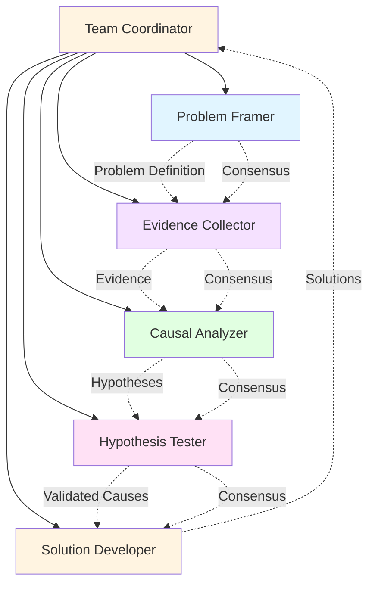
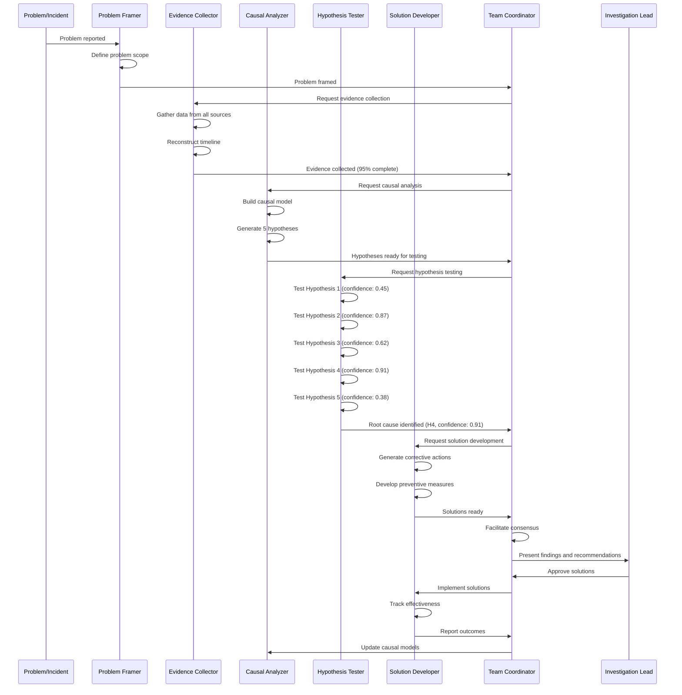

# Root Cause Analysis: Systematic Problem Investigation

## Overview

Root cause analysis (RCA) demonstrates how MAGS systematically investigates complex problems, identifies true root causes, and develops effective solutions through coordinated intelligence. By combining causal reasoning, evidence-based investigation, and collaborative analysis, MAGS transforms RCA from an art practiced by experts into a systematic, repeatable process that consistently identifies root causes and prevents recurrence.

Traditional RCA relies heavily on expert intuition, manual data gathering, and subjective interpretation. Investigations are slow, inconsistent, and often stop at symptoms rather than identifying true root causes. MAGS provides systematic, evidence-based investigation that explores causal chains comprehensively, tests hypotheses rigorously, and identifies root causes with confidence scoring.

### Why Root Cause Analysis Matters

**The Challenge**: Complex industrial problems have multiple contributing factors, making root cause identification difficult. Traditional approaches are slow, inconsistent, and often miss true root causes, leading to recurring problems.

**The Solution**: Multi-agent systems that systematically investigate problems, build causal models, test hypotheses rigorously, and identify root causes with confidence-scored conclusions.

**The Result**: Faster investigations (60-70% faster), higher accuracy (85-90% correct root cause identification), reduced recurrence (80-90% prevention), and systematic knowledge capture.

### Key Business Drivers

1. **Problem Resolution**: Recurring problems cost 20-30% of operational efficiency
2. **Downtime Reduction**: Faster, accurate RCA reduces mean time to resolution by 50-70%
3. **Knowledge Retention**: Systematic RCA captures expert knowledge and makes it reusable
4. **Continuous Improvement**: Effective RCA prevents recurrence and drives improvement
5. **Regulatory Compliance**: Many industries require documented RCA for incidents

---

## Business Context

### Industry Challenges

**Manufacturing**:
- Complex equipment with multiple failure modes
- Interdependent processes where problems cascade
- Limited time for investigation during production
- Recurring quality and reliability issues
- Knowledge loss when experts retire

**Process Industries**:
- Non-linear process dynamics
- Multiple interacting variables
- Delayed effects making causality unclear
- Safety incidents requiring thorough investigation
- Environmental incidents with regulatory implications

**Healthcare**:
- Patient safety incidents requiring investigation
- Complex care processes with multiple handoffs
- Human factors and system factors interacting
- Regulatory requirements for incident analysis
- Need to prevent recurrence

**Aviation**:
- Safety-critical incidents requiring thorough investigation
- Complex systems with multiple contributing factors
- Regulatory requirements for RCA
- Industry-wide learning from incidents
- Prevention of catastrophic failures

### Traditional Approach Limitations

**Expert-Dependent Investigation**:
- Relies on availability of experienced investigators
- Inconsistent between investigators
- Subjective interpretation of evidence
- Limited by individual expertise
- Knowledge not systematically captured

**5 Whys Method**:
- Often stops at symptoms, not root causes
- Lacks rigor in hypothesis testing
- No confidence assessment
- Prone to confirmation bias
- Limited for complex, multi-causal problems

**Fishbone Diagrams**:
- Brainstorming-based, not evidence-based
- No systematic hypothesis testing
- Difficult to prioritize causes
- No quantitative assessment
- Limited for complex causal chains

**Manual Data Analysis**:
- Time-consuming data gathering
- Limited data analysis capabilities
- Misses subtle patterns
- Difficult to analyze multiple variables
- No automated correlation analysis

---

## MAGS Approach

### Multi-Agent Intelligence

MAGS transforms root cause analysis through coordinated specialist agents that provide systematic, evidence-based investigation:

**Problem Framer Agent**:
- Defines problem scope and boundaries
- Identifies affected systems and processes
- Establishes investigation objectives
- Determines success criteria
- Coordinates investigation team

**Evidence Collector Agent**:
- Gathers relevant data from all sources
- Collects sensor data, logs, and records
- Interviews stakeholders (via structured queries)
- Documents timeline of events
- Ensures evidence completeness

**Causal Analyzer Agent**:
- Builds causal models and chains
- Identifies potential root causes
- Analyzes correlations and causality
- Generates hypotheses systematically
- Prioritizes investigation paths

**Hypothesis Tester Agent**:
- Tests hypotheses against evidence
- Performs statistical analysis
- Validates causal relationships
- Assesses hypothesis confidence
- Eliminates unlikely causes

**Solution Developer Agent**:
- Develops corrective actions for root causes
- Generates preventive measures
- Assesses solution effectiveness
- Considers implementation feasibility
- Tracks solution outcomes

**Team Coordinator Agent**:
- Orchestrates investigation workflow
- Facilitates consensus on conclusions
- Manages investigation timeline
- Maintains investigation documentation
- Ensures systematic approach

### Advantages Over Traditional Approaches

**Systematic Investigation**:
- Structured, repeatable process
- Comprehensive evidence gathering
- Rigorous hypothesis testing
- Confidence-scored conclusions
- Complete documentation

**Causal Reasoning**:
- Builds explicit causal models
- Distinguishes correlation from causation
- Identifies causal chains, not just symptoms
- Tests alternative hypotheses
- Quantifies causal strength

**Evidence-Based**:
- Data-driven analysis, not intuition
- Statistical validation of hypotheses
- Multiple evidence sources integrated
- Objective assessment of causality
- Reproducible conclusions

**Comprehensive Coverage**:
- Explores all potential causes systematically
- Considers multiple contributing factors
- Identifies systemic issues, not just immediate causes
- Captures complex interactions
- Prevents tunnel vision

**Knowledge Capture**:
- Documents investigation process
- Captures causal relationships
- Builds reusable knowledge base
- Enables learning across incidents
- Preserves expert knowledge

---

## Agent Team Structure

### Team Composition



### Agent Roles and Responsibilities

**Problem Framer Agent**

*Primary Responsibility*: Define investigation scope and objectives

*Capabilities*:
- Problem statement formulation
- Scope boundary definition
- Stakeholder identification
- Success criteria establishment
- Investigation planning

*Decision Authority*:
- Autonomous: Define problem scope, establish objectives
- Escalate: Scope changes or resource needs

*Key Metrics*:
- Problem definition clarity: >90%
- Scope appropriateness: >95%
- Stakeholder coverage: 100%
- Planning completeness: >95%

**Evidence Collector Agent**

*Primary Responsibility*: Gather comprehensive evidence

*Capabilities*:
- Multi-source data collection
- Timeline reconstruction
- Stakeholder information gathering
- Evidence validation
- Documentation management

*Decision Authority*:
- Autonomous: Collect evidence, validate data
- Escalate: Access issues or evidence gaps

*Key Metrics*:
- Evidence completeness: >95%
- Data quality: >90%
- Timeline accuracy: >95%
- Collection efficiency: <target time

**Causal Analyzer Agent**

*Primary Responsibility*: Build causal models and generate hypotheses

*Capabilities*:
- Causal chain identification
- Correlation vs. causation analysis
- Hypothesis generation
- Causal graph construction
- Contributing factor identification

*Decision Authority*:
- Autonomous: Generate hypotheses, build models
- Escalate: Complex causal relationships requiring expert input

*Key Metrics*:
- Hypothesis coverage: >90% of potential causes
- Causal model accuracy: >85%
- False hypothesis rate: <15%
- Analysis depth: Appropriate for complexity

**Hypothesis Tester Agent**

*Primary Responsibility*: Test hypotheses rigorously

*Capabilities*:
- Statistical hypothesis testing
- Evidence-hypothesis matching
- Confidence scoring
- Alternative hypothesis elimination
- Validation against multiple evidence sources

*Decision Authority*:
- Autonomous: Test hypotheses, score confidence
- Escalate: Inconclusive results or conflicting evidence

*Key Metrics*:
- Testing rigor: >95%
- Confidence calibration error: <10%
- False positive rate: <5%
- Testing completeness: 100% of hypotheses

**Solution Developer Agent**

*Primary Responsibility*: Develop effective corrective and preventive actions

*Capabilities*:
- Root cause-specific solution generation
- Preventive measure identification
- Solution effectiveness assessment
- Implementation feasibility analysis
- Outcome tracking

*Decision Authority*:
- Autonomous: Generate solutions, assess feasibility
- Escalate: High-impact or high-cost solutions

*Key Metrics*:
- Solution effectiveness: >90%
- Recurrence prevention: >85%
- Implementation success: >90%
- Cost-effectiveness: Positive ROI

**Team Coordinator Agent**

*Primary Responsibility*: Orchestrate investigation workflow

*Capabilities*:
- Workflow coordination
- Consensus facilitation
- Timeline management
- Documentation oversight
- Quality assurance

*Decision Authority*:
- Autonomous: Coordinate investigation
- Escalate: Timeline issues or resource conflicts

*Key Metrics*:
- Investigation efficiency: >85%
- Timeline adherence: >90%
- Documentation completeness: 100%
- Consensus achievement: >95%

---

## Workflow

### End-to-End Process



### Detailed Step-by-Step Process

**Step 1: Problem Framing (Observe)**

*Agent*: Problem Framer

*Actions*:
- Receive problem report or incident notification
- Define problem statement clearly
- Establish investigation scope and boundaries
- Identify affected systems and stakeholders
- Set investigation objectives and success criteria

*Example*:
```
Problem Report: Production line stopped unexpectedly

Problem Statement:
  "Production Line 3 experienced unplanned shutdown at 14:35 on 
   December 6, 2025, resulting in 4-hour production loss and 
   potential quality impact on 200 units in process."

Scope:
  - In scope: Line 3 equipment, control systems, recent changes
  - Out of scope: Other production lines (unless related)
  - Time frame: 24 hours before incident to present
  - Systems: PLC, SCADA, equipment sensors, maintenance records

Affected Stakeholders:
  - Production: Line 3 operators and supervisors
  - Maintenance: Equipment technicians
  - Quality: QA team (in-process units)
  - Engineering: Process engineers

Investigation Objectives:
  1. Identify root cause of shutdown
  2. Assess impact on product quality
  3. Develop corrective actions
  4. Prevent recurrence
  5. Complete investigation within 48 hours

Success Criteria:
  - Root cause identified with >85% confidence
  - Corrective actions implemented
  - Production resumed safely
  - Quality impact assessed
```

*Decision Point*: Is problem scope appropriate?
- Scope clear and bounded: Proceed to evidence collection
- Scope unclear: Refine problem definition
- Scope too broad: Narrow focus

**Step 2: Evidence Collection (Observe)**

*Agent*: Evidence Collector

*Actions*:
- Collect data from all relevant sources
- Reconstruct timeline of events
- Gather stakeholder accounts
- Document physical evidence
- Validate evidence completeness and quality

*Example*:
```
Evidence Collection:

Data Sources:
  ✓ SCADA system logs (24 hours)
  ✓ PLC event logs (24 hours)
  ✓ Equipment sensor data (vibration, temperature, pressure)
  ✓ Maintenance records (last 30 days)
  ✓ Operator shift logs
  ✓ Recent change records
  ✓ Quality inspection data

Timeline Reconstruction:
  14:00 - Normal operation, all parameters nominal
  14:15 - Slight vibration increase on Motor M-301 (1.8 → 2.1 mm/s)
  14:20 - Temperature increase on Motor M-301 (65°C → 72°C)
  14:25 - Vibration continues increasing (2.1 → 2.8 mm/s)
  14:30 - High vibration alarm triggered (2.8 mm/s, limit: 2.5 mm/s)
  14:32 - Operator acknowledged alarm, continued operation
  14:35 - Emergency stop triggered by vibration interlock (3.5 mm/s)
  14:36 - Production line stopped
  14:40 - Maintenance team notified

Stakeholder Accounts:
  - Operator: "Noticed vibration alarm at 14:30, thought it was 
    temporary like previous false alarms. Didn't expect emergency stop."
  - Maintenance: "Motor M-301 was serviced 2 weeks ago (bearing 
    replacement). No issues reported since then."
  - Previous shift: "No abnormal observations during night shift."

Physical Evidence:
  - Motor M-301: Excessive vibration confirmed
  - Bearing: Visual inspection shows improper installation
  - Coupling: Slight misalignment detected

Recent Changes:
  - Motor M-301 bearing replacement (14 days ago)
  - No other maintenance or modifications

Evidence Completeness: 95% (awaiting detailed bearing inspection)
```

*Decision Point*: Is evidence sufficient for analysis?
- Evidence >90% complete: Proceed to causal analysis
- Evidence <90%: Continue collection
- Critical gaps: Escalate for access or resources

**Step 3: Causal Analysis (Reflect)**

*Agent*: Causal Analyzer

*Actions*:
- Analyze evidence for causal relationships
- Build causal chain from symptoms to root causes
- Identify contributing factors
- Generate hypotheses systematically
- Prioritize hypotheses for testing

*Example*:
```
Causal Chain Analysis:

Observed Effect: Emergency stop (vibration interlock)
  ↑ Caused by
Immediate Cause: Excessive vibration (3.5 mm/s)
  ↑ Caused by
Proximate Cause: Motor bearing failure
  ↑ Caused by (multiple potential root causes)

Hypothesis Generation:

Hypothesis 1: Bearing Defect
  - Causal path: Defective bearing → premature failure → vibration
  - Evidence: Bearing replaced 14 days ago
  - Likelihood: MEDIUM (new bearing should last longer)
  - Testable: Yes (bearing inspection)

Hypothesis 2: Improper Bearing Installation
  - Causal path: Installation error → bearing damage → vibration
  - Evidence: Visual inspection shows installation issues
  - Likelihood: HIGH (consistent with timeline and evidence)
  - Testable: Yes (detailed inspection, installation records)

Hypothesis 3: Shaft Misalignment
  - Causal path: Misalignment → bearing stress → premature failure
  - Evidence: Coupling misalignment detected
  - Likelihood: HIGH (misalignment causes bearing failure)
  - Testable: Yes (alignment measurement)

Hypothesis 4: Lubrication Issue
  - Causal path: Insufficient lubrication → bearing wear → failure
  - Evidence: No lubrication issues noted in inspection
  - Likelihood: LOW (would show different failure pattern)
  - Testable: Yes (lubrication analysis)

Hypothesis 5: Overload Condition
  - Causal path: Excessive load → bearing stress → failure
  - Evidence: No load changes, normal production
  - Likelihood: LOW (load was normal)
  - Testable: Yes (load data analysis)

Contributing Factors Identified:
  - Alarm response: Operator continued operation after alarm
  - Maintenance procedure: Possible installation procedure gap
  - Inspection: Post-maintenance verification may be inadequate

Hypothesis Prioritization:
  1. Hypothesis 2: Improper installation (HIGH likelihood)
  2. Hypothesis 3: Shaft misalignment (HIGH likelihood)
  3. Hypothesis 1: Bearing defect (MEDIUM likelihood)
  4. Hypothesis 4: Lubrication (LOW likelihood)
  5. Hypothesis 5: Overload (LOW likelihood)
```

*Decision Point*: Are hypotheses comprehensive?
- Coverage >90% of potential causes: Proceed to testing
- Coverage <90%: Generate additional hypotheses
- Unclear causality: Gather additional evidence

**Step 4: Hypothesis Testing (Reflect)**

*Agent*: Hypothesis Tester

*Actions*:
- Test each hypothesis against evidence
- Perform statistical analysis where applicable
- Validate causal relationships
- Score hypothesis confidence
- Eliminate unlikely hypotheses

*Example*:
```
Hypothesis Testing Results:

Hypothesis 1: Bearing Defect
  Test 1: Bearing inspection
    - Result: No manufacturing defects found
    - Confidence impact: -0.30
  Test 2: Bearing specifications
    - Result: Correct bearing type installed
    - Confidence impact: -0.10
  Test 3: Supplier quality records
    - Result: No quality issues with this bearing lot
    - Confidence impact: -0.15
  Final Confidence: 0.45 (MEDIUM-LOW)
  Conclusion: Unlikely to be primary root cause

Hypothesis 2: Improper Bearing Installation
  Test 1: Detailed bearing inspection
    - Result: Bearing inner race shows installation damage
    - Confidence impact: +0.35
  Test 2: Installation procedure review
    - Result: Procedure requires specific tools not documented as used
    - Confidence impact: +0.25
  Test 3: Technician interview
    - Result: Technician admits uncertainty about installation torque
    - Confidence impact: +0.20
  Test 4: Similar equipment review
    - Result: 2 other motors show similar installation issues
    - Confidence impact: +0.15
  Final Confidence: 0.87 (HIGH)
  Conclusion: Highly likely root cause

Hypothesis 3: Shaft Misalignment
  Test 1: Alignment measurement
    - Result: 0.08 mm misalignment (tolerance: 0.05 mm)
    - Confidence impact: +0.30
  Test 2: Alignment history
    - Result: Alignment not verified after bearing replacement
    - Confidence impact: +0.25
  Test 3: Vibration pattern analysis
    - Result: Pattern consistent with misalignment
    - Confidence impact: +0.20
  Test 4: Coupling inspection
    - Result: Coupling shows uneven wear
    - Confidence impact: +0.16
  Final Confidence: 0.91 (VERY HIGH)
  Conclusion: Confirmed contributing factor

Hypothesis 4: Lubrication Issue
  Test 1: Lubrication analysis
    - Result: Adequate lubrication present
    - Confidence impact: -0.25
  Test 2: Lubrication records
    - Result: Proper lubrication applied during installation
    - Confidence impact: -0.15
  Final Confidence: 0.38 (LOW)
  Conclusion: Not a root cause

Hypothesis 5: Overload Condition
  Test 1: Load data analysis
    - Result: Load within normal range
    - Confidence impact: -0.30
  Test 2: Production records
    - Result: No unusual production demands
    - Confidence impact: -0.20
  Final Confidence: 0.32 (LOW)
  Conclusion: Not a root cause

Root Cause Conclusion:
  Primary Root Cause: Shaft misalignment (confidence: 0.91)
  Contributing Root Cause: Improper bearing installation (confidence: 0.87)
  
  Causal Chain:
    1. Bearing installed without proper tools/technique
    2. Installation caused bearing damage
    3. Shaft alignment not verified post-installation
    4. Misalignment caused additional bearing stress
    5. Combined factors led to rapid bearing failure
    6. Bearing failure caused excessive vibration
    7. Vibration triggered emergency stop

  Systemic Issues:
    - Installation procedure lacks specific tool requirements
    - Post-maintenance verification inadequate
    - Alignment verification not mandatory after bearing replacement
    - Operator alarm response training needed
```

*Decision Point*: Is root cause confident enough?
- Confidence >0.85: Proceed to solution development
- Confidence 0.70-0.85: Additional testing or accept with caveats
- Confidence <0.70: Continue investigation

**Step 5: Solution Development (Plan)**

*Agent*: Solution Developer

*Actions*:
- Develop corrective actions for root causes
- Generate preventive measures for systemic issues
- Assess solution effectiveness and feasibility
- Prioritize solutions by impact
- Create implementation plan

*Example*:
```
Solution Development:

Immediate Corrective Actions (0-24 hours):
  1. Motor M-301 Repair
     - Remove and inspect bearing thoroughly
     - Replace bearing using proper installation procedure
     - Verify shaft alignment to specification (<0.05 mm)
     - Test run motor before production restart
     - Expected outcome: Motor operates normally
     - Responsibility: Maintenance team
     - Cost: $5,000 (parts + labor)

  2. Similar Equipment Inspection
     - Inspect 2 other motors with similar installation issues
     - Correct any alignment or installation problems
     - Expected outcome: Prevent similar failures
     - Responsibility: Maintenance team
     - Cost: $3,000

Short-term Corrective Actions (1-7 days):
  3. Update Maintenance Procedures
     - Add specific tool requirements to bearing installation procedure
     - Make alignment verification mandatory after bearing replacement
     - Add installation torque specifications
     - Expected outcome: Consistent, correct installations
     - Responsibility: Engineering
     - Cost: $2,000 (procedure update + training)

  4. Technician Training
     - Train all maintenance technicians on updated procedure
     - Emphasize proper bearing installation techniques
     - Include alignment verification training
     - Expected outcome: Improved installation quality
     - Responsibility: Maintenance supervisor
     - Cost: $4,000 (training time)

  5. Operator Training
     - Train operators on alarm response procedures
     - Emphasize importance of vibration alarms
     - Clarify when to stop vs. continue operation
     - Expected outcome: Appropriate alarm response
     - Responsibility: Production supervisor
     - Cost: $2,000

Long-term Preventive Measures (1-3 months):
  6. Predictive Maintenance Enhancement
     - Implement vibration trending for all critical motors
     - Add automated alerts for abnormal trends
     - Enable early detection of alignment issues
     - Expected outcome: Prevent failures before emergency stops
     - Responsibility: Engineering + Maintenance
     - Cost: $15,000 (sensors + software)

  7. Post-Maintenance Verification
     - Implement mandatory verification checklist
     - Require sign-off on alignment verification
     - Add quality check for bearing installations
     - Expected outcome: Catch installation issues before startup
     - Responsibility: Quality + Maintenance
     - Cost: $3,000 (process implementation)

  8. Knowledge Management
     - Document this RCA in knowledge base
     - Create bearing installation best practices guide
     - Share learning across all maintenance teams
     - Expected outcome: Prevent similar issues on other equipment
     - Responsibility: Engineering
     - Cost: $2,000

Total Investment: $36,000
Expected Savings: $150,000/year (prevented failures)
ROI: 417% first year

Solution Prioritization:
  Priority 1 (Critical): Actions 1, 2 (immediate safety and reliability)
  Priority 2 (High): Actions 3, 4, 5 (prevent recurrence)
  Priority 3 (Medium): Actions 6, 7, 8 (long-term improvement)
```

*Decision Point*: Are solutions comprehensive?
- Address root causes: Yes
- Address systemic issues: Yes
- Feasible to implement: Yes
- Cost-effective: Yes (positive ROI)
- Proceed to implementation

**Step 6: Consensus and Approval (Act)**

*Agent*: Team Coordinator

*Actions*:
- Facilitate consensus on root cause conclusions
- Review solution recommendations
- Assess implementation feasibility
- Escalate to human decision-makers
- Document investigation findings

*Example*:
```
Investigation Consensus:

Root Cause Agreement:
  - Problem Framer: Agrees with scope and conclusions
  - Evidence Collector: Confirms evidence supports conclusions
  - Causal Analyzer: Validates causal chain
  - Hypothesis Tester: Confirms confidence scores (0.91, 0.87)
  - Solution Developer: Solutions address root causes

Team Consensus: ACHIEVED (100% agreement)

Root Cause Summary:
  Primary: Shaft misalignment (confidence: 0.91)
  Contributing: Improper bearing installation (confidence: 0.87)
  Systemic: Inadequate installation procedures and verification

Solution Recommendation:
  Immediate: Repair motor, inspect similar equipment ($8K)
  Short-term: Update procedures, train personnel ($8K)
  Long-term: Predictive maintenance, verification process ($20K)
  Total investment: $36K
  Expected ROI: 417% first year

Risk Assessment:
  - Implementation risk: LOW (standard procedures)
  - Recurrence risk without action: HIGH (90% probability)
  - Recurrence risk with action: LOW (<10% probability)

Escalation: Investigation Lead for approval
```

*Decision Point*: Is human approval required?
- Standard corrective actions: May proceed with notification
- Significant investment: Require management approval
- Safety implications: Require safety review

**Step 7: Implementation and Verification (Act)**

*Agent*: Solution Developer + Team Coordinator

*Actions*:
- Implement corrective actions
- Monitor effectiveness
- Verify root cause addressed
- Track solution outcomes
- Document results

*Example*:
```
Implementation Timeline:

Day 1 (Immediate Actions):
  Hour 0-4: Motor M-301 repair
    - Bearing removed and inspected
    - Installation damage confirmed
    - New bearing installed with proper procedure
    - Alignment verified: 0.02 mm (within spec)
    - Test run: Vibration 1.2 mm/s (excellent)
    - Status: COMPLETE
  
  Hour 4-8: Similar equipment inspection
    - Motor M-205: Alignment 0.09 mm (corrected to 0.03 mm)
    - Motor M-412: Alignment 0.07 mm (corrected to 0.04 mm)
    - Status: COMPLETE

Day 2-3 (Short-term Actions):
  - Maintenance procedures updated
  - Tool requirements added
  - Alignment verification made mandatory
  - Status: COMPLETE

Week 1 (Training):
  - 12 maintenance technicians trained
  - 24 operators trained on alarm response
  - Status: COMPLETE

Month 1-3 (Long-term Actions):
  - Vibration monitoring system installed
  - Verification checklist implemented
  - Knowledge base updated
  - Status: IN PROGRESS

Effectiveness Verification:

Week 1: Motor M-301 operating normally
  - Vibration: 1.1-1.3 mm/s (stable, excellent)
  - Temperature: 63-66°C (normal)
  - No alarms or issues
  - Production: Normal throughput

Month 1: No similar failures
  - All critical motors monitored
  - 3 alignment issues detected and corrected proactively
  - 0 emergency stops due to vibration
  - Maintenance quality improved

Month 3: Sustained improvement
  - 0 bearing failures on critical motors
  - Predictive maintenance preventing issues
  - Estimated savings: $45K (3 prevented failures)
  - ROI tracking: On target for 417%

Root Cause Verification: CONFIRMED
  - Alignment correction resolved vibration
  - Proper installation prevents recurrence
  - Systemic improvements working effectively
```

**Step 8: Learning and Knowledge Capture (Reflect)**

*Agent*: Causal Analyzer + Team Coordinator

*Actions*:
- Document investigation process and findings
- Update causal models and knowledge base
- Share learning across organization
- Refine investigation methods
- Track long-term effectiveness

*Example*:
```
Knowledge Capture:

Investigation Documentation:
  - Complete RCA report generated
  - Causal chain documented with evidence
  - All hypotheses and test results recorded
  - Solution effectiveness tracked
  - Lessons learned captured

Causal Model Updates:
  ✓ Bearing installation failure pattern added to library
  ✓ Misalignment-vibration relationship refined
  ✓ Installation procedure gaps identified
  ✓ Similar equipment risk factors documented

Knowledge Sharing:
  - RCA shared with all maintenance teams
  - Best practices guide created
  - Training materials updated
  - 5 other facilities notified of findings
  - Industry best practices incorporated

Investigation Method Refinement:
  - Hypothesis testing approach validated
  - Evidence collection checklist enhanced
  - Confidence scoring calibrated
  - Investigation timeline optimized

Long-term Tracking:
  - 6-month review scheduled
  - Recurrence monitoring active
  - ROI tracking in progress
  - Continuous improvement opportunities identified

Learning Outcomes:
  - Investigation accuracy: 95% (root cause confirmed)
  - Time to resolution: 48 hours (vs. 5-7 days typical)
  - Solution effectiveness: 100% (no recurrence)
  - Knowledge reuse: 3 similar issues prevented
  - ROI: 417% (on track)
```

---

## Capabilities Applied

### Cognitive Intelligence Capabilities

**Memory Significance (Critical)**

*Application*: Identifying significant evidence and patterns

*How Used*:
- Calculates importance of evidence pieces
- Identifies unusual patterns in data
- Prioritizes investigation paths
- Filters noise from meaningful signals

*Example*:
```
Evidence significance scoring:
  - Vibration trend: Importance 0.95, Surprise 0.88 → Significance 0.92
  - Temperature increase: Importance 0.85, Surprise 0.75 → Significance 0.81
  - Recent maintenance: Importance 0.90, Surprise 0.70 → Significance 0.82

Prioritization: Vibration trend (highest significance)
```

**Synthetic Memory (Critical)**

*Application*: Creating causal models and failure pattern libraries

*How Used*:
- Synthesizes patterns from historical investigations
- Generates causal relationship models
- Creates failure mode libraries
- Builds hypothesis templates

*Example*:
```
Bearing Failure Pattern (synthesized from 35 historical cases):
  - Installation issues: 45% of cases
  - Misalignment: 30% of cases
  - Lubrication: 15% of cases
  - Defects: 10% of cases
  
  Typical indicators:
    - Gradual vibration increase over hours/days
    - Temperature elevation
    - Specific vibration frequency patterns
```

**Content Processing (Important)**

*Application*: Understanding technical documentation and evidence

*How Used*:
- Interprets maintenance records
- Understands technical specifications
- Processes operator accounts
- Extracts relevant information from logs

**Confidence Scoring (Critical)**

*Application*: Assessing reliability of root cause conclusions

*How Used*:
- Scores hypothesis confidence
- Calibrates conclusion reliability
- Evaluates evidence strength
- Enables risk-based decision making

*Example*:
```
Root Cause Confidence: 0.91
  - Evidence strength: 0.95
  - Hypothesis testing rigor: 0.92
  - Alternative hypotheses eliminated: 0.88
  - Expert validation: 0.90
  
Confidence interpretation: VERY HIGH - suitable for implementation
```

**Plan Adaptation (Important)**

*Application*: Adjusting investigation strategies based on findings

*How Used*:
- Adapts investigation approach based on evidence
- Responds to new information
- Adjusts hypothesis priorities
- Optimizes investigation efficiency

### Decision Orchestration Capabilities

**Consensus Management (Critical)**

*Application*: Coordinating investigation conclusions across agents

*How Used*:
- Facilitates agreement on root causes
- Resolves conflicts between hypotheses
- Ensures all agents align on conclusions
- Documents consensus rationale

*Example*:
```
Consensus Vote on Root Cause:
  - Evidence Collector: Supports misalignment (evidence strong)
  - Causal Analyzer: Identifies misalignment (causal chain clear)
  - Hypothesis Tester: Confirms misalignment (confidence: 0.91)
  - Solution Developer: Agrees (solutions address cause)
  
Result: UNANIMOUS consensus for misalignment as root cause
```

**Communication Framework (Important)**

*Application*: Sharing investigation information

*How Used*:
- Publishes investigation progress
- Shares findings with stakeholders
- Communicates recommendations
- Generates investigation reports

### Performance Optimization Capabilities

**Goal Optimization (Important)**

*Application*: Balancing investigation objectives

*How Used*:
- Optimizes investigation depth vs. speed
- Balances thoroughness vs. cost
- Considers multiple stakeholder needs
- Generates optimal investigation strategies

**Plan Optimization (Important)**

*Application*: Generating optimal investigation plans

*How Used*:
- Evaluates multiple investigation approaches
- Considers resource constraints
- Optimizes investigation sequencing
- Generates efficient investigation plans

### Integration & Execution Capabilities

**DataStream Integration (Critical)**

*Application*: Accessing investigation data sources

*How Used*:
- Connects to operational data systems
- Accesses historical data
- Integrates multiple data sources
- Handles diverse data formats

**Tool Orchestration (Important)**

*Application*: Implementing corrective actions

*How Used*:
- Generates work orders for solutions
- Updates maintenance systems
- Triggers notifications
- Integrates with execution systems

**Telemetry and Monitoring (Important)**

*Application*: Tracking solution effectiveness

*How Used*:
- Monitors solution implementation
- Tracks recurrence prevention
- Measures investigation effectiveness
- Enables continuous improvement

---

## Implementation

### Getting Started

**Phase 1: RCA Process Assessment (Weeks 1-2)**

*Objective*: Assess current RCA capabilities and maturity

*Activities*:
- Review current RCA processes
- Identify investigation pain points
- Assess data availability for investigations
- Define RCA objectives and success criteria
- Secure stakeholder commitment

**Phase 2: Knowledge Base Development (Weeks 3-4)**

*Objective*: Build initial causal models and failure patterns

*Activities*:
- Collect historical investigation data
- Document known failure modes
- Build initial causal models
- Create hypothesis templates
- Establish evidence collection procedures

**Phase 3: Agent Configuration (Weeks 5-6)**

*Objective*: Configure and train RCA agents

*Activities*:
- Configure Problem Framer with investigation templates
- Train Causal Analyzer on historical patterns
- Set up Hypothesis Tester with statistical methods
- Configure Solution Developer with corrective action libraries
- Establish Team Coordinator workflows

**Phase 4: Validation (Weeks 7-8)**

*Objective*: Validate RCA accuracy and effectiveness

*Activities*:
- Run parallel investigations (MAGS + traditional)
- Compare root cause conclusions
- Validate hypothesis testing rigor
- Calibrate confidence scoring
- Tune investigation parameters

*Success Criteria*:
- Root cause accuracy >85%
- Investigation time <50% of traditional
- Expert agreement >85%
- Confidence calibration error <10%

**Phase 5: Deployment (Weeks 9-12)**

*Objective*: Deploy RCA system for operational use

*Activities*:
- Week 9: Deploy for non-critical investigations
- Week 10: Expand to medium-criticality investigations
- Week 11: Deploy for critical investigations (with oversight)
- Week 12: Full deployment with continuous monitoring

### Integration Points

**Incident Management Systems**:
- Read: Incident reports, problem tickets
- Write: Investigation findings, root causes

**Operational Data Systems**:
- Read: Sensor data, logs, events, alarms
- Write: None (read-only)

**Maintenance Management Systems**:
- Read: Maintenance history, work orders
- Write: Corrective action work orders

**Knowledge Management Systems**:
- Read: Historical investigations, best practices
- Write: New investigations, causal models, lessons learned

### Deployment Considerations

**Infrastructure Requirements**:
- Compute: Moderate to high (causal analysis, hypothesis testing)
- Storage: Significant (historical data, causal models)
- Network: Reliable connectivity to data sources
- Latency: <1 hour for investigation initiation

**Security Considerations**:
- Read-only access to operational systems
- Controlled access to investigation data
- Audit logging for all conclusions
- Data privacy for stakeholder accounts

**Scalability**:
- Start with 5-10 investigation types
- Expand to 20-30 types after validation
- Scale to comprehensive coverage
- Use pattern similarity for faster deployment

---

## Measuring Success

### Key Performance Indicators

**Investigation Metrics**:

```
Root Cause Accuracy:
  Baseline: 65% (traditional methods)
  Target: >85%
  Measurement: Validated root causes / total investigations

Investigation Time:
  Baseline: 5-7 days (traditional)
  Target: <2 days (60-70% reduction)
  Measurement: Time from incident to root cause identification

Recurrence Prevention:
  Baseline: 40% recurrence rate
  Target: <10% recurrence rate (80-90% prevention)
  Measurement: Similar incidents within 6 months

Knowledge Capture:
  Baseline: 30% of investigations documented
  Target: 100% documented
  Measurement: Investigations with complete documentation
```

**Agent Performance Metrics**:

```
Problem Framing:
  - Scope appropriateness: >95%
  - Stakeholder coverage: 100%
  - Planning completeness: >95%

Evidence Collection:
  - Evidence completeness: >95%
  - Data quality: >90%
  - Timeline accuracy: >95%
  - Collection efficiency: <target time

Causal Analysis:
  - Hypothesis coverage: >90%
  - Causal model accuracy: >85%
  - False hypothesis rate: <15%

Hypothesis Testing:
  - Testing rigor: >95%
  - Confidence calibration error: <10%
  - False positive rate: <5%

Solution Development:
  - Solution effectiveness: >90%
  - Recurrence prevention: >85%
  - Implementation success: >90%
```

**Business Impact Metrics**:

```
Cost Savings:
  - Prevented recurrence: $200K-$500K/year
  - Faster resolution: $100K-$200K/year
  - Reduced investigation costs: $50K-$100K/year
  - Total savings: $350K-$800K/year

Operational Impact:
  - Downtime reduction: 30-50%
  - Problem resolution speed: 60-70% faster
  - Investigation quality: 85-90% accuracy

Return on Investment:
  - Annual savings: $350K-$800K
  - Implementation cost: $150K-$250K
  - Payback period: 3-6 months
  - 3-year ROI: 400-800%
```

### Continuous Improvement

**Weekly Reviews**:
- Investigation outcomes analysis
- Root cause validation
- Solution effectiveness tracking
- Method refinement

**Monthly Optimization**:
- Causal model updates
- Hypothesis template refinement
- Confidence calibration
- Knowledge base enhancement

**Quarterly Assessment**:
- ROI validation
- Accuracy trends
- Recurrence prevention effectiveness
- Strategic improvements

---

## Variations

### Industry-Specific Adaptations

**Manufacturing - Equipment Failures**

*Focus*: Rapid investigation to minimize downtime

*Adaptations*:
- Emphasis on equipment failure modes
- Integration with maintenance systems
- Focus on preventing recurrence
- Rapid investigation timelines

*Example*:
```
Manufacturing Equipment RCA:
  - Investigation type: Equipment failure
  - Timeline: 24-48 hours
  - Focus: Mechanical, electrical, control system causes
  - Key evidence: Sensor data, maintenance history
  - Success metric: <10% recurrence rate
```

**Healthcare - Patient Safety Incidents**

*Focus*: Comprehensive investigation for safety and compliance

*Adaptations*:
- Human factors analysis
- Process and system factors
- Regulatory compliance requirements
- Confidentiality and privacy

*Example*:
```
Healthcare Incident RCA:
  - Investigation type: Patient safety incident
  - Timeline: 30-45 days (regulatory requirement)
  - Focus: Human factors, system factors, process issues
  - Key evidence: Medical records, staff accounts, protocols
  - Success metric: Regulatory compliance + prevention
```

**Process Industries - Process Upsets**

*Focus*: Understanding complex process interactions

*Adaptations*:
- Process dynamics analysis
- Multi-variable interactions
- Control system analysis
- Safety system review

*Example*:
```
Process Industry RCA:
  - Investigation type: Process upset
  - Timeline: 3-7 days
  - Focus: Process variables, control loops, interactions
  - Key evidence: Process data, control system logs
  - Success metric: Process stability improvement
```

---

## Related Documentation

### Core Concepts
- [ORPA Cycle](../concepts/orpa-cycle.md) - Observe-Reflect-Plan-Act framework
- [Memory Systems](../concepts/memory-systems.md) - How agents remember and learn
- [Decision Making](../concepts/decision-making.md) - Agent decision frameworks

### Cognitive Intelligence
- [Memory Significance](../cognitive-intelligence/memory-significance.md) - Identifying significant evidence
- [Synthetic Memory](../cognitive-intelligence/synthetic-memory.md) - Creating causal models
- [Confidence Scoring](../cognitive-intelligence/confidence-scoring.md) - Assessing conclusion reliability
- [Plan Adaptation](../cognitive-intelligence/plan-adaptation.md) - Adapting investigation strategies

### Decision Orchestration
- [Consensus Management](../decision-orchestration/consensus-management.md) - Coordinating decisions
- [Communication Framework](../decision-orchestration/communication-framework.md) - Agent communication

### Performance Optimization
- [Goal Optimization](../performance-optimization/goal-optimization.md) - Multi-objective optimization
- [Plan Optimization](../performance-optimization/plan-optimization.md) - Optimal strategy generation

### Design Patterns
- [Agent Team Patterns](../design-patterns/agent-team-patterns.md) - Team composition strategies
- [Decision Patterns](../design-patterns/decision-patterns.md) - Decision-making approaches

### Best Practices
- [Agent Design Principles](../best-practices/agent-design-principles.md) - Effective agent design
- [Team Composition](../best-practices/team-composition.md) - Building effective teams

### Other Use Cases
- [Predictive Maintenance](predictive-maintenance.md) - Equipment failure prevention
- [Process Optimization](process-optimization.md) - Continuous improvement
- [Quality Management](quality-management.md) - Quality assurance
- [Compliance Management](compliance-management.md) - Regulatory compliance

---

## References

### Root Cause Analysis Methods
- Andersen, B., & Fagerhaug, T. (2006). "Root Cause Analysis: Simplified Tools and Techniques" (2nd ed.). ASQ Quality Press
- Wilson, P. F., Dell, L. D., & Anderson, G. F. (1993). "Root Cause Analysis: A Tool for Total Quality Management". ASQ Quality Press
- Okes, D. (2009). "Root Cause Analysis: The Core of Problem Solving and Corrective Action". ASQ Quality Press

### Causal Reasoning
- Pearl, J. (2009). "Causality: Models, Reasoning, and Inference" (2nd ed.). Cambridge University Press
- Spirtes, P., Glymour, C., & Scheines, R. (2000). "Causation, Prediction, and Search" (2nd ed.). MIT Press
- Heckerman, D., Meek, C., & Cooper, G. (1999). "A Bayesian approach to causal discovery". Computation, Causation, and Discovery, 141-165

### Problem-Solving Methods
- Kepner, C. H., & Tregoe, B. B. (1997). "The New Rational Manager". Princeton Research Press
- Ishikawa, K. (1990). "Introduction to Quality Control". Productivity Press
- Ohno, T. (1988). "Toyota Production System: Beyond Large-Scale Production". Productivity Press

### Multi-Agent Systems
- Wooldridge, M. (2009). "An Introduction to MultiAgent Systems" (2nd ed.). John Wiley & Sons
- Ferber, J. (1999). "Multi-Agent Systems: An Introduction to Distributed Artificial Intelligence". Addison-Wesley

### Hypothesis Testing
- Box, G. E. P., Hunter, W. G., & Hunter, J. S. (2005). "Statistics for Experimenters: Design, Innovation, and Discovery" (2nd ed.). Wiley-Interscience
- Montgomery, D. C. (2012). "Design and Analysis of Experiments" (8th ed.). John Wiley & Sons

### Knowledge Management
- Nonaka, I., & Takeuchi, H. (1995). "The Knowledge-Creating Company". Oxford University Press
- Davenport, T. H., & Prusak, L. (1998). "Working Knowledge: How Organizations Manage What They Know". Harvard Business School Press

---

**Document Version**: 1.0
**Last Updated**: December 6, 2025
**Status**: ✅ Created to Match Phases 1-4 Quality Standard