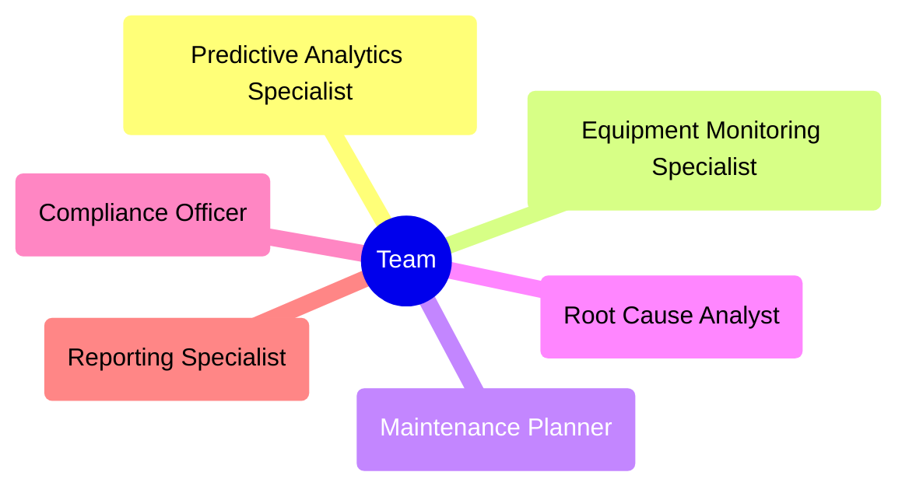

# Advanced Predictive Maintenance MAGS Team

## 1. Business Problem Definition and Objectives

### Business Objective

The primary business objective for implementing the Advanced Predictive Maintenance MAGS solution is to maximize the efficiency, reliability, and transparency of maintenance operations in industrial settings. This solution aims to transform reactive maintenance practices into proactive and predictive strategies, ensuring optimal equipment performance and minimizing unplanned downtime.

### Key Goals

1. **Improve Equipment Reliability and Uptime**
   - **Goal:** Minimize equipment failures and maximize operational uptime.
   - **Benefit:** Increased equipment reliability leads to higher production capacity, reduced downtime, and better utilization of resources.

2. **Optimize Maintenance Planning and Scheduling**
   - **Goal:** Develop and implement efficient maintenance schedules based on predictive data.
   - **Benefit:** Optimized maintenance schedules reduce unnecessary maintenance activities, minimize disruptions, and ensure timely interventions.

3. **Enhance Maintenance Management and Oversight**
   - **Goal:** Ensure all maintenance activities are effective, efficient, and comply with standards.
   - **Benefit:** Improved oversight ensures maintenance tasks are completed correctly, enhancing overall operational efficiency and safety.

4. **Provide Real-Time KPI Reporting and Feedback**
   - **Goal:** Offer transparent and real-time insights into maintenance operations through Key Performance Indicators (KPIs).
   - **Benefit:** Real-time KPI reporting enables quick identification of issues, facilitates data-driven decision-making, and supports continuous improvement.

5. **Ensure Compliance and Safety**
   - **Goal:** Adhere to maintenance standards and safety regulations.
   - **Benefit:** Compliance with standards and regulations protects the workforce, ensures legal compliance, and reduces the risk of accidents or incidents.

### Summary

The Advanced Predictive Maintenance MAGS team aims to create a highly efficient, reliable, and transparent maintenance operation within industrial environments. By improving equipment reliability, optimizing maintenance planning and scheduling, enhancing management oversight, and providing real-time KPI reporting, the system ensures significant gains in productivity, cost savings, and operational excellence. This holistic approach ensures that maintenance operations are not only optimized for current conditions but are also capable of adapting to future challenges and opportunities.

## 2. Requirements

### Functional Requirements

1. Real-time equipment monitoring and data collection
2. Predictive analytics for failure prediction and maintenance scheduling
3. Automated work order generation and management
4. Integration with existing CMMS and ERP systems
5. Root cause analysis capabilities for equipment failures
6. Real-time KPI dashboards and reporting
7. Mobile interface for field technicians
8. Historical data analysis and trend identification
9. Inventory management and spare parts optimization
10. Compliance and safety protocol management

### Non-Functional Requirements

1. Performance: Process and analyze data in real-time, with response times under 2 seconds for critical alerts
2. Reliability: 99.99% uptime for critical system components
3. Scalability: Ability to handle data from up to 10,000 sensors simultaneously
4. Security: End-to-end encryption for all data transmissions, role-based access control
5. Usability: Intuitive user interface with minimal training required for operators
6. Interoperability: Open APIs for integration with third-party systems
7. Data Retention: Capability to store and process 5 years of historical data
8. Auditability: Comprehensive logging of all system actions and decisions

### Potential Failure Modes

1. Sensor Malfunction: Inaccurate or missing data from equipment sensors
2. Algorithm Drift: Predictive models becoming less accurate over time
3. Communication Failures: Loss of connectivity between sensors and central system
4. False Positives: Incorrect prediction of equipment failures leading to unnecessary maintenance
5. Data Security Breach: Unauthorized access to sensitive maintenance and equipment data
6. System Overload: Inability to process large volumes of data during peak times
7. Integration Failures: Issues with connecting to existing CMMS or ERP systems
8. Human Error: Incorrect data entry or misinterpretation of system recommendations

## 3. Team Capabilities

1. Advanced data analytics and machine learning for predictive modeling
2. Real-time equipment monitoring and data processing
3. Maintenance planning and scheduling optimization
4. Root cause analysis and failure mode prediction
5. Compliance management and safety protocol adherence
6. Real-time reporting and KPI tracking
7. Mobile application development for field technicians
8. Integration expertise with CMMS and ERP systems
9. Cybersecurity and data protection
10. User interface design and user experience optimization

## 4. Team Composition and Agent Roles

### Agent Role Suggestions

1. Predictive Analytics Specialist Agent
2. Equipment Monitoring and Diagnostics Agent
3. Maintenance Planning and Scheduling Agent
4. Root Cause Analysis Agent
5. Compliance and Safety Officer Agent
6. Reporting and KPI Tracking Agent

### Team Structure


## 5. Agent Profiles

[Compliance and Safety Officer Agent Profile](../agent_profiles/compliance_and_safety_officer_agent.md)

[Equipment Monitoring and Diagnostics Agent Profile](../agent_profiles/equipment_monitoring_and_diagnostics_agent.md)

[Maintenance Planning and Scheduling Agent Profile](../agent_profiles/maintenance_planning_and_scheduling_agent.md)

[Predictive Analytics Specialist Agent Profile](../agent_profiles/predictive_analytics_specialist_agent.md)

[Reporting and KPI Tracking Agent Profile](../agent_profiles/reporting_and_kpi_tracking_agent.md)

[Root Cause Analysis Agent Profile](../agent_profiles/root_cause_analysis_agent_profile.md)

## 6. Deontic Rules for MAGS Agents Collaboration and Operation

### Obligation Rules (O)

1. **O1: Data Sharing Obligation**
   - Agents must share relevant data and insights with other agents in real-time to ensure comprehensive and coordinated optimization.

2. **O2: Compliance with Standard Operating Procedures (SOP)**
   - Agents must operate in compliance with established SOPs of the maintenance operations.

3. **O3: Safety and Reliability Prioritization**
   - Agents must prioritize safety and reliability in all recommendations and actions.

4. **O4: Continuous Learning**
   - Agents must continuously update their knowledge base and models based on new data and outcomes.

5. **O5: Transparency in Decision-Making**
   - Agents must provide clear explanations for their recommendations and decisions when requested.

### Permission Rules (P)
1. **P1: Autonomous Schedule Adjustments**
   - Agents are permitted to make minor adjustments to maintenance schedules without human approval, within predefined limits.

2. **P2: Data Access**
   - Agents are permitted to access historical maintenance records and real-time sensor data relevant to their function.

3. **P3: Inter-Agent Communication**
   - Agents are permitted to initiate communication with other agents to request information or collaborate on tasks.

### Prohibition Rules (F)
1. **F1: Unauthorized System Changes**
   - Agents are prohibited from making changes to critical system parameters without human authorization.

2. **F2: Confidentiality Breaches**
   - Agents are prohibited from sharing sensitive maintenance data outside the authorized system boundaries.

3. **F3: Exceeding Authority**
   - Agents are prohibited from making decisions or taking actions beyond their defined roles and capabilities.

### Conditional Rules (C)
1. **C1: Escalation Protocol**
   - If predicted failure probability exceeds 80%, agents must escalate the issue to human supervisors immediately.

2. **C2: Emergency Override**
   - In case of imminent safety risks, agents are authorized to bypass standard procedures to prevent accidents or equipment damage.

3. **C3: Model Retraining Trigger**
   - If prediction accuracy falls below 85% for any agent, a model retraining process must be initiated.

### Normative Rules (N)
1. **N1: Collaborative Problem Solving**
   - Agents should work collaboratively to solve complex maintenance issues, sharing insights and coordinating actions.

2. **N2: Continuous Improvement Focus**
   - Agents should consistently seek ways to improve maintenance processes and their own performance.

3. **N3: Human-AI Cooperation**
   - Agents should support and complement human decision-making, not replace it entirely.

## 7. Performance Metrics Definition

1. Overall Equipment Effectiveness (OEE): Target 85%, Weight 20%
2. Mean Time Between Failures (MTBF): Target 2000 hours, Weight 15%
3. Mean Time To Repair (MTTR): Target 4 hours, Weight 15%
4. Planned Maintenance Percentage (PMP): Target 80%, Weight 10%
5. Maintenance Cost as Percentage of Replacement Asset Value (RAV): Target 2.5%, Weight 10%
6. Safety Incident Rate: Target 0 incidents, Weight 10%
7. Predictive Model Accuracy: Target 95%, Weight 10%
8. Compliance Rate: Target 100%, Weight 10%

## 8. Communication Protocol Setup

1. Primary Channel: Integrated Maintenance Management System (IMMS) for routine communication and data sharing
2. Escalation Channel: Alert system for critical issues, directly notifying relevant human supervisors
3. Update Frequency: Real-time for critical data, hourly for performance summaries, daily for detailed reports
4. Reporting Schedule: 
   - Daily: Automated performance summary at 06:00 local time
   - Weekly: Comprehensive maintenance report every Monday at 09:00 local time
   - Monthly: Strategic review report on the 1st of each month
5. Inter-Agent Communication: REST API for structured data exchange, publish-subscribe system for event-driven updates
6. Human Interface: Web-based dashboard for real-time monitoring, mobile app for field technicians

## 9. Decision-Making Process

1. Routine Decisions: 
   - Agents have 90% autonomy for standard operations within defined parameters
   - Decisions are logged and reviewable by human supervisors
2. Critical Decisions:
   - Require consensus from at least 3 relevant agents
   - Must have a confidence level of 95% or higher
   - Logged with detailed justification for human review
3. Emergency Decisions:
   - Any agent can trigger emergency protocols for imminent safety or critical equipment risks
   - Immediate notification to human supervisors
   - Full autonomy to take preventive actions within safety guidelines
4. Human Oversight:
   - All decisions impacting production schedules or involving high-cost components require human approval
   - Weekly review of agent decision logs by maintenance managers
5. Escalation:
   - Automatic escalation to human supervisors for unresolved issues after 2 hours
   - Tiered escalation based on severity: Supervisor > Manager > Director
6. Conflict Resolution:
   - In case of inter-agent conflicts, the Reporting and KPI Tracking Agent acts as an arbiter
   - If unresolved, escalated to human decision-makers

## 10. Operational Constraints

1. Response Time: Critical alerts must be processed and escalated within 30 seconds
2. Decision Time: Routine decisions must be made within 5 minutes, critical decisions within 2 minutes
3. System Availability: 99.99% uptime required for critical components
4. Data Freshness: Sensor data must be no more than 5 seconds old when processed
5. Model Accuracy: Predictive models must maintain at least 90% accuracy, triggering retraining if they fall below
6. Compliance: All operations must adhere to ISO 55000 (Asset Management) standards
7. Security: All data transmissions must be encrypted, and access controlled via multi-factor authentication
8. Audit Trail: All agent actions and decisions must be logged for a minimum of 5 years
9. Resource Utilization: CPU usage should not exceed 80% for more than 5 minutes
10. Maintenance Window: System updates and non-critical maintenance limited to 2am-4am local time on Sundays

## 11. System Workflow

1. **Data Collection:** Continuous ingestion of sensor data, maintenance records, and operational inputs from various sources
2. **Data Processing and Analysis:** Agents process incoming data, applying their specialized analytics and models
3. **Predictive Modeling:** Predictive Analytics Agent generates failure probabilities and maintenance forecasts
4. **Health Monitoring:** Equipment Monitoring Agent continuously assesses current equipment state
5. **Maintenance Planning:** Planning Agent optimizes maintenance schedules based on predictions and current health
6. **Execution and Monitoring:** Planned maintenance is executed, with real-time monitoring for anomalies
7. **Performance Tracking:** KPI Tracking Agent continuously updates performance metrics
8. **Reporting and Feedback:** Regular reports are generated, and feedback is incorporated for continuous improvement
9. **Compliance Checking:** Compliance Agent ensures all activities adhere to regulations and standards
10. **Root Cause Analysis:** For any failures or significant anomalies, RCA Agent conducts in-depth analysis
11. **Knowledge Update:** Insights from all processes are used to update agent knowledge bases and models
12. **Human Interface:** Results, recommendations, and alerts are presented to human operators via dashboards and reports

## 12. Implementation Considerations

1. Data Integration: Develop robust ETL processes to integrate data from diverse legacy systems
2. Scalability: Design the system architecture to easily accommodate additional equipment and new plants
3. Security: Implement end-to-end encryption and role-based access control to protect sensitive maintenance data
4. Change Management: Develop a comprehensive training program for maintenance staff to adapt to the new AI-driven processes
5. Fallback Procedures: Establish manual backup procedures in case of system failures
6. Regulatory Compliance: Ensure the system meets all relevant industry standards and regulations (e.g., ISO 55000, OSHA requirements)
7. Performance Monitoring: Implement thorough monitoring of the MAGS system itself to ensure optimal performance
8. Customization: Allow for customization of agent behaviors and reports to meet specific plant or equipment needs
9. Offline Capabilities: Develop offline modes for critical functions in case of network issues
10. Vendor Lock-in Mitigation: Use open standards and APIs where possible to avoid dependency on specific vendors
11. Ethical Considerations: Establish clear guidelines for AI decision-making, especially in safety-critical situations
12. Continuous Improvement: Set up a regular review process to evaluate and enhance the system based on operational feedback

## 13. Review and Summary

The Advanced Predictive Maintenance MAGS Team represents a sophisticated application of AI and machine learning technologies to revolutionize maintenance operations. Key aspects of this system include:

1. Comprehensive Agent Coverage: With specialized agents for predictive analytics, equipment monitoring, maintenance planning, root cause analysis, compliance, and reporting, the team covers all critical aspects of maintenance operations.

2. Data-Driven Decision Making: By leveraging real-time data from sensors, historical maintenance records, and operational inputs, the system enables highly informed and timely decision-making.

3. Predictive Capabilities: The Predictive Analytics Agent's ability to forecast equipment failures allows for a shift from reactive to proactive maintenance strategies, potentially saving significant costs and reducing downtime.

4. Optimized Resource Allocation: Through intelligent scheduling and prioritization, the system ensures efficient use of maintenance resources, balancing immediate needs with long-term equipment health.

5. Compliance and Safety Focus: The dedicated Compliance and Safety Officer Agent ensures that all maintenance activities adhere to regulatory requirements and safety standards, reducing risks and potential liabilities.

6. Continuous Improvement: With built-in feedback loops and the ability to learn from outcomes, the system is designed to continuously improve its performance over time.

7. Scalability and Flexibility: The system architecture allows for easy integration of new equipment or expansion to additional facilities, ensuring long-term viability and adaptability.

Potential challenges and considerations include:

1. Data Quality and Integration: The system's effectiveness relies heavily on the quality and completeness of input data. Ensuring seamless integration with existing systems and maintaining data integrity will be crucial.

2. Change Management: Implementing such an advanced system may require significant changes to existing maintenance processes and workflows. Proper training and change management strategies will be essential for successful adoption.

3. Balancing Autonomy and Oversight: While the system is designed for high autonomy in routine operations, maintaining appropriate human oversight, especially for critical decisions, will be an ongoing challenge.

4. Handling Edge Cases: The system must be robust enough to handle unusual or unprecedented situations that may not be well-represented in historical data.

5. Ethical and Liability Considerations: As AI plays a more significant role in decision-making, clear guidelines must be established regarding responsibility and liability, especially in safety-critical situations.

Expected impact:

1. Increased Equipment Reliability: By predicting and preventing failures before they occur, the system should significantly improve overall equipment reliability and uptime.

2. Cost Reduction: Optimized maintenance scheduling and reduced unexpected downtime should lead to substantial cost savings in both maintenance activities and lost production time.

3. Improved Safety: Proactive identification of potential issues and strict adherence to safety protocols should result in a safer working environment.

4. Enhanced Compliance: Automated tracking and reporting of compliance-related activities will help ensure consistent adherence to regulatory requirements.

5. Data-Driven Culture: The implementation of this system is likely to foster a more data-driven culture within the maintenance organization, leading to more informed decision-making at all levels.

6. Competitive Advantage: The improved efficiency and reliability offered by this system could provide a significant competitive advantage in terms of production capabilities and cost structure.

In conclusion, the Advanced Predictive Maintenance MAGS Team represents a powerful tool for transforming maintenance operations. Its success will depend on careful implementation, ongoing refinement, and a commitment to data-driven, AI-augmented decision-making processes. With proper execution, this system has the potential to deliver substantial improvements in equipment reliability, cost efficiency, and overall maintenance effectiveness.

## 14. Team Manifest (JSON)

```json
{
  "team_id": "LOCATION-PROD-OPS-TEAM-001",
  "name": "Advanced Predictive Maintenance Team",
  "version": "1.0.0",
  "description": "An AI-driven team for optimizing industrial maintenance operations through predictive analytics and intelligent decision-making",
  "created_at": "2024-09-01T00:00:00Z",
  "created_by": "Maintenance Innovation Department",
  "last_updated": "2024-09-05T12:00:00Z",
  "objectives": [
    "Maximize equipment reliability and uptime",
    "Optimize maintenance planning and resource allocation",
    "Ensure regulatory compliance and safety in maintenance operations",
    "Provide data-driven insights for continuous improvement",
    "Reduce overall maintenance costs",
    "Extend equipment lifespan through proactive maintenance"
  ],
  "performance_metrics": {
    "overall_equipment_effectiveness": {"target": 0.85, "weight": 0.20},
    "mean_time_between_failures": {"target": 2000, "unit": "hours", "weight": 0.15},
    "mean_time_to_repair": {"target": 4, "unit": "hours", "weight": 0.15},
    "planned_maintenance_percentage": {"target": 0.80, "weight": 0.10},
    "maintenance_cost_percentage": {"target": 0.025, "weight": 0.10},
    "safety_incident_rate": {"target": 0, "weight": 0.10},
    "predictive_model_accuracy": {"target": 0.95, "weight": 0.10},
    "compliance_rate": {"target": 1.00, "weight": 0.10}
  },
  "communication_protocol": {
    "primary_channel": "team_chat",
    "escalation_channel": "alert_system",
    "update_frequency": "real-time",
    "report_schedule": {
      "frequency": "daily",
      "time_utc_24h": "18:00"
    }
  },
  "decision_making": [
    {
      "name": "routine_operations",
      "method": "autonomous",
      "autonomy_level": 0.90,
      "confidence_threshold": 0.95,
      "human_oversight": "review_logs",
      "applicable_scenarios": ["standard_maintenance", "minor_adjustments"]
    },
    {
      "name": "critical_decisions",
      "method": "agent_consensus",
      "quorum_requirement": 3,
      "confidence_threshold": 0.95,
      "human_oversight": "approval_required",
      "applicable_scenarios": ["major_repairs", "significant_schedule_changes"]
    },
    {
      "name": "emergency_protocol",
      "method": "immediate_action",
      "autonomy_level": 1.0,
      "human_notification": "instant",
      "applicable_scenarios": ["safety_risks", "imminent_failures"]
    }
  ],
  "operational_constraints": {
    "response_time": {"value": 30, "unit": "seconds"},
    "decision_time": {
      "routine": {"value": 5, "unit": "minutes"},
      "critical": {"value": 2, "unit": "minutes"}
    },
  },
  	"compliance_requirements": ["ISO_55000"]
}
```
