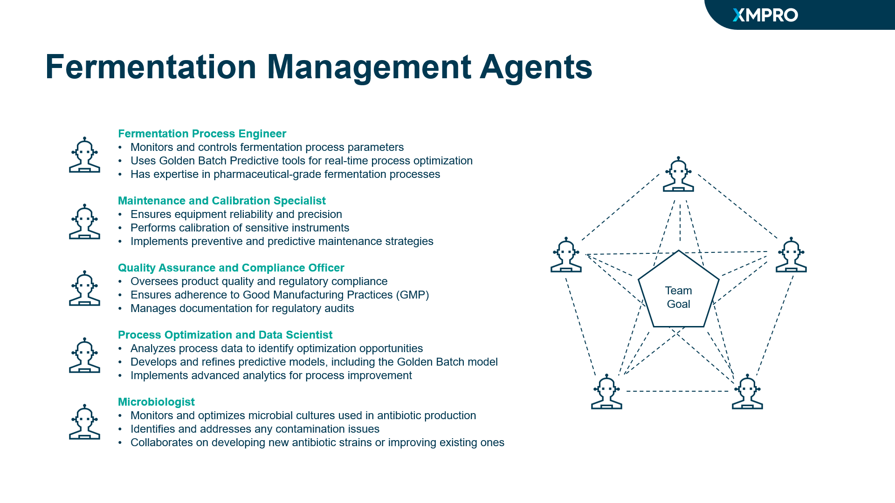

# Fermentation Optimization Team Manifest

This document contains the team manifest for the Fermentation Optimization Team, which is responsible for optimizing antibiotic production in fermentation tanks.

## Team Objective

The primary business objective for implementing the Fermentation Tank Optimization Team solution in pharmaceutical antibiotic production is to maximize the efficiency, consistency, and quality of antibiotic production through optimized fermentation processes while ensuring strict adherence to regulatory standards. This objective encompasses several key goals:

1. Ensure Product Quality and Efficacy
2. Optimize Production Yield
3. Enhance Regulatory Compliance
4. Improve Overall Equipment Effectiveness (OEE)
5. Reduce Production Costs
6. Accelerate Time-to-Market
7. Ensure Supply Chain Reliability
8. Drive Continuous Improvement and Innovation
9. Enhance Environmental Sustainability
10. Support Pharmacovigilance

## Team Workflow
1. **Data Ingestion:** Continuous data collection from sensors, databases, and manual inputs
2. **Agent Processing:** Each agent processes relevant data to generate insights and recommendations
3. **Collaboration:** Agents share outputs and collaborate to refine solutions
4. **Decision Support:** System presents optimized recommendations to human operators
5. **Implementation:** Approved changes are implemented automatically or by human operators
6. **Feedback Loop:** Outcomes are monitored and fed back into the system for continuous improvement

## Agent Profiles



1. [Antibiotic Fermentation Maintenance and Calibration Specialist Agent](../agent_profiles/antibiotic_production_fermentation_maintenance_calibration_specialist.md)
    - **Input:** Equipment sensor data, maintenance schedules, calibration records
    - **Function:** Predict maintenance needs, generate calibration schedules
    - **Output:** Maintenance recommendations, calibration schedules, equipment health reports
    - **Performance:** Minimize unplanned downtime, ensure calibration accuracy within ±0.1% of standard
2. [Antibiotic Fermentation Microbiologist Agent](../agent_profiles/antibiotic_production_fermentation_microbiologist.md)
    - **Input:** Microbial culture data, contamination reports, research literature
    - **Function:** Monitor microbial health, detect contaminations, optimize culture conditions
    - **Output:** Culture health reports, contamination alerts, culture optimization recommendations
    - **Performance:** Detect contaminations with 99.9% accuracy, improve culture yield by 20%
3. [Antibiotic Fermentation Process Engineer Agent](../agent_profiles/antibiotic_production_fermentation_process_engineer.md)
    - **Input:** Historical process data, equipment specifications, regulatory guidelines
    - **Function:** Generate optimized process parameters and improvement strategies
    - **Output:** Process optimization recommendations, updated Golden Batch models
    - **Performance:** Continuously refine process models based on new data and outcomes
4. [Antibiotic Fermentation Process Optimization and Data Scientist Agent](../agent_profiles/antibiotic_production_process_optimization_data_scientist.md)
    - **Input:** Real-time sensor data (temperature, pressure, pH, dissolved oxygen), Golden Batch model
    - **Function:** Monitor and control fermentation process in real-time
    - **Output:** Real-time process adjustments, operation logs, alert notifications
    - **Performance:** Maintain process variables within specified ranges, respond to anomalies within seconds
5. [Antibiotic Fermentation Quality Assurance and Compliance Officer Agent](../agent_profiles/antibiotic_production_quality_assurance_compliance_officer.md)
    - **Input:** Batch records, regulatory guidelines, quality control data
    - **Function:** Ensure GMP compliance, generate audit-ready documentation
    - **Output:** Compliance reports, quality assurance recommendations, audit preparation documents
    - **Performance:** Maintain 100% compliance with current GMP regulations, reduce quality deviations by 50%

## Team Configuration

```json
{
  "team_id": "PHARMA-FERM-TEAM-001",
  "name": "Antibiotic Fermentation Optimization Team",
  "version": "1.0.0",
  "description": "A team of specialized AI agents for optimizing antibiotic production in fermentation tanks",
  "created_at": "2024-09-04T12:00:00Z",
  "created_by": "System Administrator",
  "last_updated": "2024-09-04T12:00:00Z",
  "objectives": [
    "Maximize antibiotic yield",
    "Ensure product quality and consistency",
    "Optimize fermentation process efficiency",
    "Maintain regulatory compliance",
    "Minimize contamination risks",
    "Reduce production costs"
  ],
  "performance_metrics": {
    "antibiotic_yield": {"target": 0.95, "weight": 0.25},
    "product_quality_index": {"target": 0.99, "weight": 0.25},
    "process_efficiency": {"target": 0.9, "weight": 0.2},
    "regulatory_compliance_rate": {"target": 1.0, "weight": 0.15},
    "contamination_prevention_rate": {"target": 0.99, "weight": 0.15}
  },
  "communication_protocol": {
    "primary_channel": "team_chat",
    "escalation_channel": "alert_system",
    "update_frequency": "real-time",
    "report_schedule": {
      "frequency": "daily",
      "time_utc_24h": "18:00"
    }
  },
  "decision_making": [
    {
      "name": "standard_consensus",
      "method": "consensus",
      "tie_breaker": "lead_agent",
      "autonomy_level": 0.8,
      "time_constraint": "4_hours",
      "quorum_requirement": 0.75,
      "applicable_scenarios": ["routine_operations", "process_optimization", "maintenance_scheduling"]
    },
    {
      "name": "emergency_protocol",
      "method": "lead_agent_decision",
      "autonomy_level": 1.0,
      "time_constraint": "5_minutes",
      "post_decision_review": true,
      "applicable_scenarios": ["critical_failures", "contamination_events", "safety_threats"]
    },
    {
      "name": "data_driven_optimization",
      "method": "ai_recommendation",
      "human_oversight": true,
      "autonomy_level": 0.9,
      "confidence_threshold": 0.95,
      "applicable_scenarios": ["yield_optimization", "process_improvements", "predictive_maintenance"]
    }
  ],
  "operational_constraints": {
    "max_simultaneous_actions": {"value": 3, "unit": "actions"},
    "response_time_sla": {"value": 5, "unit": "minutes"},
    "downtime_tolerance": {"value": 0.01, "unit": "percent"},
    "temperature_fluctuation": {"value": 0.5, "unit": "celsius", "time_period": "hour"},
    "pH_range": {"min": 6.0, "max": 8.0},
    "dissolved_oxygen_range": {"min": 20, "max": 60, "unit": "percent"},
    "pressure_range": {"min": 0.8, "max": 1.2, "unit": "atm"},
    "maintenance_window": {
      "duration": {"value": 8, "unit": "hours"},
      "frequency": {"value": 1, "unit": "week"}
    }
  },
  "escalation_policy": {
    "conditions": [
      {
        "id": "yield_low",
        "metric": "antibiotic_yield",
        "operator": "less_than",
        "threshold": 0.9,
        "duration": {"value": 2, "unit": "hours"}
      },
      {
        "id": "quality_issue",
        "metric": "product_quality_index",
        "operator": "less_than",
        "threshold": 0.95,
        "duration": {"value": 30, "unit": "minutes"}
      },
      {
        "id": "contamination_detected",
        "metric": "microbial_contamination",
        "operator": "greater_than",
        "threshold": 0,
        "duration": {"value": 0, "unit": "seconds"}
      }
    ],
    "actions": [
      {
        "id": "alert_supervisor",
        "type": "alert",
        "target": "human_supervisor",
        "method": "sms_and_email",
        "priority": "high"
      },
      {
        "id": "pause_fermentation",
        "type": "system_action",
        "action": "pause_fermentation_process",
        "scope": "affected_tank",
        "duration": {"value": -1, "unit": "minutes", "description": "until_manual_override"}
      },
      {
        "id": "emergency_protocol",
        "type": "protocol_initiation",
        "protocol": "contamination_response",
        "steps": [
          "isolate_affected_tank",
          "initiate_sterilization_procedure",
          "collect_samples_for_analysis"
        ]
      }
    ],
    "escalation_levels": [
      {
        "level": 1,
        "conditions": ["yield_low", "quality_issue"],
        "actions": ["alert_supervisor"],
        "response_time": {"value": 15, "unit": "minutes"}
      },
      {
        "level": 2,
        "conditions": ["yield_low", "quality_issue"],
        "trigger": "condition_persists_for_1_hour",
        "actions": ["alert_supervisor", "pause_fermentation"],
        "response_time": {"value": 5, "unit": "minutes"}
      },
      {
        "level": 3,
        "conditions": ["contamination_detected"],
        "actions": ["alert_supervisor", "pause_fermentation", "emergency_protocol"],
        "response_time": {"value": 0, "unit": "seconds"}
      }
    ]
  },
  "compliance_requirements": ["FDA 21 CFR Part 11", "EU GMP Annex 1", "ISO 13485"]
}
```

## Potential Failure Modes

The team must be aware of and monitor for the following potential failure modes in fermentation tanks:

1. Contamination Issues
   - Microbial Contamination (e.g., bacteriophages)
   - Chemical Contamination
2. Process Control Failures
   - Temperature Control Issues
   - Pressure Control Problems
3. Material Degradation
   - Corrosion
4. Sanitation Failures
5. Mechanical Failures
   - Agitation System Breakdown
   - Sensor Malfunctions

## Conclusion

This team manifest outlines the structure, objectives, and key considerations for the Fermentation Tank Optimization Team in pharmaceutical antibiotic production. By leveraging specialized AI agents and addressing potential failure modes, the team aims to optimize fermentation processes, ensure product quality, and maintain regulatory compliance.