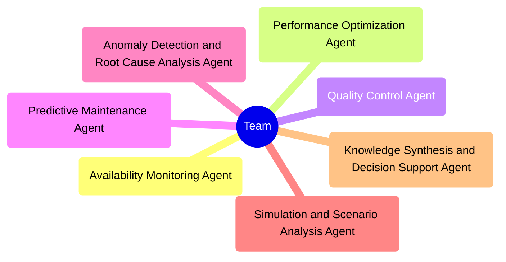

# Expert OEE Optimizer MAGS Team

## 1. Business Problem Definition and Objectives

### Business Objective

The primary business objective for implementing the Expert Overall Equipment Effectiveness (OEE) Optimizer Multi-Agent Generative System (MAGS) is to maximize the efficiency, performance, and reliability of manufacturing processes. This MAGS team aims to optimize equipment availability, enhance production performance, improve product quality, and implement proactive maintenance strategies, ultimately leading to increased productivity, reduced costs, and improved competitiveness in the market.

### Key Goals

1. **Increase Equipment Availability**
   - **Goal:** Minimize downtime and ensure that equipment is operational as much as possible.
   - **Benefit:** Higher equipment availability leads to increased production capacity, reduced delays, and better utilization of resources.

2. **Enhance Production Performance**
   - **Goal:** Optimize production speed and cycle times to improve overall productivity.
   - **Benefit:** Improved performance efficiency results in higher output, reduced operational costs, and better alignment with production schedules.

3. **Improve Product Quality**
   - **Goal:** Reduce defect rates and rework by ensuring high product quality from the outset.
   - **Benefit:** Enhanced product quality leads to higher customer satisfaction, reduced waste, and lower costs associated with defects and returns.

4. **Implement Proactive Maintenance**
   - **Goal:** Shift from reactive to predictive and preventive maintenance strategies.
   - **Benefit:** Proactive maintenance reduces unexpected equipment failures, minimizes maintenance costs, and extends the lifespan of equipment.

5. **Optimize Resource Utilization**
   - **Goal:** Ensure optimal use of labor, materials, and equipment.
   - **Benefit:** Efficient resource utilization lowers production costs, increases profit margins, and supports sustainable operations.

6. **Facilitate Informed Decision-Making**
   - **Goal:** Provide real-time data and insights to support quick and informed decision-making by operators and management.
   - **Benefit:** Improved decision-making processes lead to faster response times, better strategic planning, and enhanced operational agility.

### Summary

The business objective of the Expert OEE Optimizer MAGS team is to create a highly efficient, reliable, and adaptable manufacturing process that maximizes equipment effectiveness. By achieving higher OEE, the company can increase productivity, reduce costs, improve quality, and enhance overall competitiveness in the market. This holistic approach ensures that the manufacturing operations are not only optimized for current conditions but are also capable of adapting to future challenges and opportunities.

## 2. Requirements

### Functional Requirements

1. Real-time monitoring of equipment availability, performance, and quality metrics
2. Advanced data analytics for predictive maintenance and performance optimization
3. Anomaly detection and root cause analysis capabilities
4. Scenario simulation and analysis for process improvements
5. Integration with existing manufacturing execution systems (MES) and enterprise resource planning (ERP) systems
6. Customizable dashboards and reporting tools for different user roles
7. Machine learning models for continuous improvement of OEE predictions and recommendations

### Non-Functional Requirements

1. Performance: Process data and generate outputs in real-time with minimal latency
2. Reliability: Ensure high availability (99.9% uptime) and fault tolerance
3. Scalability: Ability to handle increasing data volumes and additional production lines
4. Security: Implement robust data encryption, access controls, and audit trails
5. Usability: Intuitive user interface for operators, managers, and executives
6. Interoperability: Seamless integration with existing plant systems and data sources
7. Compliance: Adherence to industry standards and regulations (e.g., ISO 9001, GDPR)

### Potential Failure Modes
1. Data Quality Issues
   - Sensor Malfunction
   - Data Transmission Errors
2. Algorithm Failures
   - Inaccurate Predictions
   - False Positive Alerts
3. System Integration Problems
   - Incompatibility with Legacy Systems
   - Data Synchronization Issues
4. Performance Degradation
   - System Overload
   - Slow Response Times
5. Security Breaches
   - Unauthorized Access
   - Data Tampering
6. User Adoption Challenges
   - Resistance to Change
   - Inadequate Training

## 3. Team Capabilities

1. Real-time data processing and analytics
2. Machine learning and predictive modeling
3. Root cause analysis and problem-solving
4. Process simulation and optimization
5. Data visualization and reporting
6. System integration and interoperability
7. Cybersecurity and data protection
8. Manufacturing process expertise
9. Change management and user training

## 4. Team Composition and Agent Roles

### Agent Role Suggestions

1. Availability Monitoring Agent
2. Performance Optimization Agent
3. Quality Control Agent
4. Predictive Maintenance Agent
5. Anomaly Detection and Root Cause Analysis Agent
6. Simulation and Scenario Analysis Agent
7. Knowledge Synthesis and Decision Support Agent

### Team Structure



## 5. Agent Profiles

[Anomaly Detection and Root Cause Analysis Agent Profile](../agent_profiles/anomaly_detection_and_rca_agent.md)

[Availability Monitoring Agent Profile](../agent_profiles/availability_monitoring_agent.md)

[Knowledge Synthesis and Decision Support Agent Profile](../agent_profiles/knowledge_synthesis_and_decision_support_agent.md)

[Performance Optimization Agent Profile](../agent_profiles/performance_optimization_agent.md)

[Predictive Maintenance Agent Profile](../agent_profiles/predictive_maintenance_agent.md)

[Quality Control Agent Profile](../agent_profiles/quality_control_agent_profile.md)

[Simulation and Scenario Analysis Agent Profile](../agent_profiles/simulation_and_scenario_analysis_agent.md)

## 6. Deontic Rules for MAGS Agents Collaboration and Operation

### Obligation Rules (O)

1. **O1: Data Sharing Obligation**
   - Agents must share relevant data and insights with other agents in real-time to ensure comprehensive and coordinated optimization of Overall Equipment Effectiveness (OEE).

2. **O2: Compliance with Standard Operating Procedures (SOP)**
   - Agents must operate in compliance with established SOPs of the production environment.

3. **O3: Safety and Reliability Prioritization**
   - Agents must prioritize safety and reliability in all recommendations and actions.

4. **O4: Continuous Learning and Adaptation**
   - Agents must continuously learn from new data and adapt their models to improve performance over time.

5. **O5: Real-Time Monitoring and Alerting**
   - Agents must provide immediate alerts for any detected anomalies or significant deviations from optimized conditions.

### Permission Rules (P)

1. **P1: Adjustment of Parameters**
   - Agents are permitted to adjust process parameters autonomously within pre-defined safe limits to optimize efficiency and product quality.

2. **P2: Hypothesis Generation**
   - The Anomaly Detection and Root Cause Analysis Agent is permitted to generate hypotheses and potential solutions for detected anomalies based on historical data and process knowledge.

3. **P3: Scenario Simulation**
   - The Simulation and Scenario Analysis Agent is permitted to simulate different process scenarios and provide detailed reports on potential outcomes of various adjustments.

### Prohibition Rules (F)

1. **F1: Unauthorized Data Access**
   - Agents are prohibited from accessing or using data beyond their scope of authorization, ensuring data privacy and security.

2. **F2: Unsafe Recommendations**
   - Agents are prohibited from recommending or implementing process adjustments that exceed predefined safety thresholds or operational constraints.

3. **F3: Interference with Manual Operations**
   - Agents are prohibited from interfering with manual operations performed by human operators unless explicitly authorized or in emergency scenarios.

### Conditional Rules (C)
1. **C1: Conditional Data Sharing**
   - Data sharing between agents is conditional on the relevance and necessity of the data for the recipient agent's function.
2. **C2: Hierarchical Decision Making**
   - Agents must follow a hierarchical decision-making protocol where critical adjustments or decisions are reviewed and approved by a higher-level supervisory agent or human operator before implementation.
3. **C3: Emergency Protocols**
   - In case of emergency conditions detected, agents are authorized to override standard procedures and implement immediate corrective actions, followed by alerting human operators and providing detailed reports.

### Normative Rules (N)
1. **N1: Normative Collaboration**
   - Agents must collaborate based on predefined norms governing data exchange, decision-making, and responsibility sharing.
2. **N2: Reporting and Documentation**
   - Agents must maintain detailed logs of their actions, decisions, and adjustments made to ensure traceability and accountability.
3. **N3: Regular Status Updates**
   - Agents must provide regular updates on their status, performance, and any significant changes or learning outcomes to human operators and other relevant agents.

## 7. Performance Metrics Definition
1. Overall Equipment Effectiveness (OEE): Target 85%, Weight 30%
2. Equipment Availability: Target 95%, Weight 20%
3. Production Performance: Target 90%, Weight 20%
4. Product Quality Rate: Target 99%, Weight 20%
5. Predictive Maintenance Accuracy: Target 95%, Weight 10%

## 8. Communication Protocol Setup
1. Primary Channel: Integrated Maintenance Management System (IMMS) for routine communication and data sharing
2. Escalation Channel: Alert system for critical issues, directly notifying relevant human supervisors
3. Update Frequency: Real-time for critical data, hourly for performance summaries, daily for detailed reports
4. Reporting Schedule: 
   - Daily: Automated performance summary at 06:00 local time
   - Weekly: Comprehensive maintenance report every Monday at 09:00 local time
   - Monthly: Strategic review report on the 1st of each month
5. Inter-Agent Communication: REST API for structured data exchange, publish-subscribe system for event-driven updates
6. Human Interface: Web-based dashboard for real-time monitoring, mobile app for field technicians

## 9. Decision-Making Process

1. Routine Decisions: Agents have 80% autonomy for standard operations within predefined safe limits
2. Critical Decisions: Require consensus from at least 75% of relevant agents and approval from the OEE Optimization Lead
3. Emergency Decisions: OEE Optimization Lead has full autonomy, with post-decision review by human supervisors
4. Human Oversight: Required for decisions with confidence below 90% or potential impact above a defined threshold
5. Escalation: Automatic escalation to human supervisors for unresolved issues after 2 hours or if safety thresholds are approached

## 10. Operational Constraints

1. Safety Thresholds: Must operate within defined safety parameters at all times
2. Quality Standards: Must maintain product quality within specified tolerance levels
3. Production Targets: Must balance OEE improvements with meeting production quotas
4. Resource Limitations: Must optimize within available resource constraints (e.g., energy, raw materials)
5. Regulatory Compliance: Must adhere to all relevant industry regulations and standards
6. Data Privacy: Must handle all data in compliance with data protection regulations
7. System Capacity: Limited to processing a maximum of 10,000 data points per second
8. Update Frequency: Agent models can be updated no more than once per week to ensure stability

## 11. System Workflow

1. **Data Collection:** Continuous ingestion of real-time data from sensors, quality control systems, and production logs
2. **Data Processing:** Each agent processes relevant data using specialized algorithms and machine learning models
3. **Analysis and Optimization:** Agents collaborate to analyze data, identify improvement opportunities, and generate optimization strategies
4. **Decision Making:** Proposed actions are evaluated against decision-making criteria and operational constraints
5. **Implementation:** Approved optimizations are implemented automatically or with human oversight as required
6. **Monitoring and Feedback:** Continuous monitoring of implemented changes with real-time feedback for further optimization
7. **Reporting:** Generation of regular performance reports and alerts for stakeholders
8. **Learning and Adaptation:** Ongoing learning from outcomes to improve future recommendations and decision-making

## 12. Implementation Considerations

1. Integration with existing MES (Manufacturing Execution System) and SCADA (Supervisory Control and Data Acquisition) systems
2. Robust cybersecurity measures to protect against potential threats and ensure data integrity
3. Comprehensive training program for operators, managers, and maintenance staff on the new MAGS system
4. Phased implementation approach, starting with non-critical processes before full deployment
5. Establishment of a dedicated support team for system maintenance and troubleshooting
6. Regular system audits and performance reviews to ensure alignment with business objectives
7. Development of contingency plans for system failures or unexpected outcomes
8. Continuous stakeholder engagement to address concerns and gather feedback for system improvements

## 13. Review and Summary

The Expert OEE Optimizer MAGS Team is designed to revolutionize manufacturing efficiency by leveraging advanced AI agents to continuously monitor, analyze, and optimize Overall Equipment Effectiveness. This comprehensive solution addresses the key components of OEE: Availability, Performance, and Quality.

Key strengths of the system include:
1. Real-time monitoring and optimization capabilities
2. Predictive maintenance to minimize downtime
3. Advanced quality control measures to reduce defects
4. Adaptive performance optimization strategies
5. Collaborative decision-making among specialized agents

Potential challenges to consider:
1. Integration complexity with existing systems
2. Change management and user adoption
3. Balancing automation with human oversight
4. Ensuring data quality and integrity
5. Managing the system's learning curve and continuous improvement

The success of this MAGS implementation will depend on careful planning, thorough testing, and ongoing collaboration between the AI agents and human operators. By addressing the identified challenges and leveraging the system's strengths, the Expert OEE Optimizer MAGS Team has the potential to significantly enhance manufacturing efficiency, reduce costs, and improve product quality.

Regular reviews and updates to the system will be crucial to ensure it continues to meet evolving business needs and technological advancements. With proper implementation and management, this MAGS solution can provide a substantial competitive advantage in the manufacturing industry.

## 14. Team Manifest (JSON)

```json
{
  "team_id": "LOCATION-PROD-OEE-TEAM-001",
  "name": "Expert OEE Optimizer MAGS Team",
  "version": "1.0.0",
  "description": "A team of specialized AI agents for optimizing Overall Equipment Effectiveness in manufacturing environments",
  "created_at": "2024-09-05T14:30:00Z",
  "created_by": "System Administrator",
  "objectives": [
    "Maximize equipment availability",
    "Optimize production performance",
    "Enhance product quality",
    "Implement proactive maintenance",
    "Facilitate informed decision-making",
    "Drive continuous improvement"
  ],
  "performance_metrics": {
    "overall_oee": {"target": 0.85, "weight": 0.3},
    "equipment_availability": {"target": 0.95, "weight": 0.2},
    "production_performance": {"target": 0.9, "weight": 0.2},
    "product_quality_rate": {"target": 0.99, "weight": 0.2},
    "predictive_maintenance_accuracy": {"target": 0.95, "weight": 0.1}
  },
  "communication_protocol": {
    "primary_channel": "team_chat",
    "escalation_channel": "alert_system",
    "update_frequency": "real-time",
    "report_schedule": {
      "frequency": "daily",
      "time_utc_24h": "18:00"
    }
  },
  "decision_making": [
    {
      "name": "routine_decisions",
      "method": "agent_autonomy",
      "autonomy_level": 0.8,
      "applicable_scenarios": ["standard_operations"]
    },
    {
      "name": "critical_decisions",
      "method": "consensus",
      "quorum_requirement": 0.75,
      "final_approval": "oee_optimization_lead",
      "applicable_scenarios": ["major_adjustments", "resource_allocation"]
    },
    {
      "name": "emergency_decisions",
      "method": "lead_agent_decision",
      "decision_maker": "oee_optimization_lead",
      "post_decision_review": true,
      "applicable_scenarios": ["safety_concerns", "critical_failures"]
    }
  ],
  "operational_constraints": {
    "safety_thresholds": "must_be_within_defined_parameters",
    "quality_standards": "must_maintain_specified_tolerance_levels",
    "production_targets": "must_balance_with_oee_improvements",
    "resource_limitations": "must_optimize_within_constraints",
    "regulatory_compliance": "must_adhere_to_all_relevant_regulations",
    "data_privacy": "must_comply_with_data_protection_regulations",
    "system_capacity": {"max_data_points_per_second": 10000},
    "update_frequency": {"agent_models": "once_per_week"}
  },
  "escalation_policy": {
    "conditions": [
      {
        "id": "unresolved_issues",
        "time_threshold": {"value": 2, "unit": "hours"}
      },
      {
        "id": "safety_threshold_approach",
        "metric": "safety_parameter",
        "threshold": 0.9
      }
    ],
    "action": "escalate_to_human_supervisors"
  },
  "compliance_requirements": []
}
```