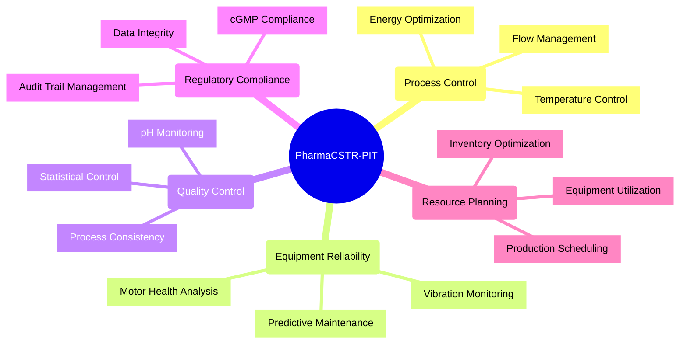

# Pharmaceutical CSTR Process Intelligence Team (PharmaCSTR-PIT)

## 1. Business Problem Definition and Objectives

### Business Objective

The primary business objective for implementing the Pharmaceutical CSTR Process Intelligence Team is to maximize the efficiency, reliability, and regulatory compliance of continuous stirred tank reactor operations in pharmaceutical manufacturing environments. This team aims to transform traditional reactive process control into proactive, predictive, and autonomous optimization strategies while maintaining strict FDA cGMP compliance standards.

### Key Goals

1. **Optimize CSTR Process Performance**
   - **Goal:** Maximize space-time yield, heat transfer efficiency, and mixing effectiveness while minimizing energy consumption and process variability.
   - **Benefit:** Enhanced process efficiency leads to improved product quality, reduced manufacturing costs, and increased facility throughput capacity.

2. **Enhance Equipment Reliability and Predictive Maintenance**
   - **Goal:** Achieve 92% equipment availability through predictive maintenance and equipment protection strategies.
   - **Benefit:** Reduced unplanned downtime, extended equipment life, and optimized maintenance costs through condition-based interventions.

3. **Ensure Pharmaceutical Quality Consistency**
   - **Goal:** Maintain process consistency with <3% coefficient of variation on critical parameters through real-time quality monitoring.
   - **Benefit:** Improved product quality consistency, reduced batch failures, and enhanced regulatory compliance through statistical process control.

4. **Maintain FDA cGMP Compliance and Data Integrity**
   - **Goal:** Achieve >99% data completeness and 100% parameter compliance with automated audit trail management.
   - **Benefit:** Enhanced regulatory compliance, reduced audit findings, and improved inspection readiness through continuous compliance monitoring.

5. **Optimize Resource Planning and Utilization**
   - **Goal:** Improve equipment utilization from 75-80% to 85-90% through intelligent production planning and resource allocation.
   - **Benefit:** Increased facility capacity, reduced inventory costs, improved schedule adherence, and optimized changeover efficiency.

### Summary

The Pharmaceutical CSTR Process Intelligence Team aims to create a highly efficient, reliable, and compliant pharmaceutical manufacturing operation. By optimizing process control, enhancing equipment reliability, ensuring quality consistency, maintaining regulatory compliance, and improving resource utilization, the system delivers significant gains in productivity, cost savings, and operational excellence while ensuring patient safety and regulatory adherence.

## 2. Requirements

### Functional Requirements

1. Real-time CSTR process monitoring (temperature, pressure, flow, pH, conductivity)
2. Predictive analytics for equipment health and maintenance scheduling
3. Automated process optimization within validated pharmaceutical ranges
4. Integration with existing DCS/SCADA, MES, and ERP systems
5. Statistical process control and quality trend analysis
6. Real-time regulatory compliance monitoring and data integrity verification
7. Production planning and resource allocation optimization
8. Electronic batch record management and audit trail maintenance
9. Energy efficiency optimization and utility load balancing
10. Automated deviation detection and root cause analysis

### Non-Functional Requirements

1. **Performance:** Process and analyze data in real-time, with control loop response times under 10 seconds for critical parameters
2. **Reliability:** 99.99% uptime for critical process control components
3. **Scalability:** Ability to handle data from multiple CSTR reactors and associated equipment
4. **Security:** End-to-end encryption for all pharmaceutical data, role-based access control with FDA 21 CFR Part 11 compliance
5. **Usability:** Intuitive operator interface compatible with existing pharmaceutical HMI systems
6. **Interoperability:** Standard pharmaceutical protocols (OPC UA, MQTT) for DCS/SCADA integration
7. **Data Retention:** 5+ years of historical data storage for regulatory compliance and trend analysis
8. **Auditability:** Complete electronic audit trail for all process changes and agent decisions

### Potential Failure Modes

1. **Sensor Malfunction:** Temperature, pH, or flow sensor failures affecting process control accuracy
2. **Algorithm Drift:** Predictive models becoming less accurate due to process changes or aging equipment
3. **Communication Failures:** Loss of connectivity between process control systems and agent platform
4. **False Alarms:** Incorrect parameter deviation alerts leading to unnecessary process interventions
5. **Data Security Breach:** Unauthorized access to sensitive pharmaceutical process data
6. **System Overload:** Inability to process multiple concurrent process optimization requests
7. **Integration Failures:** Issues connecting to existing DCS, MES, or ERP pharmaceutical systems
8. **Regulatory Compliance Gaps:** Missing documentation or audit trail incomplete for FDA inspection

## 3. Team Capabilities

1. Advanced pharmaceutical process control and optimization algorithms
2. Real-time CSTR equipment health monitoring and predictive maintenance
3. Statistical process control and pharmaceutical quality assurance
4. FDA cGMP compliance monitoring and electronic documentation management
5. Production planning optimization and resource allocation for pharmaceutical operations
6. Energy efficiency optimization for pharmaceutical CSTR operations
7. Multi-agent consensus coordination for complex pharmaceutical decisions
8. Integration expertise with pharmaceutical DCS, MES, and ERP systems
9. Pharmaceutical data security and 21 CFR Part 11 compliance
10. Regulatory inspection support and audit trail management

## 4. Team Composition and Agent Roles

### Agent Role Specifications

1. **CSTR Process Control Agent** - Temperature & Flow Control Specialist
2. **CSTR Equipment Reliability Agent** - Mechanical Integrity Specialist  
3. **CSTR Quality Control Agent** - Process Consistency Guardian
4. **CSTR Regulatory Compliance Agent** - Data Integrity & Documentation Specialist
5. **CSTR Resource Planning & Scheduling Agent** - Production Planning Specialist

### Team Structure



## 5. Agent Profiles Summary

### CSTR Process Control Agent
- **Focus:** Real-time optimization of temperature stability (±0.5°C), flow control (±1%), pressure management, and energy efficiency
- **Key Capabilities:** Advanced PID control, multi-variable optimization, heat transfer analysis, residence time control
- **Objective:** Maximize space-time yield and energy efficiency while maintaining pharmaceutical process validation requirements

### [CSTR Equipment Reliability Agent](../agent_profiles/pharmaceutical_cstr_equipment_reliability_agent_profile.md)  
- **Focus:** Predictive maintenance through motor power analysis, vibration monitoring, and mechanical integrity assessment
- **Key Capabilities:** Motor signature analysis, vibration trend detection, heat exchanger fouling assessment, seal integrity monitoring
- **Objective:** Achieve 92% equipment availability through condition-based maintenance and equipment protection

### CSTR Quality Control Agent
- **Focus:** Process consistency monitoring using pH, conductivity, turbidity as quality indicators
- **Key Capabilities:** Statistical process control, real-time quality trending, process-quality correlation analysis
- **Objective:** Maintain <3% process variability and ensure pharmaceutical quality consistency

### CSTR Regulatory Compliance Agent
- **Focus:** FDA cGMP compliance through data integrity monitoring and electronic documentation
- **Key Capabilities:** 21 CFR Part 11 compliance, audit trail management, parameter limit checking, batch record validation
- **Objective:** Achieve >99% data completeness and 100% regulatory compliance

### CSTR Resource Planning & Scheduling Agent
- **Focus:** Production planning optimization, equipment utilization, and resource allocation
- **Key Capabilities:** Batch sequencing optimization, capacity planning, inventory management, maintenance coordination
- **Objective:** Improve equipment utilization to 85-90% and optimize resource allocation efficiency

## 6. Deontic Rules for MAGS Agents Collaboration and Operation

### Obligation Rules (Must Do)

1. **O1: Patient Safety Priority**
   - All agents MUST prioritize patient safety over process efficiency when pharmaceutical parameters exceed validated safety limits.

2. **O2: FDA cGMP Compliance**
   - All agents MUST maintain complete audit trails and ensure all actions comply with FDA 21 CFR Part 11 requirements.

3. **O3: Data Integrity Maintenance**
   - Agents MUST ensure >99% data completeness and validate all critical process parameters continuously.

4. **O4: Equipment Protection**
   - Agents MUST implement equipment protection measures when motor load >95% or vibration >4.0 mm/s.

5. **O5: Consensus Participation**
   - Agents MUST participate in XMPro consensus protocols for multi-agent decisions affecting pharmaceutical processes.

6. **O6: Real-Time Communication**
   - Agents MUST share critical process data and alerts with relevant agents within specified timeframes (1-15 minutes based on criticality).

### Permission Rules (May Do)

1. **P1: Autonomous Process Adjustments**
   - Agents MAY make minor process parameter adjustments within validated pharmaceutical ranges without human approval.

2. **P2: Predictive Maintenance Scheduling**
   - Equipment Reliability Agent MAY schedule maintenance windows based on condition monitoring data and consensus with Planning Agent.

3. **P3: Quality Hold Initiation**
   - Quality Control Agent MAY initiate quality investigations and coordinate with other agents when process consistency is at risk.

4. **P4: Resource Optimization**
   - Planning Agent MAY optimize batch sequences and resource allocation within operational constraints and regulatory requirements.

### Prohibition Rules (Must Not Do)

1. **F1: Parameter Range Violations**
   - Agents MUST NOT operate outside validated pharmaceutical parameter ranges without human authorization and regulatory approval.

2. **F2: Safety System Override**
   - Agents MUST NOT override existing Safety Instrumented Systems (SIS) or emergency shutdown procedures.

3. **F3: Unauthorized Data Modification**
   - Agents MUST NOT modify historical data or electronic batch records without proper change control procedures.

4. **F4: Regulatory Non-Compliance**
   - Agents MUST NOT recommend actions that would violate FDA cGMP requirements or pharmaceutical manufacturing standards.

### Conditional Rules (If-Then)

1. **C1: Emergency Escalation**
   - IF process parameters exceed safety limits or equipment shows imminent failure risk, THEN agents MUST escalate immediately to human oversight within 30 seconds.

2. **C2: Consensus Requirement**
   - IF process changes affect multiple operational areas, THEN multi-agent consensus MUST be achieved before implementation.

3. **C3: Regulatory Documentation**
   - IF any parameter changes are implemented, THEN complete audit trail documentation MUST be generated automatically.

4. **C4: Quality Risk Response**
   - IF quality indicators show >5% deviation from target, THEN Quality Agent MUST coordinate immediate investigation with Process Control Agent.

### Normative Rules (Should Do)

1. **N1: Continuous Improvement**
   - Agents SHOULD continuously learn from operational outcomes and optimize their decision-making algorithms.

2. **N2: Energy Efficiency**
   - Agents SHOULD optimize energy consumption while maintaining process performance and pharmaceutical quality requirements.

3. **N3: Predictive Operations**
   - Agents SHOULD use predictive analytics to prevent equipment failures and process deviations before they occur.

4. **N4: Resource Optimization**
   - Agents SHOULD coordinate to maximize equipment utilization and minimize resource conflicts through collaborative planning.

## 7. Performance Metrics Definition

### Primary KPIs (Target Values and Weights)

1. **Process Control Efficiency: Target 95%, Weight 18%**
   - Temperature stability (±0.5°C): Target achieved 95% of time
   - Flow control quality (±1%): Target achieved 95% of time
   - Energy efficiency: ≤150 kWh/kg product

2. **Equipment Availability: Target 92%, Weight 17%**
   - Overall equipment availability: 92% uptime
   - Predictive maintenance effectiveness: 85% of issues predicted >4 hours in advance
   - Equipment protection success: Zero motor overloads or vibration alarms

3. **Quality Consistency: Target <3% CV, Weight 16%**
   - Process parameter variability: <3% coefficient of variation
   - pH stability: ±0.1 units maintained 95% of time
   - Quality deviation prevention: 95% of potential deviations prevented

4. **Regulatory Compliance: Target 100%, Weight 15%**
   - Data completeness: >99% of all required data points captured
   - Parameter compliance: 100% of critical parameters within limits
   - Audit trail completeness: 100% of all changes documented

5. **Resource Utilization: Target 85-90%, Weight 12%**
   - Equipment utilization: 85-90% of available operating time
   - Schedule adherence: 90-95% on-time completion
   - Inventory optimization: 30-40 day inventory levels

6. **Energy Efficiency: Target 150 kWh/kg, Weight 12%**
   - Specific energy consumption: ≤150 kWh/kg product
   - Heat transfer efficiency: ≥85% of clean condition performance
   - Utility optimization: 95% of optimal utility usage achieved

7. **Safety Performance: Target Zero Incidents, Weight 10%**
   - Safety incidents: Zero safety-related incidents
   - Safety parameter compliance: 100% adherence to safety limits
   - Emergency response effectiveness: <30 seconds for critical alerts

### Secondary KPIs

1. **Agent Consensus Effectiveness:** 95% successful consensus resolution
2. **Predictive Model Accuracy:** >90% accuracy for all predictive models
3. **Human Intervention Rate:** <5% of decisions requiring human override
4. **System Response Time:** <30 seconds for critical alerts, <5 minutes for optimization decisions

## 8. Communication Protocol Setup

### Primary Communication Channels

1. **XMPro Abstract Message Broker:** Primary channel for agent-to-agent consensus communication
2. **Pharmaceutical DCS Integration:** Direct integration with process control systems via OPC UA protocols
3. **MES/ERP Integration:** Real-time integration for production planning and batch record management
4. **Alert Management System:** Critical alerts and escalations to human operators and supervisors

### Communication Frequencies

1. **Real-Time Control Data (1-10 seconds):**
   - Process parameters: Temperature, pressure, flow, pH, conductivity
   - Equipment health: Motor power, vibration, bearing temperature
   - Safety monitoring: All safety-critical parameter continuous monitoring

2. **Agent Consensus Communication (1-15 minutes):**
   - Process optimization consensus: Every 5 minutes for routine optimization
   - Equipment maintenance consensus: Every 15 minutes for maintenance coordination
   - Quality investigation consensus: Within 2 minutes for quality deviations
   - Resource planning consensus: Hourly for production scheduling

3. **Regulatory Documentation (Real-time to daily):**
   - Audit trail updates: Real-time for all parameter changes
   - Batch record entries: Real-time during batch operations
   - Compliance reporting: Daily summary reports and exception reports

4. **Performance Reporting:**
   - Shift reports: Every 8 hours with performance summary
   - Daily performance dashboard: Updated every 15 minutes
   - Weekly optimization report: Every Monday at 06:00 local time
   - Monthly compliance report: First business day of each month

### Inter-Agent Communication Protocols

1. **Consensus Topics:** Structured by priority and domain (process, equipment, quality, compliance, planning)
2. **Data Exchange Standards:** JSON format for structured data, MQTT for real-time streams
3. **Human Interface:** Web-based dashboard for real-time monitoring, mobile alerts for critical issues
4. **Escalation Protocols:** Automatic escalation based on severity, response time requirements, and agent authority levels

## 9. Decision-Making Process

### Autonomous Decision Authority (90% of Operations)

1. **Individual Agent Autonomy:**
   - Process parameter adjustments within ±5% of setpoints
   - Equipment health monitoring and trend analysis
   - Quality deviation detection and initial response
   - Compliance monitoring and documentation
   - Resource allocation within daily planning parameters

2. **Logging and Auditability:**
   - All autonomous decisions logged with timestamp, rationale, and outcome tracking
   - Complete audit trail maintained for FDA compliance
   - Performance feedback integrated into agent learning algorithms

### Consensus-Required Decisions (8% of Operations)

1. **Multi-Agent Consensus Scenarios:**
   - Process optimization affecting multiple operational areas
   - Equipment maintenance scheduling impacting production
   - Quality investigations requiring process modifications
   - Resource conflicts requiring multi-agent resolution
   - Energy optimization affecting multiple process variables

2. **Consensus Requirements:**
   - Minimum 3 relevant agents must participate
   - 75% agreement required for implementation
   - Pharmaceutical priority matrix applied (Safety > Compliance > Equipment > Quality > Efficiency)
   - Complete consensus rationale documented for audit trail

### Human-Required Decisions (2% of Operations)

1. **Mandatory Human Approval:**
   - Process changes outside validated parameter ranges
   - Equipment shutdowns affecting production >4 hours
   - Regulatory interpretation requiring pharmaceutical expertise
   - Capital expenditure recommendations >$50K
   - Novel operational scenarios not covered in agent training

2. **Emergency Override Authority:**
   - Immediate safety risks: Agents can take protective action, notify humans within 30 seconds
   - Equipment protection: Automatic limitations to prevent damage
   - Regulatory violations: Automatic escalation to quality assurance and regulatory affairs

### Escalation Protocols

1. **Tier 1 - Operations (30 seconds - 5 minutes):** Shift supervisors and control room operators
2. **Tier 2 - Management (5 - 30 minutes):** Production managers and maintenance managers  
3. **Tier 3 - Engineering (30 minutes - 2 hours):** Process engineers and reliability engineers
4. **Tier 4 - Executive (2+ hours):** Plant manager and regulatory affairs director

### Conflict Resolution

1. **Technical Conflicts:** Resolved through pharmaceutical priority matrix and XMPro consensus algorithms
2. **Resource Conflicts:** Planning Agent coordinates resolution based on production priorities
3. **Regulatory Conflicts:** Compliance Agent has veto authority for regulatory violations
4. **Unresolved Conflicts:** Automatic escalation to human supervisors within 30 minutes

## 10. Operational Constraints

### System Performance Requirements

1. **Response Times:**
   - Critical safety alerts: <30 seconds
   - Process control adjustments: <10 seconds
   - Equipment protection actions: <5 seconds
   - Quality deviation response: <2 minutes
   - Resource planning decisions: <15 minutes

2. **Decision Processing Times:**
   - Routine autonomous decisions: <5 minutes
   - Multi-agent consensus decisions: <15 minutes
   - Human escalation decisions: <2 hours with automatic escalation

3. **System Availability:**
   - Critical process control: 99.99% uptime required
   - Equipment monitoring: 99.95% uptime required
   - Planning and reporting systems: 99.9% uptime required

### Pharmaceutical Manufacturing Constraints

1. **FDA cGMP Compliance:**
   - All operations must adhere to 21 CFR Part 11 electronic records requirements
   - Complete audit trail required for all process changes
   - Data integrity >99% completeness mandatory
   - Electronic signatures required for critical parameter changes

2. **Process Validation Constraints:**
   - All process parameters must remain within validated ranges
   - Any parameter changes require proper change control documentation
   - Process modifications may require regulatory notification or approval

3. **Safety and Quality Limits:**
   - Temperature: 65-135°C (validated range for pharmaceutical materials)
   - Pressure: 0.3-2.5 bar (vessel design and safety limits)
   - pH: 5.0-9.0 (material compatibility and product stability)
   - Equipment protection: Motor load <95%, vibration <4.0 mm/s

### Technical and Infrastructure Constraints

1. **Data Management:**
   - Real-time data processing for 100+ process variables
   - Historical data retention for 5+ years for regulatory compliance
   - Encrypted data transmission with role-based access control
   - Backup and disaster recovery within 4-hour RTO

2. **Integration Requirements:**
   - DCS/SCADA integration via OPC UA protocols
   - MES/ERP integration for production and resource data
   - Historian integration for trend analysis and reporting
   - Laboratory data management system integration for quality data

3. **Resource Limitations:**
   - Computational resources: CPU utilization <80% sustained
   - Network bandwidth: <70% utilization during peak operations  
   - Storage capacity: 95% maximum utilization before expansion
   - Memory usage: <85% to maintain response time performance

## 11. System Workflow

### Core Operational Workflow

1. **Continuous Data Acquisition (1-10 seconds):**
   - Real-time process data from DCS/SCADA systems
   - Equipment condition monitoring from sensors and analyzers
   - Quality indicators from inline pharmaceutical analyzers
   - Production and resource data from MES/ERP systems

2. **Real-Time Data Processing and Analysis (10 seconds - 1 minute):**
   - Process Control Agent: Temperature, flow, pressure optimization
   - Equipment Reliability Agent: Health monitoring and predictive maintenance
   - Quality Control Agent: Statistical process control and trend analysis
   - Compliance Agent: Data validation and parameter compliance checking

3. **Multi-Agent Consensus Coordination (1-15 minutes):**
   - Cross-functional optimization requiring multi-agent consensus
   - Resource allocation and production planning coordination
   - Quality investigations and process improvement initiatives
   - Maintenance scheduling and equipment protection decisions

4. **Decision Implementation and Monitoring (Real-time):**
   - Autonomous parameter adjustments within validated ranges
   - Equipment protection actions and predictive maintenance alerts
   - Quality deviation responses and process consistency maintenance
   - Resource optimization and production schedule adjustments

5. **Performance Tracking and Reporting (15 minutes - daily):**
   - Real-time KPI updates and performance dashboard
   - Shift summaries and operational performance reports
   - Regulatory compliance reporting and audit trail maintenance
   - Continuous improvement analysis and optimization recommendations

### Specialized Workflows

#### Process Control Optimization Workflow
1. Monitor process parameters (1-second intervals)
2. Analyze trends and optimization opportunities (1-minute cycles)
3. Coordinate with Quality and Equipment agents for consensus (5-minute cycles)
4. Implement optimization changes within validated ranges
5. Monitor results and adjust as needed
6. Document all changes for regulatory compliance

#### Equipment Reliability Workflow
1. Continuous condition monitoring (vibration, power, temperature)
2. Predictive analytics for failure risk assessment (15-minute cycles)
3. Maintenance scheduling coordination with Planning Agent (hourly)
4. Equipment protection actions when thresholds exceeded
5. Maintenance effectiveness tracking and model refinement

#### Quality Control Workflow
1. Real-time quality indicator monitoring (pH, conductivity, turbidity)
2. Statistical process control and trend analysis (15-minute cycles)
3. Quality deviation detection and investigation initiation (2-minute response)
4. Process-quality correlation analysis and optimization recommendations
5. Quality data integration with batch records and regulatory reporting

#### Regulatory Compliance Workflow
1. Continuous data integrity monitoring and validation
2. Parameter compliance checking against regulatory limits
3. Audit trail generation for all process changes and decisions
4. Electronic batch record validation and completion
5. Regulatory reporting and inspection readiness support

#### Resource Planning Workflow
1. Production capacity analysis and demand forecasting (daily)
2. Equipment utilization optimization and bottleneck identification (hourly)
3. Maintenance window coordination with equipment reliability (daily)
4. Inventory level optimization and material planning (daily)
5. Schedule adherence monitoring and optimization (real-time)

## 12. Implementation Considerations

### Phase 1: Foundation and Monitoring (Months 1-6)

1. **Infrastructure Setup:**
   - DCS/SCADA integration and data connectivity validation
   - XMPro platform deployment and agent framework installation
   - Security implementation and FDA 21 CFR Part 11 compliance validation
   - Historical data migration and trend analysis baseline establishment

2. **Agent Deployment:**
   - Advisory mode deployment for all agents with human oversight
   - Basic process monitoring and equipment health tracking
   - Quality indicator monitoring and statistical control implementation
   - Regulatory compliance monitoring and audit trail generation

3. **Performance Baseline:**
   - Current state measurement and KPI baseline establishment
   - Agent accuracy validation and model calibration
   - Integration testing with existing pharmaceutical systems
   - Operator training and change management implementation

### Phase 2: Supervised Autonomy (Months 7-12)

1. **Autonomous Operations:**
   - Process control automation within validated ranges
   - Equipment health monitoring and predictive maintenance alerts
   - Quality deviation detection and automated investigation initiation
   - Resource planning optimization and schedule coordination

2. **Consensus Coordination:**
   - Multi-agent consensus implementation for cross-functional decisions
   - Conflict resolution and escalation protocol validation
   - Human oversight integration and approval workflow automation
   - Performance feedback and continuous improvement implementation

3. **Advanced Analytics:**
   - Predictive maintenance model refinement and accuracy improvement
   - Process optimization algorithm enhancement and validation
   - Quality correlation analysis and process improvement recommendations
   - Energy efficiency optimization and utility load balancing

### Phase 3: Coordinated Autonomous Operation (Months 13-18)

1. **Full Autonomy Implementation:**
   - Comprehensive autonomous operation within pharmaceutical constraints
   - Advanced multi-agent coordination and consensus-based optimization
   - Predictive analytics and proactive process management
   - Resource optimization and production planning automation

2. **Continuous Improvement:**
   - Machine learning model evolution and accuracy enhancement
   - Process optimization refinement based on operational outcomes
   - Regulatory compliance automation and audit readiness
   - Value realization measurement and ROI validation

3. **Scaling and Optimization:**
   - Multi-reactor deployment and facility-wide optimization
   - Advanced energy management and sustainability initiatives
   - Predictive quality management and process analytical technology
   - Strategic planning integration and competitive advantage realization

### Critical Success Factors

1. **Data Quality and Integration:**
   - Ensure high-quality, real-time data from all process and equipment sensors
   - Validate integration with existing DCS, MES, and ERP systems
   - Implement robust data validation and error detection mechanisms

2. **Change Management and Training:**
   - Comprehensive operator and engineer training on new AI-augmented processes
   - Clear communication of benefits and addressing concerns about AI automation
   - Gradual autonomy increase to build confidence and trust

3. **Regulatory Compliance:**
   - Ensure all implementations meet FDA cGMP requirements
   - Validate electronic records and audit trail completeness
   - Prepare for regulatory inspection and documentation review

4. **Performance Measurement:**
   - Establish clear KPIs and measurement methods for value demonstration
   - Regular performance review and continuous improvement implementation
   - ROI tracking and business case validation

## 13. Review and Summary

The Pharmaceutical CSTR Process Intelligence Team represents an advanced application of multi-agent AI technology specifically designed for pharmaceutical continuous manufacturing operations. This sophisticated system addresses the unique challenges of pharmaceutical CSTR operations while maintaining strict regulatory compliance and safety standards.

### Key Strengths and Capabilities

1. **Pharmaceutical Manufacturing Specialization:**
   - Deep understanding of CSTR operations including temperature control, mixing optimization, and heat transfer
   - FDA cGMP compliance built into all agent operations with complete audit trail management
   - Real-time quality monitoring using pharmaceutical-grade inline analyzers
   - Regulatory documentation automation and inspection readiness support

2. **Realistic Implementation Approach:**
   - All capabilities based on standard pharmaceutical instrumentation and proven control techniques
   - Conservative value estimates ($24-56M annually) based on measurable process improvements
   - Phased implementation with progressive autonomy increase and value demonstration
   - XMPro platform integration with built-in consensus coordination

3. **Comprehensive Process Coverage:**
   - Process control optimization for temperature, flow, pressure, and energy efficiency
   - Equipment reliability through predictive maintenance and condition monitoring
   - Quality consistency via statistical process control and real-time monitoring
   - Resource planning optimization for equipment utilization and production scheduling
   - Regulatory compliance automation with continuous data integrity monitoring

4. **Risk Mitigation and Safety:**
   - Pharmaceutical priority matrix ensuring patient safety as highest priority
   - Equipment protection protocols preventing motor overload and bearing damage
   - Bounded autonomy with clear escalation protocols and human oversight
   - Complete audit trail documentation for regulatory compliance and inspection

### Expected Business Impact

1. **Process Performance Improvements:**
   - Temperature stability: ±2.0°C → ±0.5°C through advanced process control
   - Energy efficiency: 180 → 150 kWh/kg through optimization algorithms
   - Process consistency: 8% CV → 3% CV through statistical process control

2. **Equipment Reliability Enhancement:**
   - Equipment availability: 85% → 92% through predictive maintenance
   - Motor efficiency: 85% → 90% through condition-based optimization
   - Maintenance cost reduction: 25% through predictive strategies

3. **Quality and Compliance Benefits:**
   - Process variability reduction enabling improved quality consistency
   - Data integrity improvement: 95% → >99% completeness
   - Audit readiness and regulatory compliance automation

4. **Resource Optimization Value:**
   - Equipment utilization: 75-80% → 85-90% through intelligent scheduling
   - Inventory optimization: 45-60 days → 30-40 days through planning
   - Changeover efficiency: 6-8 hours → 3-4 hours through optimization

### Implementation Challenges and Mitigations

1. **Technical Integration Complexity:**
   - **Challenge:** Integration with existing pharmaceutical DCS and MES systems
   - **Mitigation:** Use of standard protocols (OPC UA, MQTT) and phased implementation

2. **Regulatory Validation Requirements:**
   - **Challenge:** FDA validation of AI-driven process control systems
   - **Mitigation:** Built-in cGMP compliance, complete audit trails, and regulatory expertise

3. **Change Management and Adoption:**
   - **Challenge:** Operator acceptance of AI-augmented process control
   - **Mitigation:** Gradual autonomy increase, comprehensive training, and clear value demonstration

4. **Data Quality and Availability:**
   - **Challenge:** Ensuring high-quality, real-time data for AI algorithms
   - **Mitigation:** Robust data validation, sensor redundancy, and error detection


## 14. Team Manifest JSON

<pre> ```json {
  "team_id": "PHARMA-CSTR-PIT-001",
  "name": "Pharmaceutical CSTR Process Intelligence Team",
  "version": "1.0.0",
  "description": "An AI-driven multi-agent team for optimizing pharmaceutical continuous stirred tank reactor operations through autonomous process control, predictive maintenance, quality assurance, regulatory compliance, and resource planning while maintaining FDA cGMP standards",
  "created_at": "2024-12-19T00:00:00Z",
  "created_by": "Pharmaceutical Engineering Team",
  "category": "Pharmaceutical Manufacturing Operations",
  "objectives": [
    "Maximize CSTR process performance through temperature, flow, and energy optimization",
    "Enhance equipment reliability and achieve 92% availability through predictive maintenance", 
    "Ensure pharmaceutical quality consistency with <3% process variability",
    "Maintain FDA cGMP compliance with >99% data integrity and complete audit trails",
    "Optimize resource utilization and improve equipment utilization to 85-90%",
    "Reduce energy consumption to ≤150 kWh/kg product through process optimization"
  ],
  "compliance_requirements": [
    "FDA_21_CFR_Part_11",
    "FDA_cGMP",
    "ISO_9001",
    "ICH_Q8_Q9_Q10",
    "ISPE_GAMP_5"
  ],
  "tags": [
    "pharmaceutical",
    "CSTR",
    "process_control",
    "predictive_maintenance", 
    "quality_control",
    "cGMP_compliance",
    "resource_planning"
  ],
  "active": true,
  "author": "Pharmaceutical Process Engineering",
  "objectiveFunction": "Maximize CSTR_Performance = w₁(Space_Time_Yield) + w₂(Heat_Transfer_Efficiency) + w₃(Mixing_Effectiveness) - w₄(Specific_Energy_Consumption) - w₅(Process_Variability) + w₆(Equipment_Health) + w₇(Quality_Consistency) + w₈(Compliance_Score) + w₉(Resource_Utilization)",
  "performance_metrics": {
    "process_control_efficiency": {
      "target": 0.95,
      "weight": 0.18,
      "unit": "percentage",
      "description": "Temperature stability (±0.5°C) and flow control quality (±1%)"
    },
    "equipment_availability": {
      "target": 0.92,
      "weight": 0.17,
      "unit": "percentage", 
      "description": "Overall equipment availability through predictive maintenance"
    },
    "quality_consistency": {
      "target": 0.03,
      "weight": 0.16,
      "unit": "coefficient_of_variation",
      "description": "Process parameter variability <3% CV"
    },
    "regulatory_compliance": {
      "target": 1.00,
      "weight": 0.15,
      "unit": "percentage",
      "description": "Data completeness >99% and parameter compliance 100%"
    },
    "resource_utilization": {
      "target": 0.875,
      "weight": 0.12,
      "unit": "percentage",
      "description": "Equipment utilization 85-90% target"
    },
    "energy_efficiency": {
      "target": 150,
      "weight": 0.12,
      "unit": "kWh_per_kg",
      "description": "Specific energy consumption ≤150 kWh/kg"
    },
    "safety_performance": {
      "target": 0,
      "weight": 0.10,
      "unit": "incident_count",
      "description": "Zero safety incidents and 100% safety parameter compliance"
    }
  },
  "operational_constraints": {
    "response_time": {
      "critical_safety_alerts": {"value": 30, "unit": "seconds"},
      "process_control_adjustments": {"value": 10, "unit": "seconds"},
      "equipment_protection_actions": {"value": 5, "unit": "seconds"},
      "quality_deviation_response": {"value": 2, "unit": "minutes"},
      "resource_planning_decisions": {"value": 15, "unit": "minutes"}
    },
    "decision_time": {
      "routine_autonomous": {"value": 5, "unit": "minutes"},
      "multi_agent_consensus": {"value": 15, "unit": "minutes"},
      "human_escalation": {"value": 2, "unit": "hours"}
    },
    "system_availability": {
      "critical_process_control": {"value": 99.99, "unit": "percentage"},
      "equipment_monitoring": {"value": 99.95, "unit": "percentage"},
      "planning_reporting": {"value": 99.9, "unit": "percentage"}
    },
    "pharmaceutical_constraints": {
      "temperature_range": {"min": 65, "max": 135, "unit": "celsius"},
      "pressure_range": {"min": 0.3, "max": 2.5, "unit": "bar"},
      "ph_range": {"min": 5.0, "max": 9.0, "unit": "pH_units"},
      "data_completeness": {"min": 99.0, "unit": "percentage"},
      "motor_load_limit": {"max": 95, "unit": "percentage"},
      "vibration_limit": {"max": 4.0, "unit": "mm_per_second_rms"}
    }
  },
  "communication_protocol": {
    "primary_channel": "xmpro_abstract_message_broker",
    "dcs_integration": "opc_ua_protocol",
    "mes_erp_integration": "rest_api_mqtt",
    "escalation_channel": "pharmaceutical_alert_system",
    "update_frequency": {
      "real_time_control": "1_to_10_seconds",
      "agent_consensus": "1_to_15_minutes", 
      "regulatory_documentation": "real_time_to_daily",
      "performance_reporting": "15_minutes_to_daily"
    },
    "report_schedule": {
      "shift_reports": {"frequency": "every_8_hours", "time_utc_24h": ["06:00", "14:00", "22:00"]},
      "daily_dashboard": {"frequency": "every_15_minutes", "continuous": true},
      "weekly_optimization": {"frequency": "weekly", "day": "monday", "time_utc_24h": "06:00"},
      "monthly_compliance": {"frequency": "monthly", "day": "first_business_day", "time_utc_24h": "09:00"}
    }
  },
  "decision_making": [
    {
      "name": "autonomous_operations",
      "method": "individual_agent_autonomy",
      "autonomy_level": 0.90,
      "confidence_threshold": 0.95,
      "human_oversight": "audit_trail_review",
      "applicable_scenarios": [
        "process_parameter_adjustments_within_validated_ranges",
        "equipment_health_monitoring",
        "quality_deviation_detection",
        "compliance_monitoring",
        "resource_allocation_within_daily_parameters"
      ]
    },
    {
      "name": "consensus_required_decisions", 
      "method": "multi_agent_consensus",
      "quorum_requirement": 3,
      "consensus_threshold": 0.75,
      "confidence_threshold": 0.95,
      "human_oversight": "approval_for_high_impact",
      "applicable_scenarios": [
        "process_optimization_affecting_multiple_areas",
        "equipment_maintenance_scheduling",
        "quality_investigations_requiring_process_changes",
        "resource_conflicts_requiring_resolution",
        "energy_optimization_affecting_multiple_variables"
      ]
    },
    {
      "name": "human_required_decisions",
      "method": "human_approval_required", 
      "autonomy_level": 0.02,
      "human_notification": "immediate",
      "applicable_scenarios": [
        "process_changes_outside_validated_ranges",
        "equipment_shutdowns_affecting_production_over_4_hours",
        "regulatory_interpretation_requiring_expertise",
        "capital_expenditure_over_50k_usd",
        "novel_operational_scenarios"
      ]
    },
    {
      "name": "emergency_protocol",
      "method": "immediate_action_with_notification",
      "autonomy_level": 1.0,
      "human_notification": "within_30_seconds",
      "applicable_scenarios": [
        "immediate_safety_risks",
        "equipment_protection_requirements",
        "regulatory_violation_prevention"
      ]
    }
  ],
  "escalation_protocols": {
    "tier_1_operations": {
      "personnel": ["shift_supervisors", "control_room_operators"],
      "response_time": "30_seconds_to_5_minutes"
    },
    "tier_2_management": {
      "personnel": ["production_managers", "maintenance_managers"],
      "response_time": "5_to_30_minutes"
    },
    "tier_3_engineering": {
      "personnel": ["process_engineers", "reliability_engineers"],
      "response_time": "30_minutes_to_2_hours"
    },
    "tier_4_executive": {
      "personnel": ["plant_manager", "regulatory_affairs_director"],
      "response_time": "2_plus_hours"
    }
  },
  "agent_composition": {
    "total_agents": 5,
    "agent_roles": [
      {
        "name": "CSTR Process Control Agent",
        "profile_id": "PHARMA-CSTR-PROC-PROFILE-001",
        "role": "Temperature & Flow Control Specialist",
        "primary_responsibilities": [
          "Real-time temperature stability control (±0.5°C target)",
          "Flow rate optimization (±1% variation target)",
          "Pressure management and control",
          "Energy efficiency optimization",
          "Residence time control and optimization"
        ]
      },
      {
        "name": "CSTR Equipment Reliability Agent", 
        "profile_id": "PHARMA-CSTR-EQUIP-PROFILE-001",
        "role": "Mechanical Integrity Specialist",
        "primary_responsibilities": [
          "Motor power analysis and efficiency monitoring",
          "Vibration monitoring and trend analysis",
          "Heat exchanger fouling detection",
          "Mechanical seal integrity assessment",
          "Predictive maintenance scheduling coordination"
        ]
      },
      {
        "name": "CSTR Quality Control Agent",
        "profile_id": "PHARMA-CSTR-QUAL-PROFILE-001", 
        "role": "Process Consistency Guardian",
        "primary_responsibilities": [
          "Real-time pH monitoring (±0.1 units target)",
          "Conductivity and turbidity control",
          "Statistical process control implementation",
          "Quality deviation detection and investigation",
          "Process-quality correlation analysis"
        ]
      },
      {
        "name": "CSTR Regulatory Compliance Agent",
        "profile_id": "PHARMA-CSTR-REG-PROFILE-001",
        "role": "Data Integrity & Documentation Specialist", 
        "primary_responsibilities": [
          "FDA 21 CFR Part 11 compliance monitoring",
          "Data integrity verification (>99% target)",
          "Electronic batch record management", 
          "Audit trail maintenance and completeness",
          "Parameter compliance checking"
        ]
      },
      {
        "name": "CSTR Resource Planning & Scheduling Agent",
        "profile_id": "PHARMA-CSTR-PLAN-PROFILE-001",
        "role": "Production Planning Specialist",
        "primary_responsibilities": [
          "Equipment utilization optimization (85-90% target)",
          "Production scheduling and batch sequencing",
          "Inventory management and optimization",
          "Maintenance window coordination",
          "Resource allocation and conflict resolution"
        ]
      }
    ]
  },
  "consensus_framework": {
    "xmpro_consensus_integration": {
      "abstract_message_broker": true,
      "permission_tokens": true,
      "collaborative_iteration": true,
      "compatible_plan_achievement": true
    },
    "pharmaceutical_priority_matrix": [
      "patient_safety",
      "fda_compliance", 
      "equipment_protection",
      "process_quality",
      "resource_efficiency",
      "energy_optimization"
    ],
    "consensus_topics": [
      "process_quality_optimization",
      "equipment_process_limits",
      "resource_scheduling",
      "compliance_validation"
    ]
  },
  "implementation_phases": {
    "phase_1_foundation": {
      "duration_months": 6,
      "description": "Advisory mode with monitoring and baseline establishment",
      "value_realization": "8_to_18_million_usd"
    },
    "phase_2_supervised_autonomy": {
      "duration_months": 6,
      "description": "Supervised autonomy with consensus coordination",
      "value_realization": "16_to_37_million_usd"
    },
    "phase_3_autonomous_operation": {
      "duration_months": 6,
      "description": "Coordinated autonomous operation with full optimization",
      "value_realization": "24_to_56_million_usd"
    }
  },
  "business_value": {
    "total_annual_value_range": "24_to_56_million_usd",
    "roi_timeline_months": 18,
    "value_drivers": {
      "process_control_optimization": "2_to_5_million_usd",
      "equipment_reliability_improvement": "8_to_15_million_usd",
      "quality_consistency_enhancement": "3_to_8_million_usd", 
      "regulatory_compliance_automation": "2_to_6_million_usd",
      "resource_planning_optimization": "9_to_22_million_usd"
    }
  }
}``` </pre>
